# Hardware Details

A detailed explanation of the hardware components of the Walnut Pi 2B.

## CPU

Just like a regular computer, the Walnut Pi hardware is made up of many components, each playing an important role in its overall operation. Let's start with the CPU. The Walnut Pi 2B uses the Allwinner T527 octa-core high-performance Cortex-A55 processor with a clock speed up to 1.8GHz.

::::tip Note:
The T527 comes in two variants: `M02X0DCH` and `M00X0DCH`. `M02X0DCH` indicates the version with 2 TOPS AI computing power. The Walnut Pi 2B uses the `M02X0DCH` variant, which has 2 TOPS of computing power.
::::

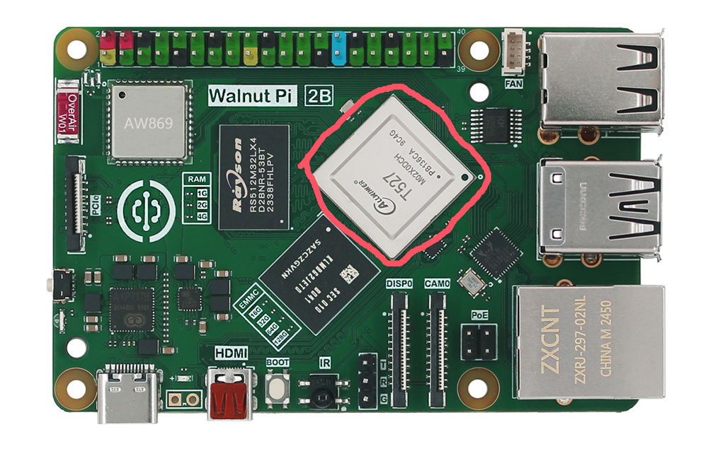

## RAM (Memory)

Next to the CPU is a black rectangular chip (shown below). This is the Walnut Pi's Random Access Memory (RAM).

When you use the Walnut Pi, RAM holds your active operations and running processes. Files are only saved to the MicroSD card or EMMC storage when you explicitly save them. Together, these components form the Walnut Pi's volatile and non-volatile memory: RAM is lost when power is removed, while the MicroSD card and EMMC retain data after power-off.

**The Walnut Pi 2B offers 1/2/4GB RAM options. (The T527 supports up to 4GB of RAM.)**

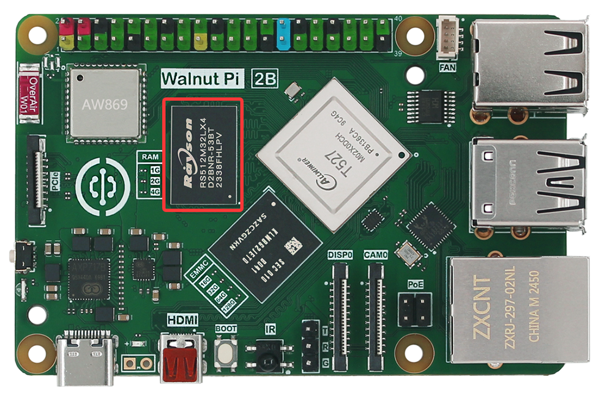

## EMMC (Flash Storage)

EMMC flash storage can be thought of as the computer's "hard drive" — it stores the operating system and files, and retains data after power-off. Its function is similar to a MicroSD card but with faster speeds.

**The EMMC on the Walnut Pi 2B is optional, with a default capacity of 32GB.**

## MicroSD Card Slot

The MicroSD card slot is located on the back of the Walnut Pi 2B. This is the board's storage: the MicroSD card inserted here contains all saved files, installed software, and the running operating system.

**The MicroSD card supports a maximum capacity of 512GB.**

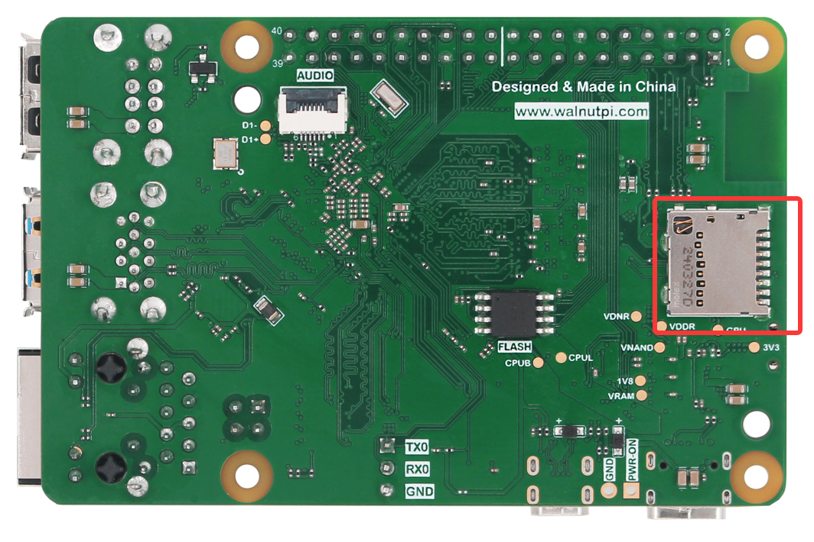

## PCIe

The Walnut Pi 2B features a PCIe 2.1 interface, which can be used to connect PCIe-compliant devices such as SSDs via an expansion board.

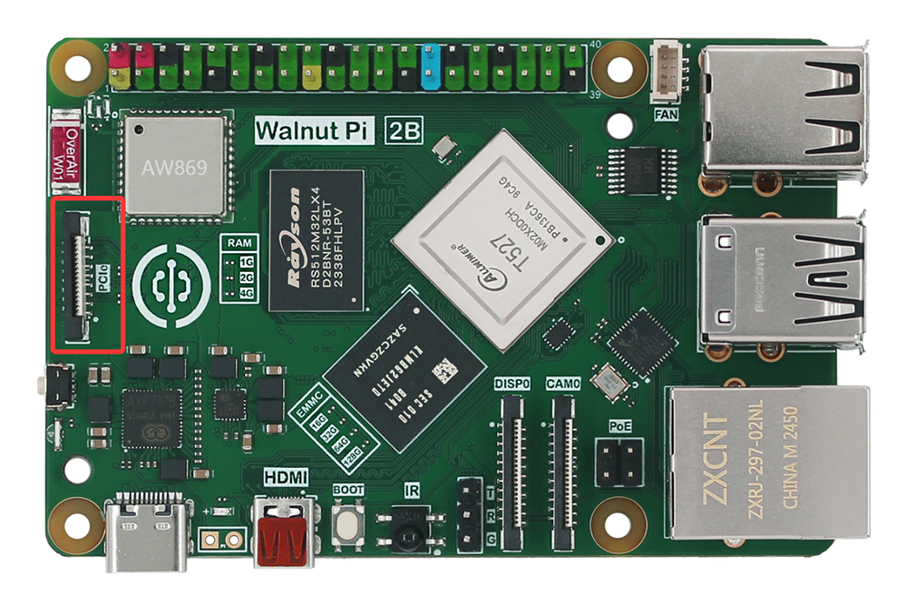

## WiFi and Bluetooth

In the upper-left corner of the Walnut Pi, you will find a metal shielding cover. This is the wireless module, which consists of two parts: WiFi and Bluetooth. WiFi is used to connect to wireless networks, while Bluetooth can be used to connect to peripherals such as Bluetooth keyboards and mice, or to send data to nearby sensors or devices like smartphones.

**The Walnut Pi 2B wireless module supports dual-band WiFi (2.4G and 5G) and Bluetooth 5.0. It features onboard dual-band ceramic antennas—no external antenna is required. An ipex4 antenna connector is also reserved; users needing an external antenna can solder 0Ω resistors to switch.**

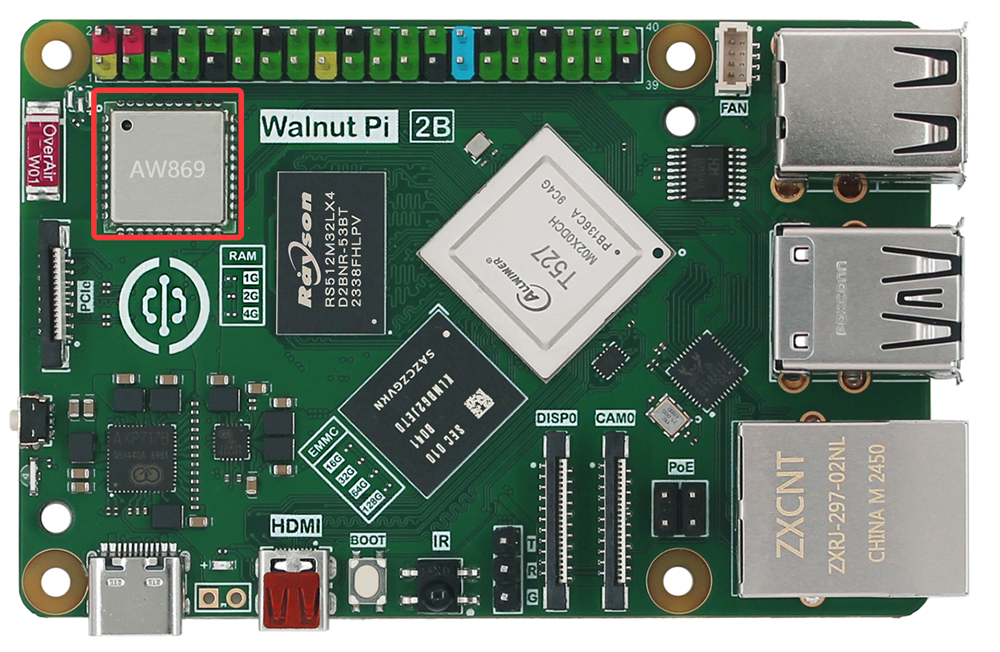

## USB

The Walnut Pi has 4 standard USB 2.0 ports and 1 USB 3.0 port. Three are exposed as USB-A female connectors (as shown below), and the fourth is the Type-C power port (which can be expanded via a Type-C hub). These can connect various USB peripherals, including keyboards, mice, USB cameras, flash drives, and more.

**Black USB connectors are USB 2.0; the blue connector is USB 3.0.**

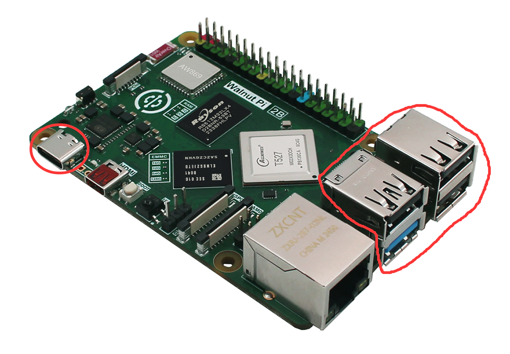

## Ethernet

The Walnut Pi 2B has an onboard Gigabit Ethernet port (10M/100M/1000M auto-negotiation). You can connect the Walnut Pi to a wired computer network (router LAN port) using an Ethernet cable. If you look closely at the Ethernet port, you will see two Light Emitting Diodes (LEDs) at the bottom — these are status LEDs that let you know the network connection is active.

::::tip Note
100M Ethernet connection indicator status: green LED steady on, yellow LED blinking;  
1000M Ethernet connection indicator status: green LED blinking, yellow LED steady on.
::::

**A PoE interface is reserved, allowing power delivery via a PoE power module (requires a PoE-capable router).**

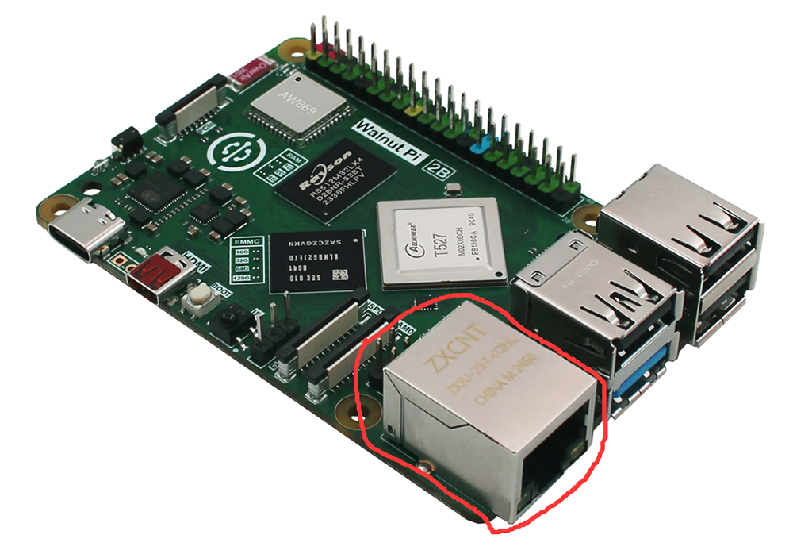

## Audio Interface

The back of the Walnut Pi 2B has an audio FPC connector, which can be adapted to a 3.5mm audio jack (the common headphone jack) using an adapter board. This can be used to connect headphones or speakers for louder sound output.

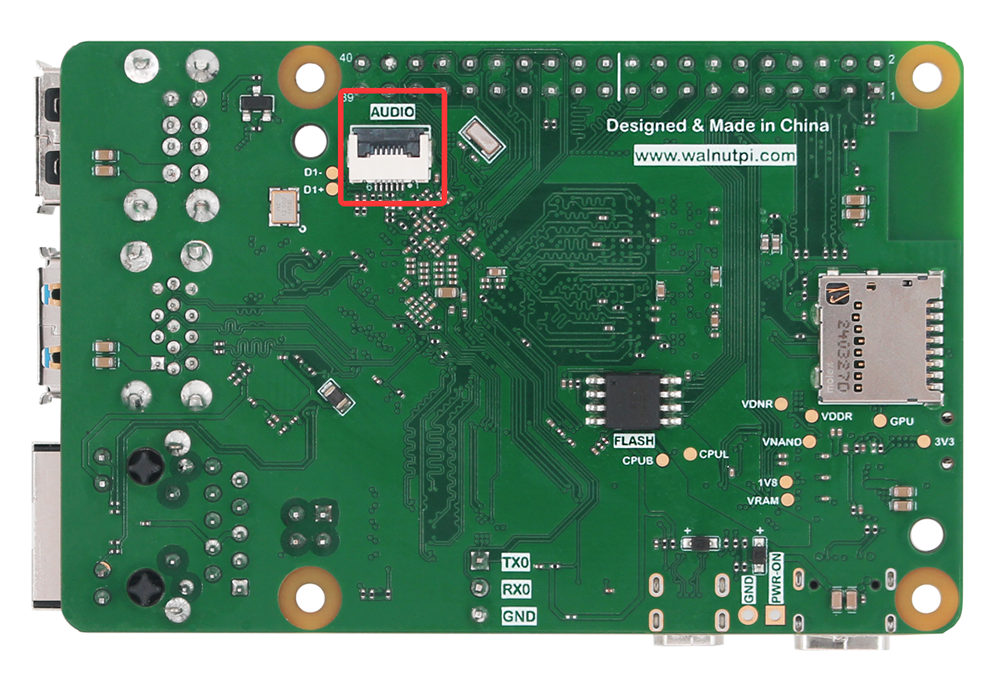

## HDMI

The Walnut Pi 2B has 1 High-Definition Multimedia Interface (HDMI 2.0) port, supporting 4K@60fps. It uses an onboard micro HDMI connector; you will typically need a micro HDMI to standard HDMI cable to connect to a display.

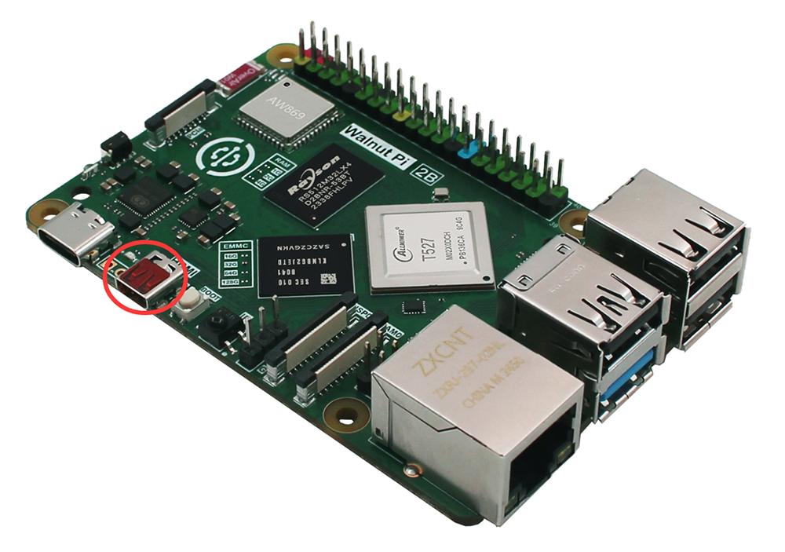

## MIPI CSI

The Walnut Pi 2B has 1 MIPI CSI interface (1x4 lane CSI, 2 lane compatible), which can connect external CSI camera devices.

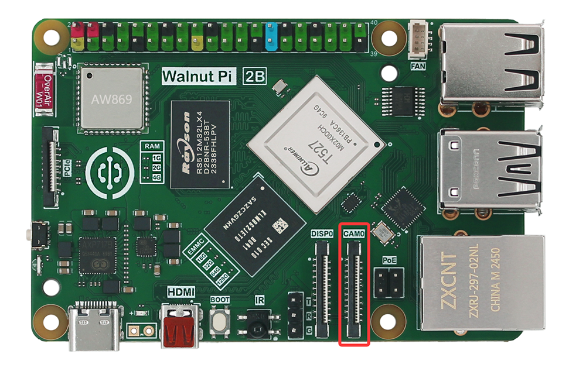

## MIPI DSI

The Walnut Pi 2B has 1 MIPI DSI interface (1x4 lane DSI, 2 lane compatible), which can connect external MIPI displays, supporting 1080P@60fps.

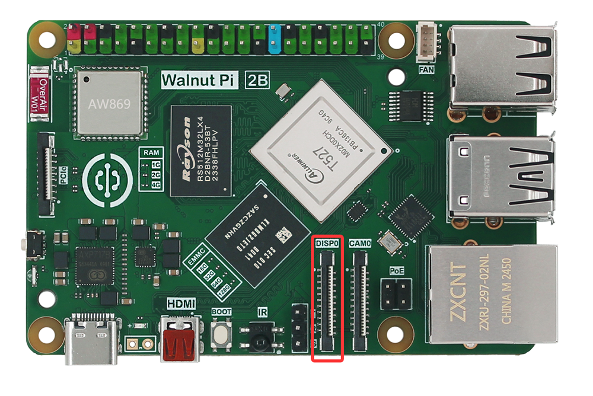

## IR Receiver

The Walnut Pi 2B has 1 onboard infrared receiver.

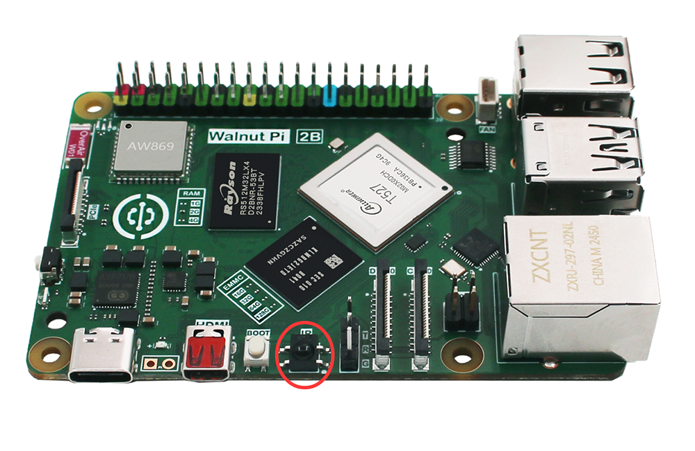

## Button and LED

The Walnut Pi 2B has 1 programmable button and 1 programmable LED onboard.

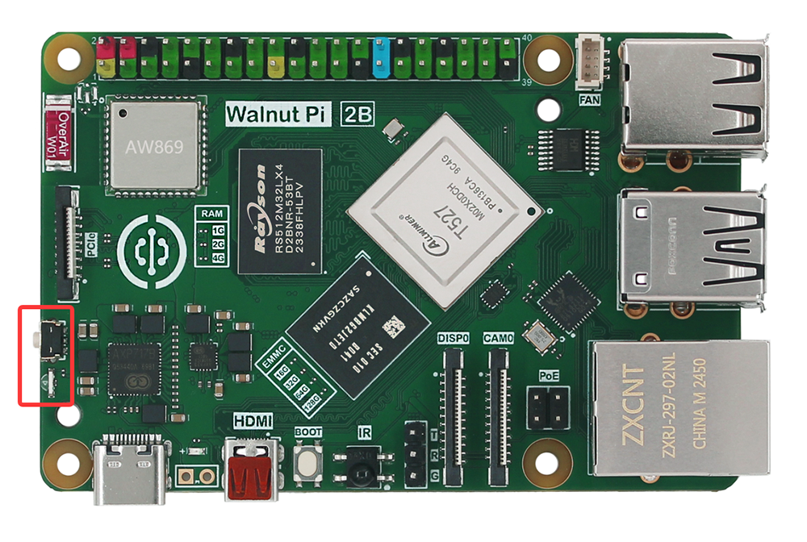

## GPIO

The top of the Walnut Pi features a 40-pin metal header (pin header), arranged in two rows of 20 pins each. This is the GPIO (General Purpose Input/Output) header. These pins are used to connect and communicate with hardware such as LEDs, buttons, sensors, joysticks, pulse rate monitors, and more—essentially what we commonly refer to as microcontroller I/O pins.

The Walnut Pi uses a color-coded 40-pin header for easier wiring and to prevent misconnection or short circuits.
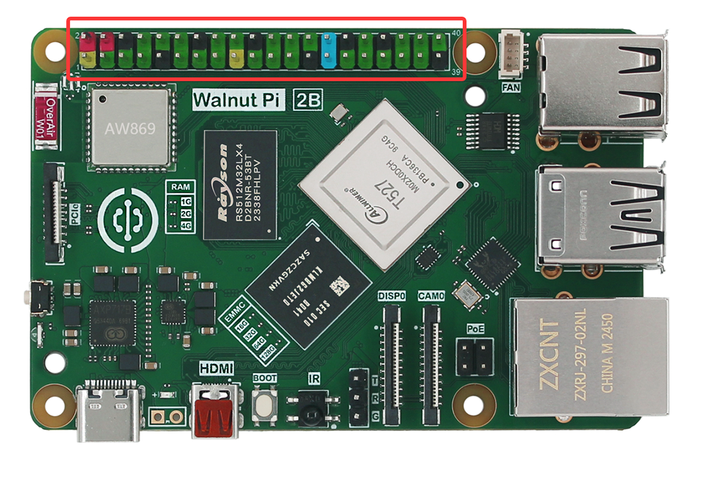

## Serial Debug Port

The Walnut Pi exposes a serial debug port, which can be connected using a USB-to-TTL serial adapter. Tools such as PuTTY can then be used to view debug information or log into the system console.
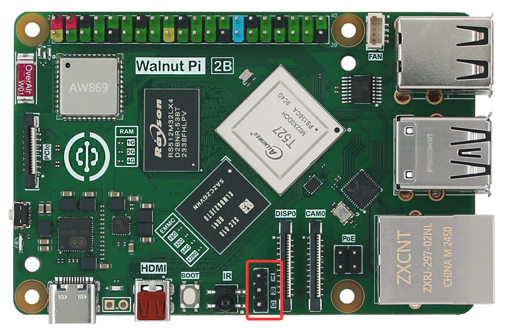

## Power Management

Above the Walnut Pi's Type-C connector, you can see a small chip. This is the Power Management IC (PMIC), which converts the power input from the Type-C port into the voltages needed for the Walnut Pi to operate. The Walnut Pi 2B requires a 5V power input with a current of 3A or higher.

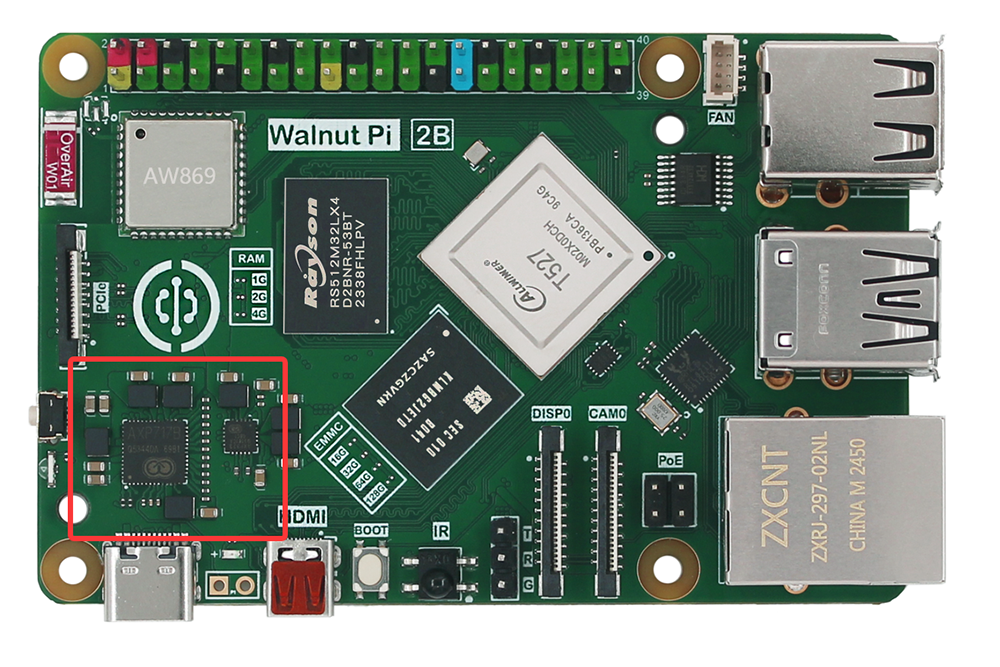
