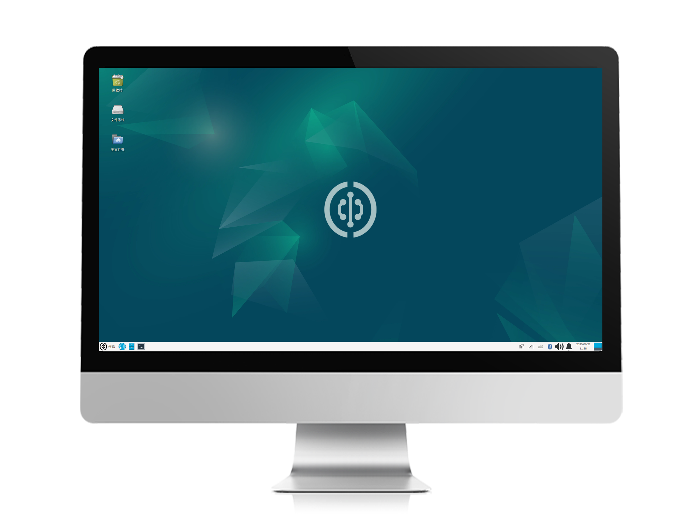

# Power On

After completing the system image burning in the previous section, the MicroSD card will contain the Walnut Pi Linux system. Insert it into the SD card slot on the back of the Walnut Pi, connect an HDMI display, and power on. You should see the operating system start up normally.

- `Normal User (Default)` Username: pi ; Password: pi
- `Root Account` Username: root ; Password: root

::::tip Note

The first boot of the Walnut Pi Desktop Edition takes quite a while—approximately several minutes—as it needs to initialize software and services. Please be patient and wait for the system desktop to appear. Subsequent boots will be much faster, taking only about tens of seconds.

:::: 

## Logging in via HDMI Display

When the system boots normally, the blue LED will remain steadily lit. After successful boot, the Desktop edition will display the Walnut Pi desktop, while the Server edition will display a terminal.

- `Desktop Edition`: The default pi user logs in automatically.

- `Server Edition`: You will need to enter your username and password to log in.

::::tip Note

If the blue LED is steadily lit but there is no HDMI output, try using a different HDMI display. If that still doesn't work, use the serial terminal method described below to view system boot information.

:::: 

## Logging in via Serial Terminal

If you do not have a display, you can use a USB-to-TTL adapter to connect to the Walnut Pi's debug serial port and log in via a serial terminal. For details, refer to: [Opening a Terminal via Debug Serial Port](../os_software/terminal#opening-terminal-via-debug-serial-port).
