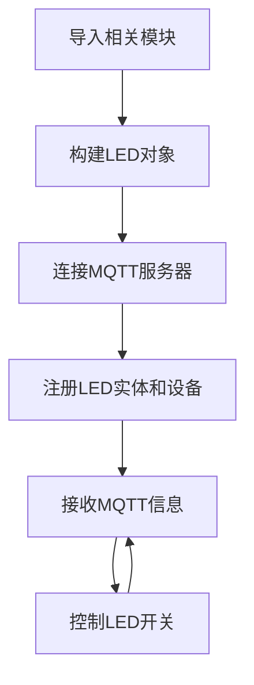
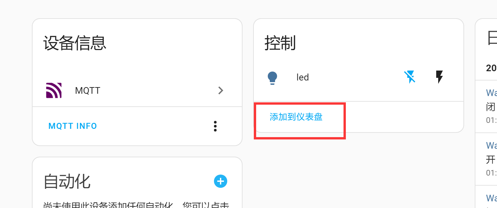
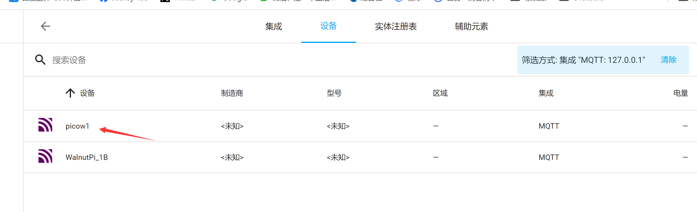
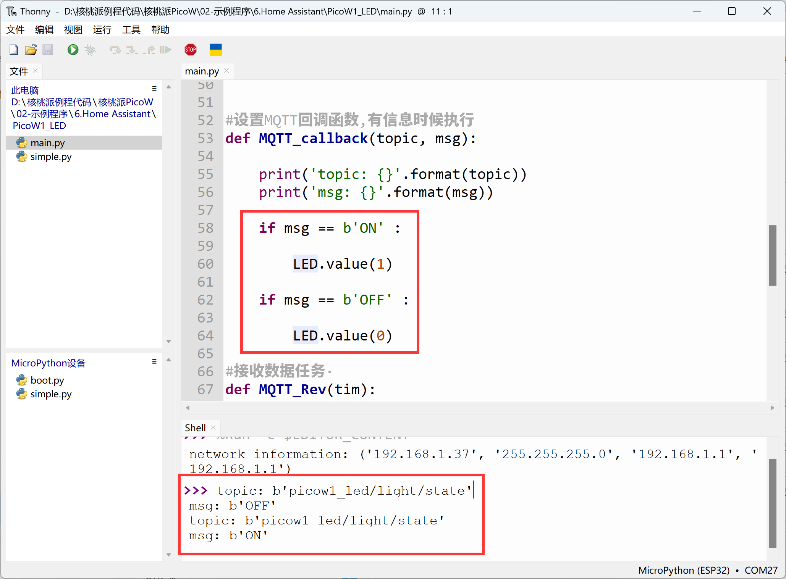

# LED

## 前言
本节主要内容是为Home Assistant添加一个LED，实现控制开关。为了方便演示，本教程会分别使用核桃派1B和核桃派PicoW（ESP32S3）来作为mqtt节点来操作。

- 核桃派1B LED


- 核桃派PicoW LED


## 实验目的
核桃派Home Assistant主机添加LED并实现控制开关。

## 实验讲解

LED可以看做是一个单色的灯具，用到Home Assistant MQTT组件中的light。实验的关键是搞清楚发现MQTT设备的主题信息以及控制方法，具体说明如下：

## MQTT主题

下面这个主题用于Home Assistant主机通过MQTT发现该设备：

```
homeassistant/light/1b_led/config
```

- `homeassistant`:默认的前缀
- `light`: LED对应的MQTT元件为light
- `1b_led`: 实体的ID，需要唯一，这里自定义的内容，表示核桃派1B的LED；
- `config`:默认的后缀

## MQTT消息

```json
{
    "name":"led",
    "device_class":"LIGHT",
    "command_topic":"1b_led/light/state",
    "unique_id":"1b_led",
               
    "device":{
                "identifiers":"1b_01",
                "name":"WalnutPi_1B"
            }
}
```

### 实体

- `"name":"led"`: 实体名称，自定义填写；
- `"device_class":"LIGHT"`: 组件类型，跟前面主题配置信息相关，不能填错，比如这里的`LIGHT`是组件`light`下的一个可用实体；
- `"command_topic":"1b_led/light/state"`: 用于注册实体后发布相关属性主题，比如灯的亮和灭状态，自定义，保证不同实体的主题不一样即可；
- `"unique_id":"1b_led"`: 实体ID，自定义，务必保证每个实体唯一；

### 设备

告知Home Assistant实体对应的设备。

- `"identifiers":"1b_01"`: 识别标识符，每个设备唯一；
- `"name":"WalnutPi_1B"`: 设备名称，自定义；

更多MQTT light内容可查阅官方文档：https://www.home-assistant.io/integrations/light.mqtt/

代码编写流程如下：



## 基于核桃派2B实现

核桃派2B板载可编程LED，我们在前面教程中学习过核桃派使用Python编程实现MQTT通讯[MQTT通讯](../../../python/network/mqtt.md)，在这个基础上实现即可：

### 参考代码

```python
'''
实验名称：Home Assistant LED灯
实验平台：核桃派
说明：编程实现Home Assistant控制LED灯。
'''

#导入相关库
import paho.mqtt.client as mqtt

import board
from digitalio import DigitalInOut, Direction

#构建LED对象和初始化
led = DigitalInOut(board.LED) #定义引脚编号
led.direction = Direction.OUTPUT  #IO为输出

led.value = 0 #输出低电平，熄灭LED蓝灯

#MQTT服务器和用户信息
CLIENT_ID = 'WalnutPi-LED' # 客户端ID
SERVER = '127.0.0.1' #表示本机IP地址
PORT = 1883    
USER='pi'
PASSWORD='pi'

#构建mqtt客户端对象
client = mqtt.Client(CLIENT_ID)

#配置用户名和密码
client.username_pw_set(USER, PASSWORD)

topic = "picow1/light/led/state"

#客户端从服务器接收到1个CONNACK响应时执行的回调函数.
def on_connect(client, userdata, flags, rc):
    print("Connected with result code "+str(rc))
    # 在on_connect()中使使用订阅主题意味着如果我们失去连接并重新连接，订阅将被更新。
    client.subscribe("1b_led/light/state")

# 当从服务器中收到其他设备的发布信息时，执行这个回调函数.
def on_message(client, userdata, msg):
    
    print(msg.topic+" "+str(msg.payload)) #打印topic和信息

    if msg.payload == b'ON' : #点亮LED
        
        led.value = 1
    
    if msg.payload == b'OFF' : #熄灭LED
        
        led.value = 0

#配置连接和接收信息的回调函数
client.on_connect = on_connect
client.on_message = on_message

#发起连接
client.connect(SERVER,PORT)

#首次启动注册设备
topic = "homeassistant/light/1b_led/config"
message = """{
           "name":"led",
           "device_class":"LIGHT",
           "command_topic":"1b_led/light/state",
           "unique_id":"1b_led",
           
           "device":{
                      "identifiers":"1b_01",
                      "name":"WalnutPi_1B"
                    }
            }"""

client.publish(topic, message)

# 开启新线程保持MQTT连接。
client.loop_start()

while True:

    pass

```

### 实验结果

这里使用Thonny远程核桃派运行以上Python代码，关于核桃派运行python代码方法请参考： [运行Python代码](../../../python/python_run.md)


运行后可以看到Home Assistant主机出现一个新设备和实体：


点击**设备**，可以看到设备相关信息，右边led为实体，点击开关按钮实现LED开关：


同时往设备发送MQTT信息：


控制核桃派1B LED亮灭：


还可以点击**添加到仪表盘**：



Home Assistant系统会自动选择卡片类型：


添加后可在概览首页界面看到该设备：


## 基于核桃派PicoW实现

核桃派PicoW（ESP32-S3）板载可编程LED，使用方法参考:[核桃派PicoW教程](https://www.walnutpi.com/picow/directory)，保证核桃派PicoW和核桃派2B连接到同一个路由器下即可：


### 参考代码
```python
'''
实验名称：Home Assistant LED灯
实验平台：核桃派 + 核桃派PicoW
作者：WalnutPi
说明：编程实现Home Assistant控制LED灯
'''

import network,time
from simple import MQTTClient #导入MQTT板块
from machine import Pin,Timer

LED=Pin(46, Pin.OUT) #初始化WIFI指示灯

#WIFI连接函数
def WIFI_Connect():

    global LED

    wlan = network.WLAN(network.STA_IF) #STA模式
    wlan.active(True)                   #激活接口
    start_time=time.time()              #记录时间做超时判断

    if not wlan.isconnected():
        print('connecting to network...')
        wlan.connect('01Studio', '88888888') #输入WIFI账号密码

        while not wlan.isconnected():

            #LED闪烁提示
            LED.value(1)
            time.sleep_ms(300)
            LED.value(0)
            time.sleep_ms(300)

            #超时判断,15秒没连接成功判定为超时
            if time.time()-start_time > 15 :
                print('WIFI Connected Timeout!')
                break

    if wlan.isconnected():
        #LED点亮
        LED.value(1)

        #串口打印信息
        print('network information:', wlan.ifconfig())

        return True

    else:
        return False


#设置MQTT回调函数,有信息时候执行
def MQTT_callback(topic, msg):
    
    print('topic: {}'.format(topic))
    print('msg: {}'.format(msg))
    
    if msg == b'ON' :
        
        LED.value(1)
    
    if msg == b'OFF' :
        
        LED.value(0)

#接收数据任务·
def MQTT_Rev(tim):
    client.check_msg()

#执行WIFI连接函数并判断是否已经连接成功
if WIFI_Connect():
    
    CLIENT_ID = 'WalnutPi-PicoW1' # 客户端ID
    SERVER = '192.168.1.118'  # MQTT服务器地址
    PORT = 1883   
    USER='pi'
    PASSWORD='pi'
    
    client = MQTTClient(CLIENT_ID, SERVER, PORT, USER, PASSWORD) #建立客户端对象
    client.set_callback(MQTT_callback)  #配置回调函数
    client.connect()
    
    #注册设备
    TOPIC = "homeassistant/light/picow1_led/config"
    mssage = """{
                  "name": "led",
                  "device_class": "LIGHT",
                  "command_topic": "picow1_led/light/state",
                  "unique_id": "picow1_led",
                  
                  "device": {
                            "identifiers": "picow_1",
                            "name": "picow1"
                            }
                }"""

    client.publish(TOPIC, mssage)
    
    #订阅主题 
    TOPIC = 'picow1_led/light/state' # TOPIC名称
    client.subscribe(TOPIC) #订阅主题

    #开启RTOS定时器，编号为1,周期100ms，执行socket通信接收任务
    tim = Timer(1)
    tim.init(period=100, mode=Timer.PERIODIC,callback=MQTT_Rev)

```

### 实验结果

使用Thonny 连接核桃派PicoW开发板，运行上面代码：


连接成功后可以看到核桃派Home Assistant主机多了一个设备：



进入设备，同样可以在右边控制LED开关和添加到仪表盘：


点击开关时PicoW收到MQTT信息并在thonny IDE下方终端打印信息，LED对应亮灭操作。




