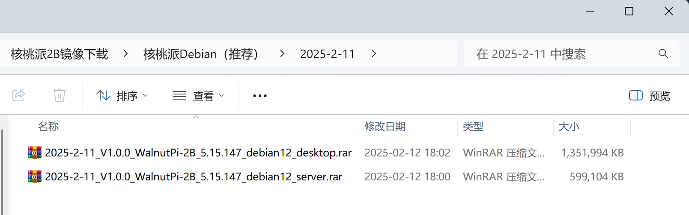
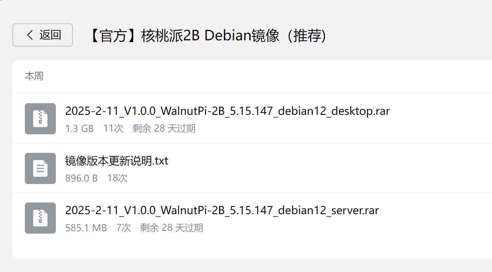
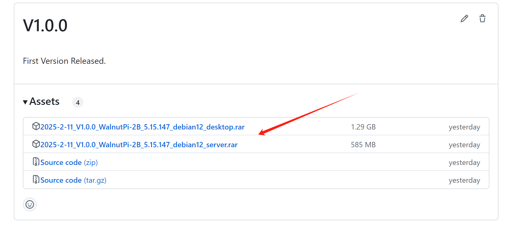

# Downloads

## System Images

Currently Walnut Pi 2B provides Walnut Pi OS (Debian12) and Home Assistant images (Ubuntu and Android images will be released later). This tutorial is mainly based on Walnut Pi OS (Debian12), which is our recommended image, available in Desktop and Server editions. The following download options are provided.

### Baidu Netdisk

- Baidu Netdisk link: https://pan.baidu.com/s/1dxZ9weWiwwEjI5t3j5sP6Q?pwd=WPKJ
- Access code: **WPKJ**

### QQ Group Files

Walnut Pi Open-Source Community Group: **677173708**

::::tip Note
Forward the group files to your own device or another QQ account within the group for high-speed downloads.
::::

### GitHub

Users outside of China can use this method to download:

https://github.com/walnutpi/walnutpi-2/releases

## Online Tutorial Resource Package

Supporting software, example source code, schematics, chip datasheets, and more for the Walnut Pi tutorials.

### Baidu Netdisk Download

- Baidu Netdisk link: https://pan.baidu.com/s/1ezCNtejvghsVO0hpYNJ27Q?pwd=WPKJ
- Access code: **WPKJ**

### GitHub Download

Users outside of China can browse the GitHub repository and download it as a package:

https://github.com/walnutpi/walnutpi-2

### Resource Package Overview

- **Development Tools**

Development software, host tools, and related drivers.

- **Tutorial Code**

Source code for this online tutorial.

- **Schematics and Diagrams**

Board schematics and interface descriptions.

- **Chip Datasheets**

Primary IC datasheets, etc.
