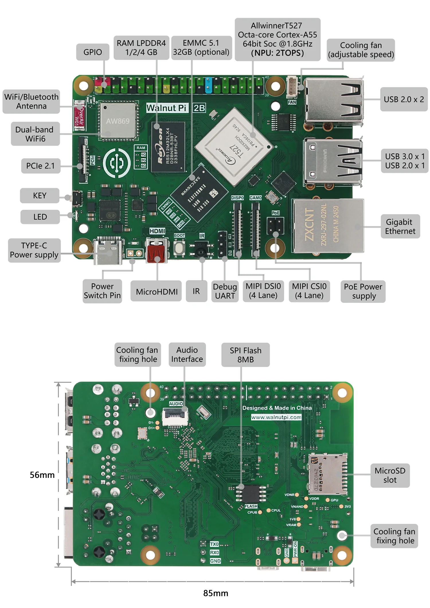
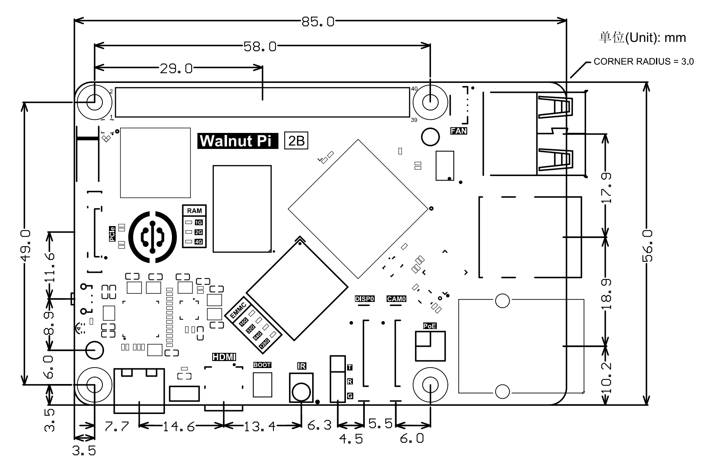

# 产品参数

核桃派2代基于全志T527 八核64位Cortex-A55高性能处理器。

## 核桃派2B

### 功能描述

### 详细参数

|  产品参数 |
|  :---:  | ---  |
| CPU  | 全志T527    ● ARM , 八核Cortex-A55 64bit @1.8GHz 高性能处理器    ● RISC-V @200MHz 协处理器 |
| GPU  | Mali G57 MC1   ● OpenGL ES 1.1/2.0/3.2   ● OpenCL 2.2   ● Vulkan 1.1/1.2/1.3|
| NPU  | 2Tops, 支持INT 8/16/32b, Float 16/32b|
| DSP  | HIFI4 @600MHz |
| 内存  | 1GB / 2GB / 4GB LPDDR4（可选）| 
| 存储  | ● MicroSD卡最大支持512G    ● 闪存 EMMC5.1 32GB 选配（其它容量可联系定制）    ● SPI Flash 8MB|
| 无线网络  | 双频WiFi6（2.4G & 5G） + 蓝牙5.0 |
| 有线网络  | 千兆以太网口（10M/100M/1000M自适应） |
| 音频输出  | ● HDMI音频    ● HPOUT (FPC座) |
| 视频输出 |  ● MicroHDMI 2.0a 支持4K@60fps    ● MIPI显示屏（1x4 lane DSI，兼容2 lane）, 支持1080P@60fps |
| 摄像头 | MIPI摄像头（1x4 lane CSI，兼容2 lane） |
| 外设  | ● PCIe 2.1 x 1 （支持NVMe固态硬盘）  ● USB 3.0 x 1   ● USB 2.0 x 3  ● 红外接收头 x 1  ● 按键 x 1（可编程）  ● LED x 1（可编程）  ● 40Pin GPIO排针（兼容树莓派）  ● 3P排针UART（串口）调试     **说明：PCIe2.1和USB3.0二选一使用，通过指令切换。**|
| 电源  | ● Type-C接口 5V@2A输入  ● PoE以太网供电 |
| 操作系统  | 核桃派OS（Debian）、Ubuntu、Android 、Home Assitant|

|  外观规格 |
|  :---:  | ---  |
| 尺寸  | 85 x 56 x 21mm  (长宽为PCB尺寸) |
| 重量  | 43克 （裸板）|

### GPIO引脚图

### 尺寸图

