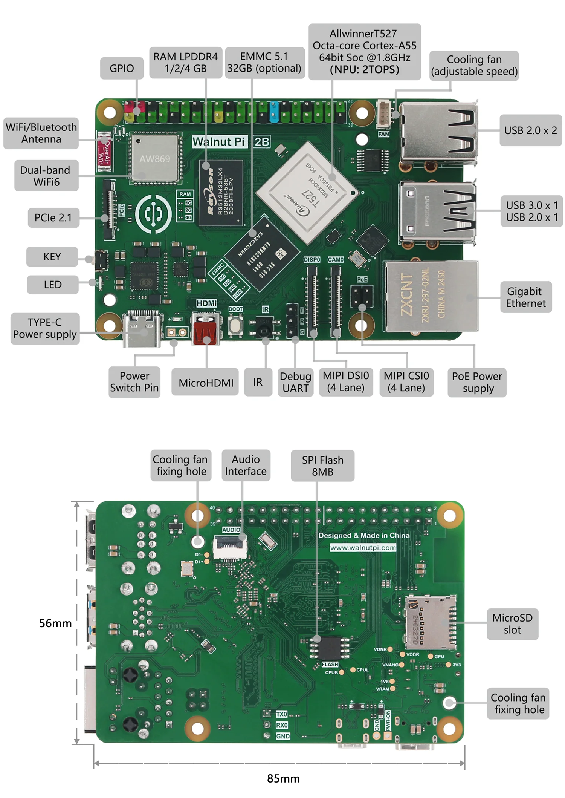
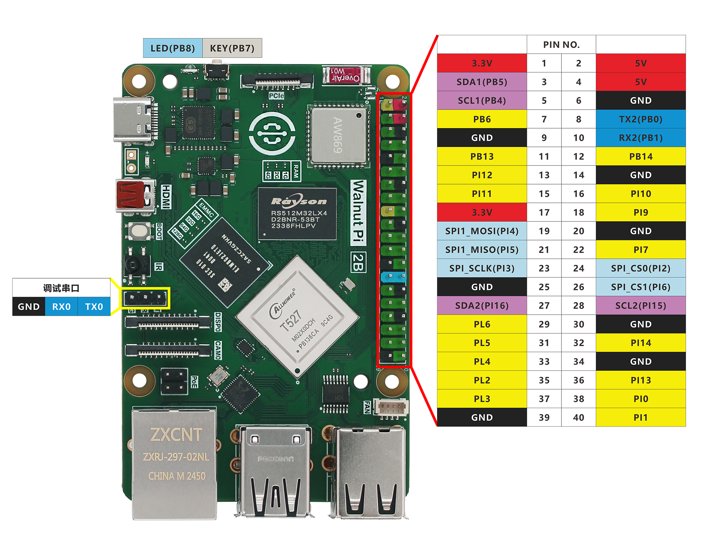
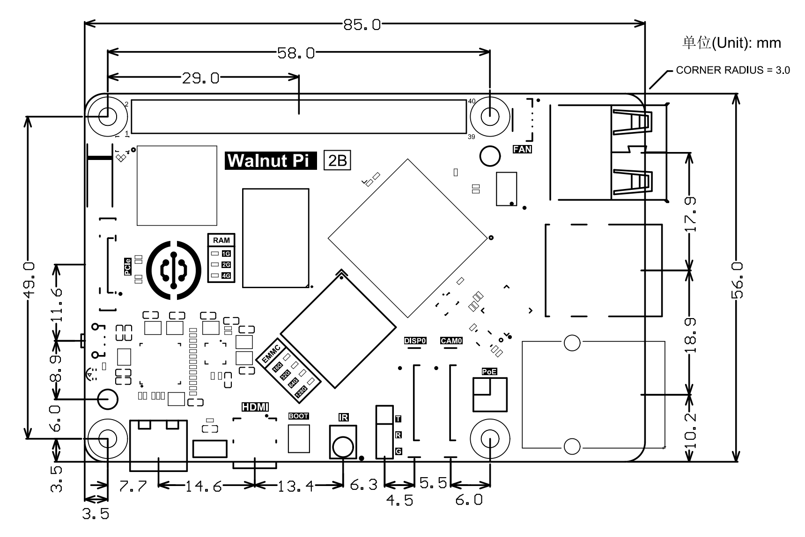

# Product Specifications

Walnut Pi 2 is based on the Allwinner T527 octa-core 64-bit Cortex-A55 high-performance processor.

## Walnut Pi 2B

### Overview

### Detailed Specifications

|  Specifications |  |
|  :---:  | ---  |
| CPU  | Allwinner T527    ● ARM, Octa-core Cortex-A55 64bit @1.8GHz High-performance Processor    ● RISC-V @200MHz Co-processor |
| GPU  | Mali G57 MC1   ● OpenGL ES 1.1/2.0/3.2   ● OpenCL 2.2   ● Vulkan 1.1/1.2/1.3|
| NPU  | 2 Tops, Supports INT 8/16/32b, Float 16/32b|
| DSP  | HIFI4 @600MHz |
| Memory  | 1GB / 2GB / 4GB LPDDR4 (Optional)|
| Storage  | ● MicroSD card up to 512GB    ● EMMC5.1 32GB Flash (Optional; other capacities available for customization)    ● SPI Flash 8MB|
| Wireless  | Dual-band WiFi6 (2.4G & 5G) + Bluetooth 5.0 |
| Ethernet  | Gigabit Ethernet (10M/100M/1000M Auto-Negotiation) |
| Audio Output  | ● HDMI Audio    ● HPOUT (FPC Connector) |
| Video Output |  ● MicroHDMI 2.0a, Supports 4K@60fps    ● MIPI Display (1x4 lane DSI, 2 lane compatible), Supports 1080P@60fps |
| Camera | MIPI Camera (1x4 lane CSI, 2 lane compatible) |
| Peripherals  | ● PCIe 2.1 x 1 (Supports NVMe SSD)  ● USB 3.0 x 1   ● USB 2.0 x 3  ● IR Receiver x 1  ● Button x 1 (Programmable)  ● LED x 1 (Programmable)  ● 40-Pin GPIO Header (Raspberry Pi Compatible)  ● 3-Pin UART (Serial) Debug Header     **Note: PCIe 2.1 and USB 3.0 are mutually exclusive; switch between them via command.**|
| Power  | ● Type-C Port 5V@2A Input  ● PoE (Power over Ethernet) |
| Operating Systems  | Walnut Pi OS (Debian), Ubuntu, Android, Home Assistant|

|  Physical Specifications |  |
|  :---:  | ---  |
| Dimensions  | 85 x 56 x 21mm (Length & width are PCB dimensions) |
| Weight  | 43g (Bare board)|

### GPIO Pinout

### Dimension Diagram

