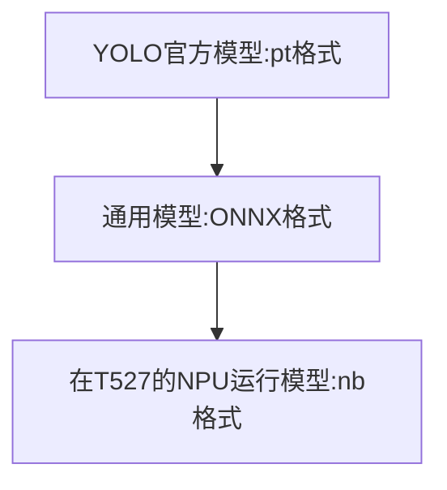
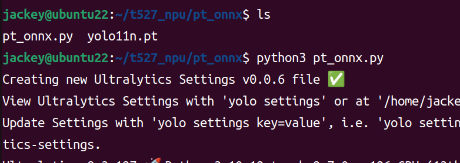
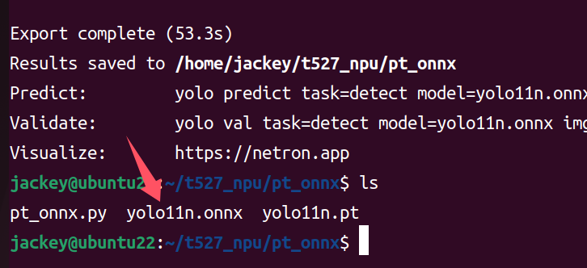
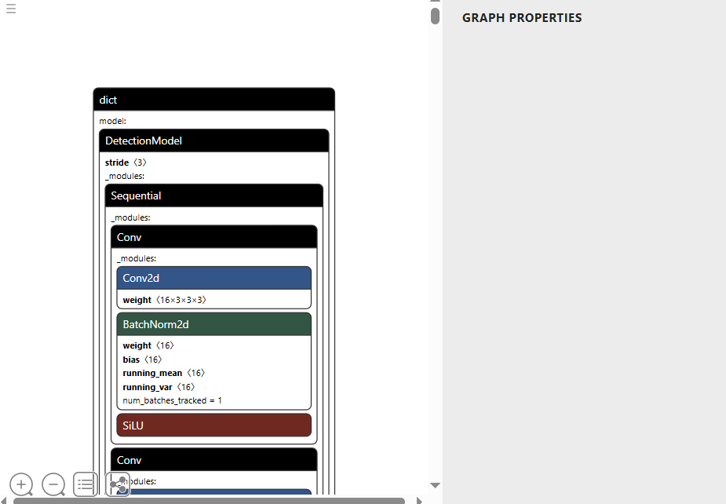
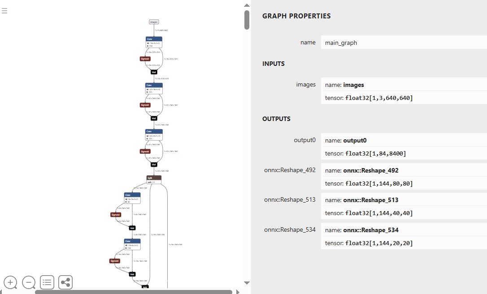

# 模型转换

本节讲述前面几个YOLOV11在核桃派上运行的.nb格式模型模型文件是如何转换的。本教程使用需要具备一定的Linux系统基础。

先下载核桃派YOLO模型相关资料包，里面包含了本教程用到的相关软件工具：

- 百度网盘链接：https://pan.baidu.com/s/1Mce6yRNqlZen-uj_qjtF6A?pwd=WPKJ
- 提取码：**WPKJ**

YOLO11官方提供有PyTorch训练好的原始模型文件（.pt格式），我们需要先转成（.onnx格式）通用模型文件，然后再转成（.nb）模型文件才能在核桃派2B（T527）NPU上运行。



## pt模型获取

本教程的.pt文件是使用从[ultralytics release(v8.3.0)](https://github.com/ultralytics/assets/releases/tag/v8.3.0)获取：

    YOLO11n：无人机、移动设备、实时监控（低算力环境）。
    YOLO11s/m：通用目标检测（如安防监控、自动驾驶辅助）。
    YOLO11l/x：高精度场景（如工业质检、医学图像分析）。

核桃派YOLO11教程模型使用的是速度最快体积最小的YOLOv11n系列。对应名称如下：

- `分类`: yolo11n-cls.pt
- `检测`: yolo11n.pt
- `定向检测`: yolo11n-obb.pt
- `图像分割`: yolo11n-seg.pt
- `姿势识别`: yolo11n-pose.pt

:::tip 提示：
本节教程以检测模型`yolo11n.pt`为例进行讲解，其它模型操作方式一样。
:::

## pt转onnx

需要使用安装了linux系统的电脑，或是在windows上使用虚拟机安装linux系统。核桃派开发板暂不支持运行模型格式转换工具。

### 下载转换工具

`.pt`文件里面包含着yolo运行所需要的参数数值，但里面没有网络结构信息。如果要在npu上运行，需要将其导出为包含网络结构信息的onnx格式。这一步需要调用yolo11源码自带的工具。

- 先安装ultralytics库

```bash
sudo pip install ultralytics
```

先需要下载一份 yolo11 的源码，用来将yolo11专用的模型文件转为通用的onnx模型文件，这里需要下载核桃派的YOLO11项目，因为官方自带的后处理操作会影响检测精度。所以我们提供的yolo11源码中对后处理部分做了一些修改，增加了一些模型原始数据的输出。

```shell
git clone https://github.com/walnutpi/ultralytics_yolo11.git
```

克隆项目后先运行以下命令，临时修改环境变量PYTHONPATH，指定python的模块搜索路径到yolo11源码的存放位置。我的yolo11源码存放路径是/opt/ultralytics_yolo11，所以命令如下：

```shell
export PYTHONPATH=/opt/ultralytics_yolo11
```

:::tip 提示
以上命令仅仅当前终端生效，如果关闭了当前终端，重新打开后需要重新执行一下该命令。
:::

### 执行转换代码

新建一个py文件，输入下面代码，然后在pt模型文件下运行以下python代码，他会从刚刚设置的`PYTHONPATH`指向的路径中查找 YOLO 这个库，并导出这个代码里指定的模型文件为onnx格式。

```python
from ultralytics import YOLO

model = YOLO("./yolo11n.pt")
model.export(format="onnx")
```
- 执行python代码


- 成功生成onnx模型


## onnx转nb

请准备一台安装了linux系统的电脑，或是在windows下安装虚拟机。

onnx是一个开放通用的模型格式，而不同芯片厂家的NPU设计结构有所差异，所以需要转成厂家NPU能跑的模型。比如针对核桃派2B T527，全志官方会提供转换工具和说明。**为了方便用户使用，我们直接将转换环境打包成Docker，用户可以直接安装。**

下载核桃派提供的docker镜像和脚本工具资料包:

### 安装docker镜像和转换脚本

- 1.安装docker

如果linux电脑内没有安装docker，可以使用资料包文件夹下的 `docker-ce_17.09.0-ce-0-ubuntu_amd64.deb` 安装包进行安装:

在linux下运行以下命令即可安装

```bash
sudo apt install docker.io
```

- 2.导入docker镜像

资料包`ubuntu-npu_v1.8.11.rar`文件经过解压后会得到一个`ubuntu-npu_v1.8.11.tar`文件(尾缀不一样)，这个是一个ubuntu18的docker镜像，里面安装并配置好了核桃派npu转换工具。

运行以下命令导入到docker中：

```bash
docker load -i ubuntu-npu_v1.8.11.tar
```

- 3.安装转换脚本

npu-model-transform文件夹下是我们写的一些快捷脚本，我们将调用docker镜像进行转换的全部步骤都写在脚本上，方便用户使用。

运行里面的install.sh，即可完成安装:

```bash
sudo ./install.sh
```

### 安装依赖库


```bash
sudo pip install onnx
```

```bash
sudo apt install jq
```

我们将导出模型信息、编写配置文件、模型量化、量化数据生成nb文件 等步骤都合并做成了一条命令 `npu-transfer-yolo`

模型在训练时使用的是float32类型来存储参数，在NPU上运行时，需要将参数转化为int8等存储范围较小的类型，以减小模型体积，同时提高模型运行速度。这个步骤就叫**量化**。**量化**不是直接对参数做四舍五入，而是需要输入一些图片给模型，根据模型的响应状态来优化各个参数。

我们需要准备几张图片用于量化，一般是从训练数据集里抽几张就行，将他们存放到一个文件夹下。

然后运行以下命令，传入两个参数，一个是onnx模型文件的路径，一个是存放图片的文件夹路径。

```bash
sudo npu-transfer-yolo yolo11n.onnx ./image/
```

最后会在当前路径下生成一个`yolo11n.nb`文件，这个文件就可以在核桃派2B的npu上运行推理了

## 模型查看工具

[netron.app](https://netron.app/) 是一个网页工具，可用于查看pt和onnx模型的结构。不支持nb等厂家自定义格式的模型查看。

- pt格式



- onnx格式




