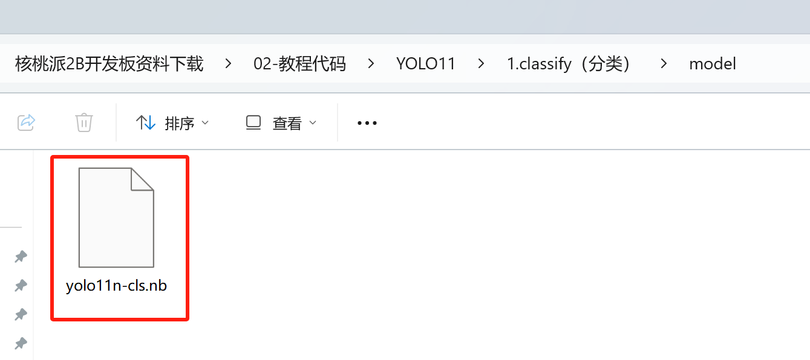
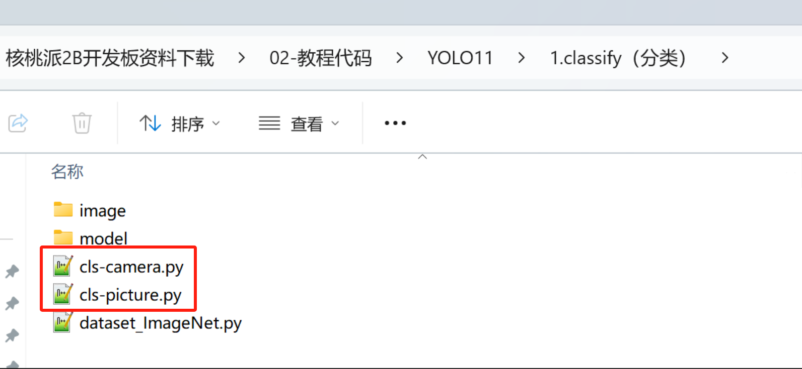
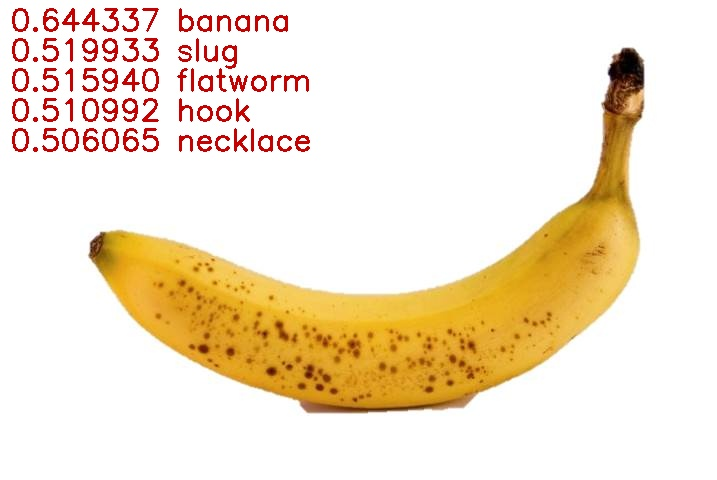
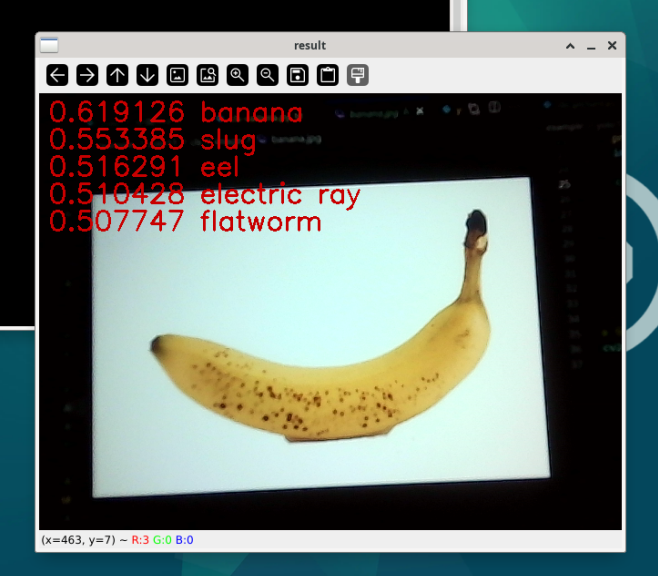

# YOLO11 分类

该模型的功能是对图片进行分类，输出这张图片有多大概率是什么物品。


## 准备模型文件

我们提供的程序包里会有一个名为`yolo11n-cls.nb`的文件，这就是在核桃派2B（T527） NPU上运行YOLO11分类的模型文件。



想尝试自行转换模型可以参考：[模型转换教程](./model_convert.md) 

## 安装OpenCV

本教程需要用到OpenCV库，安装方法参考：[OpenCV安装](../../opencv/install.md)

## Python运行模型

核桃派2B v1.3.0 版本以上系统提供一套封装好的YOLO11 Python库。

### 1. 实例化yolo11类
实例化`YOLO11_CLS`类，需要传入模型文件的路径
```python
from walnutpi import YOLO11
yolo = YOLO11.YOLO11_CLS("model/yolo11n-cls.nb")
```
### 2. 运行模型-阻塞式
使用`run`方法即可运行模型，并返回检测结果

需要传入图片数据，使用opencv的读取图片方法进行读取即可
```python
# 读取图片
import cv2
img = cv2.imread("image/banana.jpg")

# 检测
result = yolo.run(img)
```

### 3. 运行模型-非阻塞式

:::tip 提示
非阻塞式主要用于摄像头采集场景，当推理速度比摄像头慢的时候，采用阻塞方式不会影响摄像头采集图像，从感官上看不会降低显示速度。
:::

使用`run_async`方法会创建一个线程来运行模型,然后立刻返回。需要传入3个参数
- 图片数据， 使用opencv的读取图片方法进行读取即可
- 置信度阈值， 只会返回置信度高于这个值的检测框
- 检测框重叠度阈值， 模型经常会在物体周围同时命中多个检测框，如果框之间的面积重合度高于这个值，则只保留置信度最高的框，删除其他重合框

非阻塞式运行需要配合 `is_running` 属性使用，他的值是 true或false，表示后台是否跑着`run_async`启动的模型运行线程。如果后台已经跑着一个运行线程了，则运行`run_async`时不会再启动新的线程。也可以用此属性来判断模型运行线程跑完了没，是否可以获取结果了。

使用`get_result()`方法 会返回后台的识别结果，与阻塞式方法`run`得到的是相同的东西

```python
import cv2
img = cv2.imread("image/banana.jpg")

yolo.run_async(img)
while yolo.is_running:
    time.sleep(0.1)
result = yolo.get_result()
```

### 4. 检测结果
`run`方法和`get_result`方法返回的都是一个分类结果对象，它包含以下两个属性：

| 属性 | 说明                            |
| ---- | ------------------------------- |
| top5 | 列表，包含了置信度排名前5的类别 |
| all  | 列表，包含了所有类别的置信度    |

其中`top5`属性是一个列表，列表中包含5个对象，每个对象都有以下两个属性

| 属性        | 说明   |
| ----------- | ------ |
| label       | 类别   |
| reliability | 置信度 |

注意label是一个数字，例如yolo官方模型训练时标注了1000个类别，label属性就会是0-999

其中`all`属性是一个列表，列表里的每个值都代表该位置类别的置信度，例如all[15]就是类别15的置信度


可以使用以下代码输出排名前5的类别信息
```python
for i in result.top5:
    print(
        "{:f} {:d}".format(
            i.reliability,
            i.label,
        )
    )
"""
# 输出如下
0.644337 954
0.519933 114
0.515940 110
0.510992 600
0.506065 679
"""
```

也可以查看某类别的置信度，例如香蕉是954，可以使用以下代码只查看香蕉的置信度
```python
print(f"该图片为香蕉的概率{result.all[954]}")
```
## 示例程序

将资料包的整个YOLO11文件夹代码拷贝到核桃派2B，使用核桃派自带的thonny或者终端python运行代码即可。




yolo官方的cls模型训练时标注了1000个类别，模型运行的时候只会输出检测到的类别的序号，需要自己获取类别名称

这里我创建了一个名为`dataset_ImageNet.py`的文件，将类别名称写进数组里，方便在代码中调用
```python
label_names = ["tench","goldfish","great white shark","tiger shark","hammerhead shark","electric ray","stingray","cock","hen","ostrich","brambling","goldfinch","house finch","junco","indigo bunting","American robin","bulbul","jay","magpie","chickadee","American dipper","kite","bald eagle","vulture","great grey owl","fire salamander","smooth newt","newt","spotted salamander","axolotl","American bullfrog","tree frog","tailed frog","loggerhead sea turtle","leatherback sea turtle","mud turtle","terrapin","box turtle","banded gecko","green iguana","Carolina anole","desert grassland whiptail lizard","agama","frilled-necked lizard","alligator lizard","Gila monster","European green lizard","chameleon","Komodo dragon","Nile crocodile","American alligator","triceratops","worm snake","ring-necked snake","eastern hog-nosed snake","smooth green snake","kingsnake","garter snake","water snake","vine snake","night snake","boa constrictor","African rock python","Indian cobra","green mamba","sea snake","Saharan horned viper","eastern diamondback rattlesnake","sidewinder","trilobite","harvestman","scorpion","yellow garden spider","barn spider","European garden spider","southern black widow","tarantula","wolf spider","tick","centipede","black grouse","ptarmigan","ruffed grouse","prairie grouse","peacock","quail","partridge","grey parrot","macaw","sulphur-crested cockatoo","lorikeet","coucal","bee eater","hornbill","hummingbird","jacamar","toucan","duck","red-breasted merganser","goose","black swan","tusker","echidna","platypus","wallaby","koala","wombat","jellyfish","sea anemone","brain coral","flatworm","nematode","conch","snail","slug","sea slug","chiton","chambered nautilus","Dungeness crab","rock crab","fiddler crab","red king crab","American lobster","spiny lobster","crayfish","hermit crab","isopod","white stork","black stork","spoonbill","flamingo","little blue heron","great egret","bittern","crane (bird)","limpkin","common gallinule","American coot","bustard","ruddy turnstone","dunlin","common redshank","dowitcher","oystercatcher","pelican","king penguin","albatross","grey whale","killer whale","dugong","sea lion","Chihuahua","Japanese Chin","Maltese","Pekingese","Shih Tzu","King Charles Spaniel","Papillon","toy terrier","Rhodesian Ridgeback","Afghan Hound","Basset Hound","Beagle","Bloodhound","Bluetick Coonhound","Black and Tan Coonhound","Treeing Walker Coonhound","English foxhound","Redbone Coonhound","borzoi","Irish Wolfhound","Italian Greyhound","Whippet","Ibizan Hound","Norwegian Elkhound","Otterhound","Saluki","Scottish Deerhound","Weimaraner","Staffordshire Bull Terrier","American Staffordshire Terrier","Bedlington Terrier","Border Terrier","Kerry Blue Terrier","Irish Terrier","Norfolk Terrier","Norwich Terrier","Yorkshire Terrier","Wire Fox Terrier","Lakeland Terrier","Sealyham Terrier","Airedale Terrier","Cairn Terrier","Australian Terrier","Dandie Dinmont Terrier","Boston Terrier","Miniature Schnauzer","Giant Schnauzer","Standard Schnauzer","Scottish Terrier","Tibetan Terrier","Australian Silky Terrier","Soft-coated Wheaten Terrier","West Highland White Terrier","Lhasa Apso","Flat-Coated Retriever","Curly-coated Retriever","Golden Retriever","Labrador Retriever","Chesapeake Bay Retriever","German Shorthaired Pointer","Vizsla","English Setter","Irish Setter","Gordon Setter","Brittany","Clumber Spaniel","English Springer Spaniel","Welsh Springer Spaniel","Cocker Spaniels","Sussex Spaniel","Irish Water Spaniel","Kuvasz","Schipperke","Groenendael","Malinois","Briard","Australian Kelpie","Komondor","Old English Sheepdog","Shetland Sheepdog","collie","Border Collie","Bouvier des Flandres","Rottweiler","German Shepherd Dog","Dobermann","Miniature Pinscher","Greater Swiss Mountain Dog","Bernese Mountain Dog","Appenzeller Sennenhund","Entlebucher Sennenhund","Boxer","Bullmastiff","Tibetan Mastiff","French Bulldog","Great Dane","St. Bernard","husky","Alaskan Malamute","Siberian Husky","Dalmatian","Affenpinscher","Basenji","pug","Leonberger","Newfoundland","Pyrenean Mountain Dog","Samoyed","Pomeranian","Chow Chow","Keeshond","Griffon Bruxellois","Pembroke Welsh Corgi","Cardigan Welsh Corgi","Toy Poodle","Miniature Poodle","Standard Poodle","Mexican hairless dog","grey wolf","Alaskan tundra wolf","red wolf","coyote","dingo","dhole","African wild dog","hyena","red fox","kit fox","Arctic fox","grey fox","tabby cat","tiger cat","Persian cat","Siamese cat","Egyptian Mau","cougar","lynx","leopard","snow leopard","jaguar","lion","tiger","cheetah","brown bear","American black bear","polar bear","sloth bear","mongoose","meerkat","tiger beetle","ladybug","ground beetle","longhorn beetle","leaf beetle","dung beetle","rhinoceros beetle","weevil","fly","bee","ant","grasshopper","cricket","stick insect","cockroach","mantis","cicada","leafhopper","lacewing","dragonfly","damselfly","red admiral","ringlet","monarch butterfly","small white","sulphur butterfly","gossamer-winged butterfly","starfish","sea urchin","sea cucumber","cottontail rabbit","hare","Angora rabbit","hamster","porcupine","fox squirrel","marmot","beaver","guinea pig","common sorrel","zebra","pig","wild boar","warthog","hippopotamus","ox","water buffalo","bison","ram","bighorn sheep","Alpine ibex","hartebeest","impala","gazelle","dromedary","llama","weasel","mink","European polecat","black-footed ferret","otter","skunk","badger","armadillo","three-toed sloth","orangutan","gorilla","chimpanzee","gibbon","siamang","guenon","patas monkey","baboon","macaque","langur","black-and-white colobus","proboscis monkey","marmoset","white-headed capuchin","howler monkey","titi","Geoffroy's spider monkey","common squirrel monkey","ring-tailed lemur","indri","Asian elephant","African bush elephant","red panda","giant panda","snoek","eel","coho salmon","rock beauty","clownfish","sturgeon","garfish","lionfish","pufferfish","abacus","abaya","academic gown","accordion","acoustic guitar","aircraft carrier","airliner","airship","altar","ambulance","amphibious vehicle","analog clock","apiary","apron","waste container","assault rifle","backpack","bakery","balance beam","balloon","ballpoint pen","Band-Aid","banjo","baluster","barbell","barber chair","barbershop","barn","barometer","barrel","wheelbarrow","baseball","basketball","bassinet","bassoon","swimming cap","bath towel","bathtub","station wagon","lighthouse","beaker","military cap","beer bottle","beer glass","bell-cot","bib","tandem bicycle","bikini","ring binder","binoculars","birdhouse","boathouse","bobsleigh","bolo tie","poke bonnet","bookcase","bookstore","bottle cap","bow","bow tie","brass","bra","breakwater","breastplate","broom","bucket","buckle","bulletproof vest","high-speed train","butcher shop","taxicab","cauldron","candle","cannon","canoe","can opener","cardigan","car mirror","carousel","tool kit","carton","car wheel","automated teller machine","cassette","cassette player","castle","catamaran","CD player","cello","mobile phone","chain","chain-link fence","chain mail","chainsaw","chest","chiffonier","chime","china cabinet","Christmas stocking","church","movie theater","cleaver","cliff dwelling","cloak","clogs","cocktail shaker","coffee mug","coffeemaker","coil","combination lock","computer keyboard","confectionery store","container ship","convertible","corkscrew","cornet","cowboy boot","cowboy hat","cradle","crane (machine)","crash helmet","crate","infant bed","Crock Pot","croquet ball","crutch","cuirass","dam","desk","desktop computer","rotary dial telephone","diaper","digital clock","digital watch","dining table","dishcloth","dishwasher","disc brake","dock","dog sled","dome","doormat","drilling rig","drum","drumstick","dumbbell","Dutch oven","electric fan","electric guitar","electric locomotive","entertainment center","envelope","espresso machine","face powder","feather boa","filing cabinet","fireboat","fire engine","fire screen sheet","flagpole","flute","folding chair","football helmet","forklift","fountain","fountain pen","four-poster bed","freight car","French horn","frying pan","fur coat","garbage truck","gas mask","gas pump","goblet","go-kart","golf ball","golf cart","gondola","gong","gown","grand piano","greenhouse","grille","grocery store","guillotine","barrette","hair spray","half-track","hammer","hamper","hair dryer","hand-held computer","handkerchief","hard disk drive","harmonica","harp","harvester","hatchet","holster","home theater","honeycomb","hook","hoop skirt","horizontal bar","horse-drawn vehicle","hourglass","iPod","clothes iron","jack-o'-lantern","jeans","jeep","T-shirt","jigsaw puzzle","pulled rickshaw","joystick","kimono","knee pad","knot","lab coat","ladle","lampshade","laptop computer","lawn mower","lens cap","paper knife","library","lifeboat","lighter","limousine","ocean liner","lipstick","slip-on shoe","lotion","speaker","loupe","sawmill","magnetic compass","mail bag","mailbox","tights","tank suit","manhole cover","maraca","marimba","mask","match","maypole","maze","measuring cup","medicine chest","megalith","microphone","microwave oven","military uniform","milk can","minibus","miniskirt","minivan","missile","mitten","mixing bowl","mobile home","Model T","modem","monastery","monitor","moped","mortar","square academic cap","mosque","mosquito net","scooter","mountain bike","tent","computer mouse","mousetrap","moving van","muzzle","nail","neck brace","necklace","nipple","notebook computer","obelisk","oboe","ocarina","odometer","oil filter","organ","oscilloscope","overskirt","bullock cart","oxygen mask","packet","paddle","paddle wheel","padlock","paintbrush","pajamas","palace","pan flute","paper towel","parachute","parallel bars","park bench","parking meter","passenger car","patio","payphone","pedestal","pencil case","pencil sharpener","perfume","Petri dish","photocopier","plectrum","Pickelhaube","picket fence","pickup truck","pier","piggy bank","pill bottle","pillow","ping-pong ball","pinwheel","pirate ship","pitcher","hand plane","planetarium","plastic bag","plate rack","plow","plunger","Polaroid camera","pole","police van","poncho","billiard table","soda bottle","pot","potter's wheel","power drill","prayer rug","printer","prison","projectile","projector","hockey puck","punching bag","purse","quill","quilt","race car","racket","radiator","radio","radio telescope","rain barrel","recreational vehicle","reel","reflex camera","refrigerator","remote control","restaurant","revolver","rifle","rocking chair","rotisserie","eraser","rugby ball","ruler","running shoe","safe","safety pin","salt shaker","sandal","sarong","saxophone","scabbard","weighing scale","school bus","schooner","scoreboard","CRT screen","screw","screwdriver","seat belt","sewing machine","shield","shoe store","shoji","shopping basket","shopping cart","shovel","shower cap","shower curtain","ski","ski mask","sleeping bag","slide rule","sliding door","slot machine","snorkel","snowmobile","snowplow","soap dispenser","soccer ball","sock","solar thermal collector","sombrero","soup bowl","space bar","space heater","space shuttle","spatula","motorboat","spider web","spindle","sports car","spotlight","stage","steam locomotive","through arch bridge","steel drum","stethoscope","scarf","stone wall","stopwatch","stove","strainer","tram","stretcher","couch","stupa","submarine","suit","sundial","sunglass","sunglasses","sunscreen","suspension bridge","mop","sweatshirt","swimsuit","swing","switch","syringe","table lamp","tank","tape player","teapot","teddy bear","television","tennis ball","thatched roof","front curtain","thimble","threshing machine","throne","tile roof","toaster","tobacco shop","toilet seat","torch","totem pole","tow truck","toy store","tractor","semi-trailer truck","tray","trench coat","tricycle","trimaran","tripod","triumphal arch","trolleybus","trombone","tub","turnstile","typewriter keyboard","umbrella","unicycle","upright piano","vacuum cleaner","vase","vault","velvet","vending machine","vestment","viaduct","violin","volleyball","waffle iron","wall clock","wallet","wardrobe","military aircraft","sink","washing machine","water bottle","water jug","water tower","whiskey jug","whistle","wig","window screen","window shade","Windsor tie","wine bottle","wing","wok","wooden spoon","wool","split-rail fence","shipwreck","yawl","yurt","website","comic book","crossword","traffic sign","traffic light","dust jacket","menu","plate","guacamole","consomme","hot pot","trifle","ice cream","ice pop","baguette","bagel","pretzel","cheeseburger","hot dog","mashed potato","cabbage","broccoli","cauliflower","zucchini","spaghetti squash","acorn squash","butternut squash","cucumber","artichoke","bell pepper","cardoon","mushroom","Granny Smith","strawberry","orange","lemon","fig","pineapple","banana","jackfruit","custard apple","pomegranate","hay","carbonara","chocolate syrup","dough","meatloaf","pizza","pot pie","burrito","red wine","espresso","cup","eggnog","alp","bubble","cliff","coral reef","geyser","lakeshore","promontory","shoal","seashore","valley","volcano","baseball player","bridegroom","scuba diver","rapeseed","daisy","yellow lady's slipper","corn","acorn","rose hip","horse chestnut seed","coral fungus","agaric","gyromitra","stinkhorn mushroom","earth star","hen-of-the-woods","bolete","ear","toilet paper",]

```

### 基于图片

```python
'''
实验名称：YOLO11分类
实验平台：核桃派2B
说明：图片识别
'''

from walnutpi import YOLO11
import dataset_ImageNet
import cv2

#【可选代码】允许Thonny远程运行
import os
os.environ["DISPLAY"] = ":0.0"

model_path = "model/yolo11n-cls.nb" #模型路径
picture_path = "image/banana.jpg" #待识别图片路径
output_path = "result.jpg" #输出结果保存到当前路径

#读取图片
img = cv2.imread(picture_path)

# 检测图片
yolo = YOLO11.YOLO11_CLS(model_path)
result = yolo.run(img)

# 输出结果打印和绘制到图片上
index = 0
for i in result.top5:
    show_string = "{:f} {:s}".format(
        i.reliability,
        dataset_ImageNet.label_names[i.label],
    )
    print(show_string)
    index += 1

    cv2.putText(
        img,
        show_string,
        (10, 30 * index),
        cv2.FONT_HERSHEY_SIMPLEX,
        1,
        (0, 0, 200),
        2,
    )

# 保存图片
cv2.imwrite(output_path, img)

#窗口显示图片
cv2.imshow('result',img)

cv2.waitKey() #等待键盘任意按键按下
cv2.destroyAllWindows() #关闭窗口
```



### 基于摄像头

可以先学习在OpenCV的 [USB摄像头使用教程](../../opencv/usb_cam.md)

```python
'''
实验名称：YOLO11分类
实验平台：核桃派2B
说明：摄像头采集识别
'''

from walnutpi import YOLO11
import dataset_ImageNet
import cv2,time

#【可选代码】允许Thonny远程运行
import os
os.environ["DISPLAY"] = ":0.0"

#加载模型
model_path = "model/yolo11n-cls.nb"
yolo = YOLO11.YOLO11_CLS(model_path)

# 打开摄像头
cap = cv2.VideoCapture(0)
if not cap.isOpened():
    print("Cannot open camera")
    exit()

# 设置为1080p
#cap.set(cv2.CAP_PROP_FOURCC, cv2.VideoWriter_fourcc(*"MJPG"))
#cap.set(cv2.CAP_PROP_FRAME_WIDTH, 1920)  # 设置宽度
#cap.set(cv2.CAP_PROP_FRAME_HEIGHT, 1080)  # 设置长度

#计算帧率
count=0
pt=0
fps = 0


while True:
    
    #计算帧率
    count+=1    
    if time.time()-pt >=1 : #超过1秒
        
        fps=1/((time.time()-pt)/count)#计算帧率
        print(fps)
        count=0
        pt=time.time()
    
    # 摄像头读取一帧图像
    ret, img = cap.read()
    
    if not ret:
        print("Can't receive frame (stream end?). Exiting ...")
        break
    
    #推理帧
    if not yolo.is_running:
        yolo.run_async(img)
    result = yolo.get_result()

    
    #处理输出结果
    index = 0
    
    if result is not None:
        
        for i in result.top5:
            
            show_string = "{:.2f} {:s}".format(i.reliability, dataset_ImageNet.label_names[i.label])
            
            index += 1
            
            #打印结果
            print(show_string)
            
            #结果绘图
            cv2.putText(img, show_string, (10, 50+30 * index), cv2.FONT_HERSHEY_SIMPLEX, 1, (0, 0, 255), 2)        
    
    cv2.putText(img, 'FPS: '+str(fps), (10,30), cv2.FONT_HERSHEY_SIMPLEX, 1, (0,0,255), 2) #图像绘制帧率
    
    cv2.imshow("result", img)#窗口显示图片
    
    key = cv2.waitKey(1) # 窗口的图像刷新时间为1毫秒，防止阻塞    
    if key == 32: # 如果按下空格键，打断退出
        break
    
cap .release() # 关闭摄像头
cv2.destroyAllWindows() # 销毁显示摄像头视频的窗口
```



