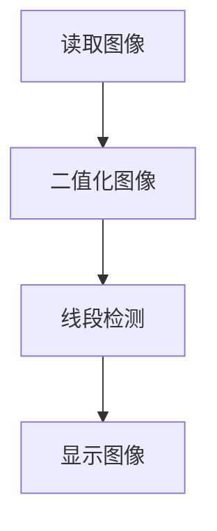

# 线段检测

## 前言

本节学习使用OpenCV对图像中的线段进行检测。

## 实验目的

检测图像中的线段并画图显示。

## 实验讲解

OpenCV Python库提供了两个线类检测方法，分别是检测直线（无限长）的HoughLines()和检测线段HoughLinesP()。本节主要用到HoughLinesP()，这个函数只支持二值化灰度图像。

### HoughLinesP() 使用方法

```python
lines = cv2.HoughLinesP(image, rho, theta, threshold, minLineLength, maxLineGap)
```
线段检测。返回lines为所有线段坐标组成的数组。例：[[x0,y0,x1,y1],[x0,y0,x1,y1]]
- `iamge` ：原始图像。需要二值化灰度图像。
- `rho` ：检测半径步长。默认使用值为1, 表示检测所有半径步长。
- `theta` ：检测直线的角度，默认使用值为π/180，表示检测所有角度。
- `threshold` ：阈值，值越小检测的数量越多。
- `minLineLength` ：最小长度。小于改长度的线段不检测。
- `maxLineGap` ：线段之间的最小距离。

读取图像，转化为二值化灰度图，然后进行线段检测。代码编写流程如下：



<br></br>

参考代码如下:

```python
'''
实验名称：线段检测
实验平台：核桃派
'''

import cv2
import numpy as np

img0 = cv2.imread('lines.png') #读取图像
cv2.imshow('lines', img0) #显示原图像

#将彩色图像转化为灰度图像（单通道）
img1 = cv2.cvtColor(img0, cv2.COLOR_BGR2GRAY)
#cv2.imshow('gray', img1) #显示图像

#将灰度图像转化二值图像
t,img2 = cv2.threshold(img1, 127, 255, cv2.THRESH_BINARY_INV)
cv2.imshow('binary', img2) #显示二值图像

#检测线段
lines = cv2.HoughLinesP(img2, 1, np.pi/180, 15, 100, 20)

print(lines) #打印线段信息

#在原始灰度图像画线段
for l in lines:    
    x0, y0, x1, y1 = l[0]
    cv2.line(img0, (x0, y0), (x1, y1), (0,255,0), 3)

cv2.imshow('result', img0)

cv2.waitKey() #等待键盘任意按键按下
cv2.destroyAllWindows() #关闭窗口

```

## 实验结果

在核桃派运行上面代码，实验结果如下：

