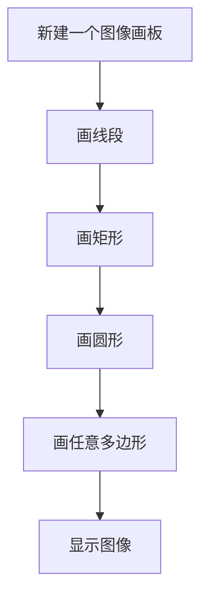

# 画图形

## 前言

本章学习使用OpenCV对图像进行画图的操作，这个功能在后面会经常用的。比如像标注图像上某个区域，或者给人脸画个矩形框。

## 实验目的

使用OpenCV库画各种图形。

## 实验讲解

OpenCV Python库提供了各类画图函数，我们直接使用即可。

### 画线段

画线段使用line()函数。使用方法如下：

```python
img = cv2.line(img, pt1, pt2, color, thinkness)
```
画线段：
- `img` ：图像。
- `pt1` ：起点坐标。
- `pt2` ：终点坐标。
- `color` ：颜色（BGR顺序）。
- `thinkness` ：线段宽度（粗细）。

### 画矩形

画矩形段使用rectangle()函数。使用方法如下：

```python
img = cv2.rectangle(img, pt1, pt2, color, thinkness)
```
画矩形：
- `img` ：图像。
- `pt1` ：左上角坐标。
- `pt2` ：右下角坐标。
- `color` ：颜色（BGR顺序）。
- `thinkness` ：线段宽度（粗细）。当值为`-1`时，表示填充。


### 画圆形

画圆形使用 circle()函数。使用方法如下：

```python
img = cv2.circle(img, center, radius, color, thinkness)
```
画圆形：
- `img` ：图像。
- `center` ：圆心坐标。
- `radius` ：半径。
- `color` ：颜色（BGR顺序）。
- `thinkness` ：线段宽度（粗细）。当值为`-1`时，表示填充。

### 任意多边形

画任意不规则多边形使用 polylines()函数，只需要知道每个点坐标即可。使用方法如下：

```python
img = cv2.polylines(img, pts, isClosed, color, thinkness)
```
画任意多边形：
- `img` ：图像。
- `pts` ：各个顶点坐标。Numpy数组。
- `isClosed` ：是否闭合。
    - `True` ：表示闭合多边形。
    - `False` ：表示不闭合多边形。
- `color` ：颜色（BGR顺序）。
- `thinkness` ：线段宽度（粗细）。

熟悉常用的画图形方法后我们通过代码实现新建一个画板（图像），将上面的各种图像画上并显示。代码编写流程如下：



<br></br>

参考代码如下，代码中用到了numpy新建数组功能，本章numpy用得不多，这里不展开，可以自行网上搜索学习。

```python
'''
实验名称：画图形
实验平台：核桃派
'''

import cv2
import numpy as np

#新建一个500x500像素的彩色RGB888纯黑色图像
img = np.zeros((500,500,3),np.uint8)

#画线段，从(50,50)到(450,50)，颜色红色，线宽5像素。
img = cv2.line(img, (50,50), (450,50), (0,0,255), 5)

 #画矩形1，从(50,80)到(200,200),绿色，线宽5像素。
img = cv2.rectangle(img, (50,80), (200,200), (0,255,0), 5)

#画矩形2，从(250,80)到(450,200)，绿色，填充。
img = cv2.rectangle(img, (250,80), (450,200), (0,255,0), -1)

#画圆形，圆心(150,300)，半径50,蓝色，线宽3
img = cv2.circle(img, (150, 300), 50, (255,0,0), 5)

#画任意多边形1,封闭
pts = np.array([[50,400],[200,400],[150,480],[50,480]],np.int32)
img = cv2.polylines(img, [pts], True, (255,0,255), 5)

#画任意多边形2,不封闭
pts = np.array([[250,400],[400,400],[350,480],[250,480]],np.int32)
img = cv2.polylines(img, [pts], False, (255,0,255), 5)

cv2.imshow('draw', img) #显示图像

cv2.waitKey() #等待键盘任意按键按下
cv2.destroyAllWindows() #关闭窗口

```

## 实验结果

在核桃派运行代码，可以看到实验结果如下图：

