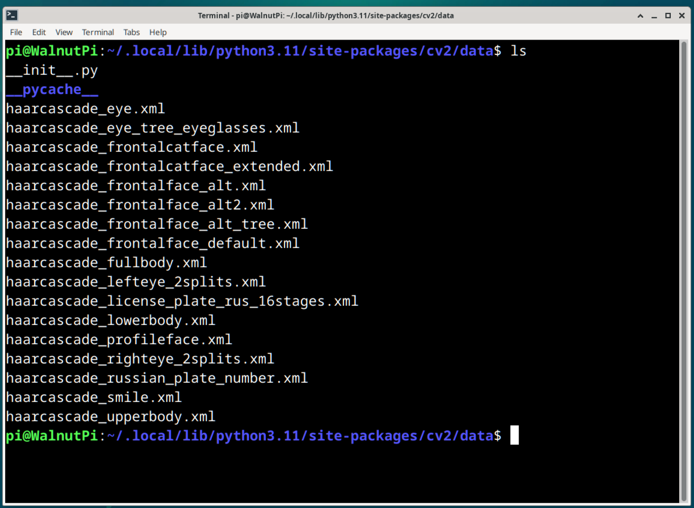

# 级联分类器介绍

级联分类器可以理解成是OpenCV用于视觉识别提前预制好的模型文件。

比如要在一张有人和猫的图片中检测人的眼睛，那么需要识别猫和人，猫有4条腿，人有2条腿，用不同的这个腿数量分类器来区分人或猫。接着在人体中可以再通过第2个分类器来区分眼睛和耳朵，从而实现检测眼睛目标。这里用到了2个分离器，将这些分类器按特定顺序串连起来，就成了一个 **级联分类器**。

## 级联分类器文件路径

OpenCV官方提供一些级联分类器文件，核桃派通过pip安装后位于以下目录，以xml结尾的就是：

```bash
/home/pi/.local/lib/python3.11/site-packages/cv2/data
```

 

也可以在github上获取：https://github.com/opencv/opencv/tree/4.x/data/haarcascades

下面是这些常用的级联分类器说明：

- `haarcascade_fullbody.xml`: 人体检测；
- `haarcascade_upperbody.xml`: 上半身检测；
- `haarcascade_lowerbody.xml`: 下半身检测；
- `haarcascade_frontalface_default.xml`: 正面人脸检测；
- `haarcascade_profileface.xml`: 侧面人脸检测；
- `haarcascade_eye.xml`: 眼睛检测；
- `haarcascade_lefteye_2splits.xml`: 左眼检测；
- `haarcascade_righteye_2splits.xml`: 右眼检测；
- `haarcascade_eye_tree_eyeglasses.xml`: 眼镜检测；
- `haarcascade_smile.xml`: 笑容检测；
- `haarcascade_frontalcatface.xml`: 正面猫脸检测；
- `haarcascade_russian_plate_number.xml`: 车牌检测；

## 使用方法

级联分类器的使用方法比较简单，只需要加载级联分类器和使用分类器识别图像即可。

### 加载级联分类器

```python
<CascadeClassifier object> = cv2.CascadeClassifier(filename)
```
返回分类器对象。
- `filename`: 级联分类器XML文件；

### 使用分类器识别对象

```python
objects = cascade.detectMultiScale(image, scaleFactor, minNeighbors, flags, minSize, maxSize)
```
返回objects为目标区域数组。每个目标包含4个值，分别是：左上角横坐标，左上角纵坐标，宽度，高度。
- `image`:待识别的图像；
- `scaleFactor`: 扫描图像时缩放比例（可选参数）；
- `minNeighbors`: 该值越大，分析误差越小（可选参数）；
- `flags`: 使用默认值（可选参数）；
- `minSize`: 最小目标尺寸（可选参数）；
- `maxSize`: 最大目标尺寸（可选参数）；

在接下来内容中我们会用到上面的级联分类器实现各种场景视觉识别。