# Audio and Recording

The Walnut Pi 2B supports both HDMI audio and 3.5mm headphone jack audio output.

## HDMI Audio

If your HDMI display has built-in speakers, you can verify this by connecting it to a Windows computer. If you can select audio output and hear sound, the HDMI display supports audio.

### Viewing Audio Devices

Use the following command to view HDMI audio information:

```bash
aplay -l
```

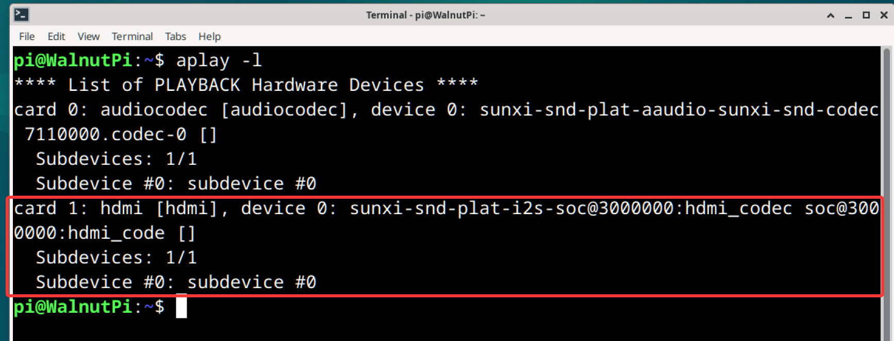

### Audio Playback Test

Test by playing a built-in WAV audio file. The **ahubhdmi** in the command below is the HDMI audio device name found from the command above: (**Note: this command uses [plughw] instead of [hw] as used for the headphone jack.**)

```bash
aplay -D plughw:hdmi /usr/share/sounds/alsa/Noise.wav
```

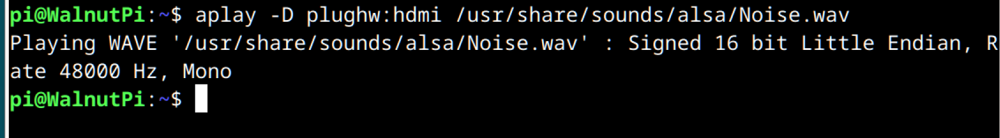


### Desktop Edition Music Playback

You can directly use the pre-installed VLC media player on the Desktop edition to play audio. The Walnut Pi system defaults to the headphone jack for audio output. Simply switch to HDMI in the bottom-right system tray to globally switch the audio output for players, browsers, etc.

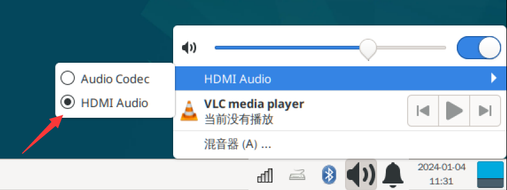


First, copy audio files to the Walnut Pi via USB drive or SSH, then right-click and select **Open with VLC Media Player**:

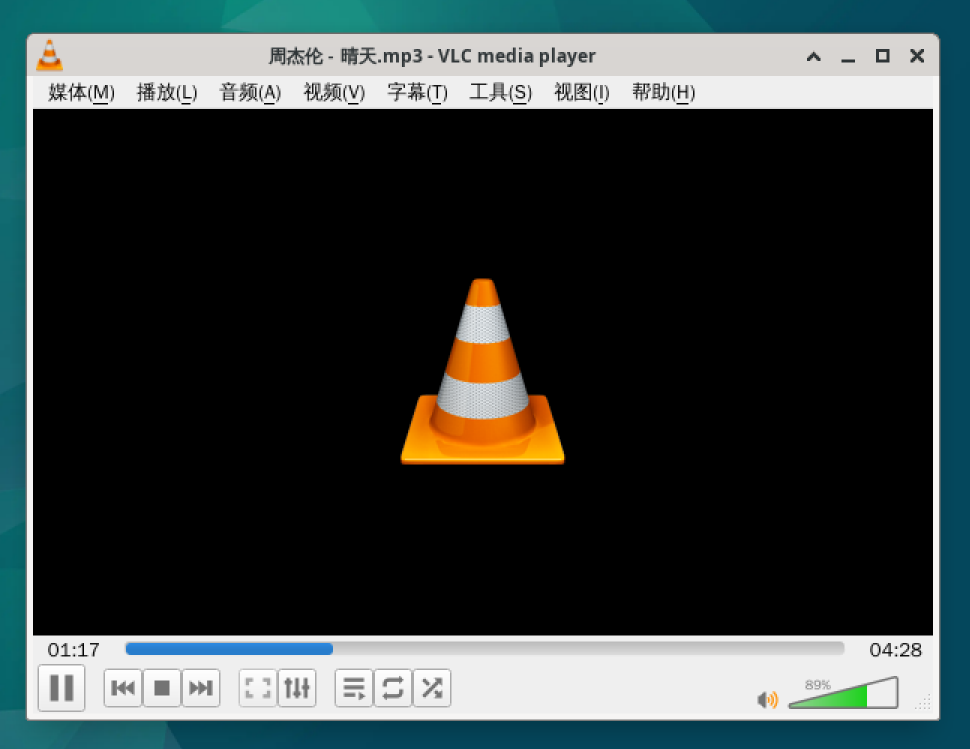

## 3.5mm Headphone Jack

The back of the Walnut Pi 2B has an audio FPC connector, which can be adapted to a 3.5mm audio jack (the common headphone jack) using an adapter board. This can be used to connect headphones or speakers for louder sound output.

:::::tip Note:
The Walnut Pi 2B's 3.5mm audio output jack has a certain output power and can drive both headphones and powered speakers.
:::::


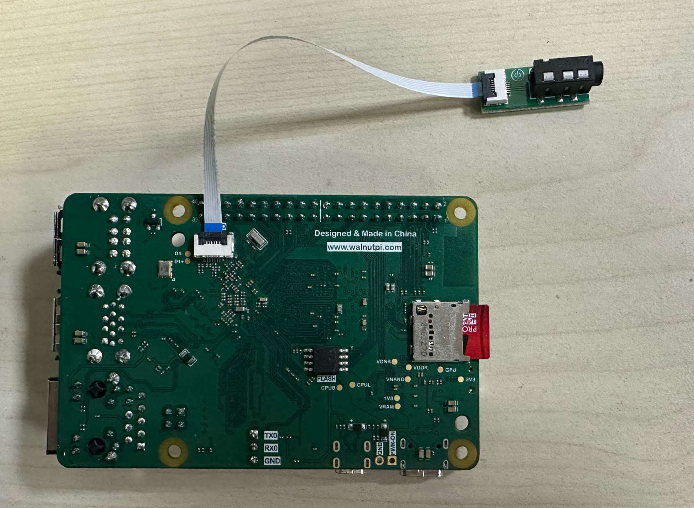

### Viewing Audio Devices

Use the following command to view audio device information:

```bash
aplay -l
```

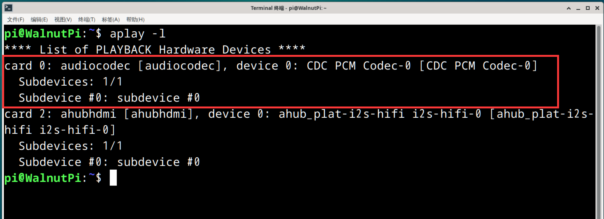

### Audio Playback Test

Test by playing a built-in WAV audio file. The **audiocodec** in the command below is the headphone jack device name found from the command above:

```bash
aplay -D hw:audiocodec /usr/share/sounds/alsa/Noise.wav
```

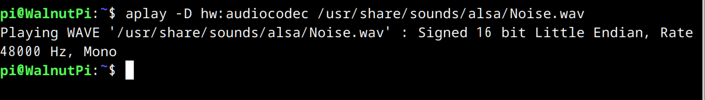

Connect headphones or speakers to the audio jack to hear the sound.

### Desktop Edition Music Playback

You can directly use the pre-installed VLC media player on the Desktop edition to play audio.

First, copy audio files to the Walnut Pi via USB drive or SSH, then right-click and select **Open with VLC Media Player**:


## USB Microphone

The Walnut Pi can use a USB microphone as a recording input device. This tutorial uses the following common Raspberry Pi USB microphone:

:::::tip Note
The Walnut Pi 2B requires image version V1.1.0 or later.
:::::

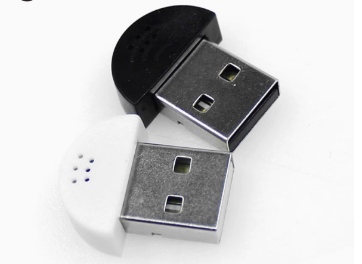

Plug the USB microphone into any USB port on the Walnut Pi.


Use the following command to identify the USB microphone device:

```bash
lsusb
```
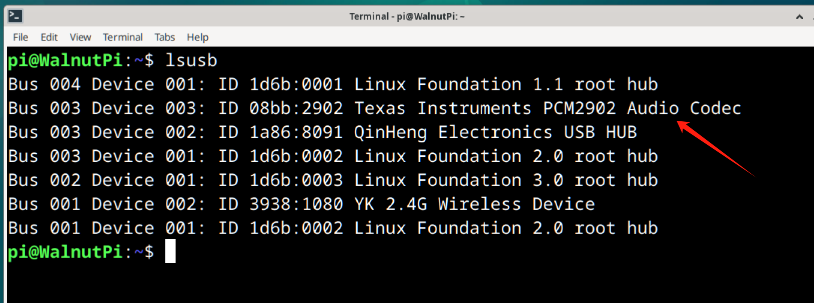

The following command lists audio devices:

```bash
arecord -l
```
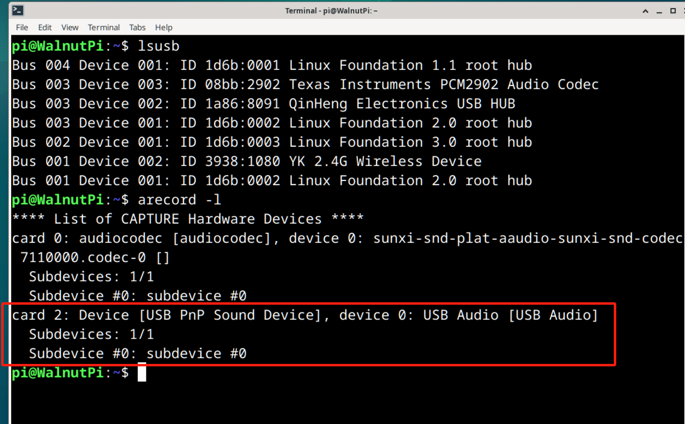

### Recording Test

You can record using the following command:

```bash
arecord -D "plughw:2,0" -f S16_LE -r 16000 -d 10 -t wav test.wav
```

- -D: Device name. From `arecord -l` above, this is card2, device0. Use: "plughw:2,0";
- -f: Recording format. S16_LE means 16-bit;
- -r: Sample rate. 16000 means 16 kHz;
- -d: Recording duration. 10 means 10 seconds;
- -t: File format. wav means WAV format;
- test.wav: Generates a test.wav file in the current directory.

After recording, you will see the generated test.wav file in the current directory:

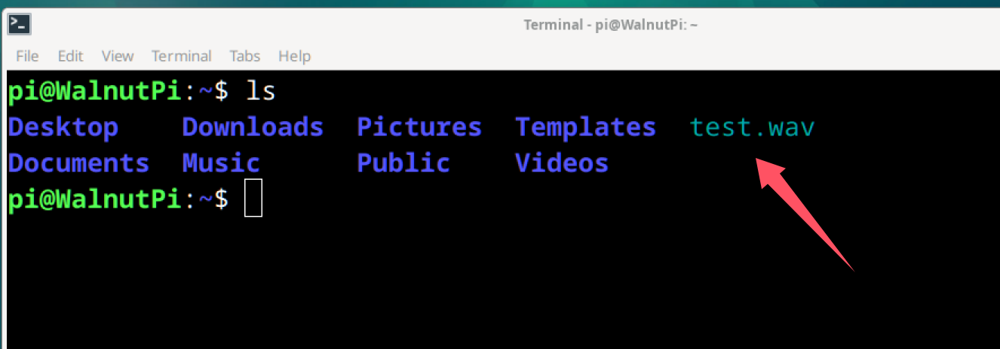

You can play it back through the audio jack with the following command:

```bash
aplay -D hw:audiocodec test.wav
```

### Adjusting Microphone Volume

The default microphone volume may be low. You can adjust it as follows:

Enter the following command:
```bash
alsamixer
```

In the pop-up interface, press F6 and select the USB microphone.

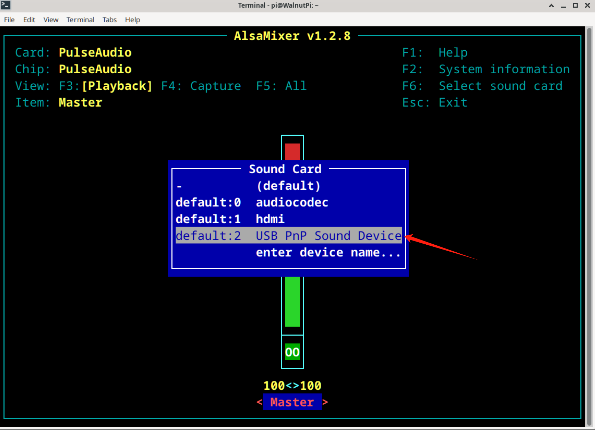

Then press F5, and use the mouse or keyboard arrow keys to select MIC:

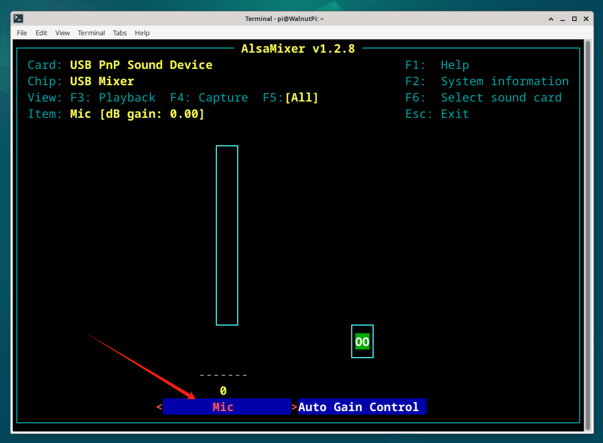

Use the keyboard up and down arrow keys to adjust the volume. Press ESC to exit when done.

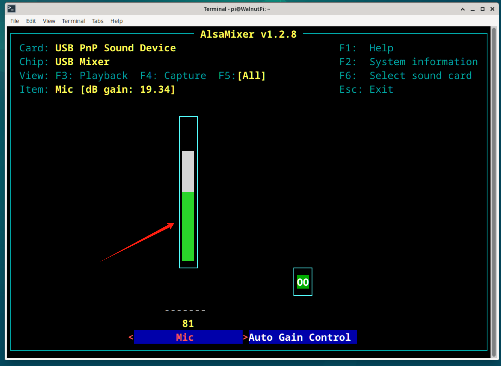

Run the recording command again, and you should hear a change in the recorded audio volume.

:::::tip Note
If you are using the Desktop edition, you can directly adjust the microphone volume via the audio icon in the bottom-right corner.
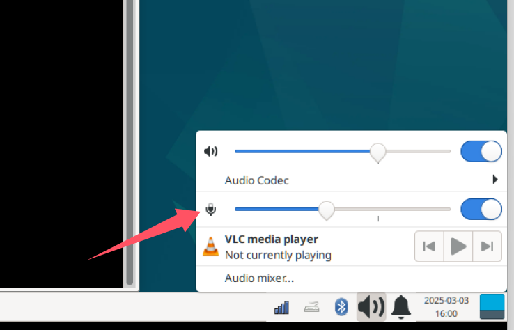
:::::

## Onboard Microphone

Only the [Walnut Pi CM2 Compute Module](../intro/hw-parameter.md#walnut-pi-cm2) has a microphone interface.

:::::tip Note
Image version V1.8.0 or later is required.
:::::

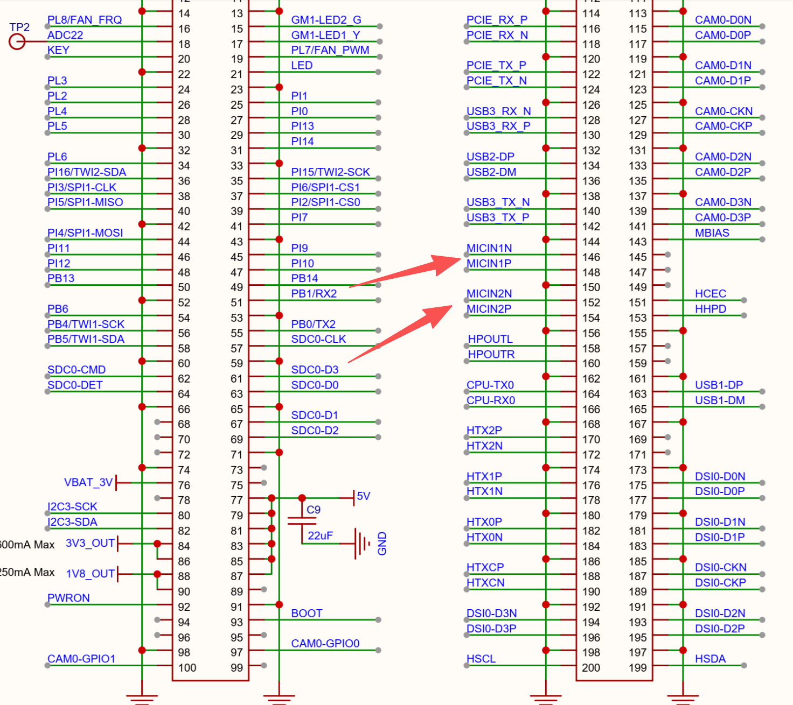

The baseboard provides MIC1.

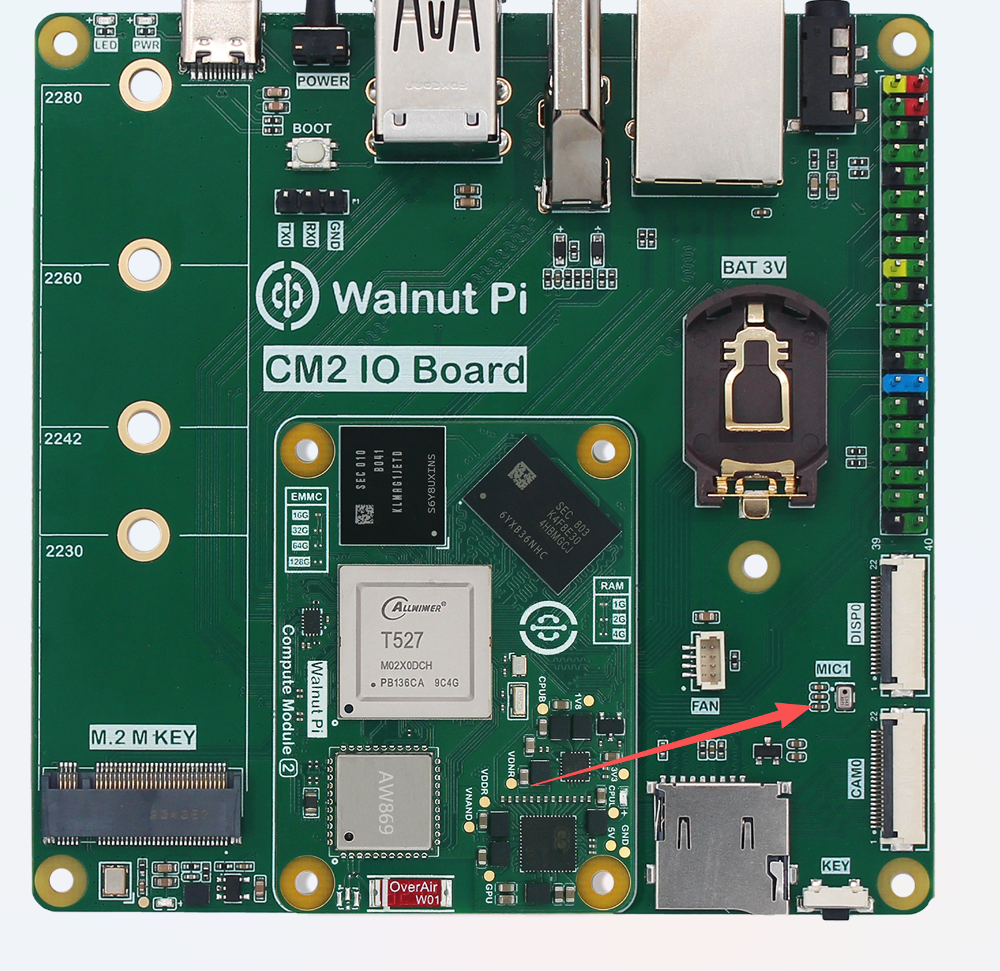

Use the following command to list microphone devices:

```bash
arecord -l
```

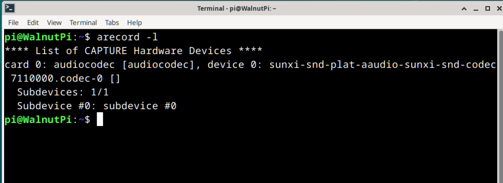

### Recording Test

You can record using the following command:

```bash
arecord -D "plughw:0,0" -f S16_LE -r 16000 -d 10 -t wav test.wav
```

- -D: Device name. From `arecord -l` above, this is card2, device0. Use: "plughw:2,0";
- -f: Recording format. S16_LE means 16-bit;
- -r: Sample rate. 16000 means 16 kHz;
- -d: Recording duration. 10 means 10 seconds;
- -t: File format. wav means WAV format;
- test.wav: Generates a test.wav file in the current directory.

After recording, you will see the generated test.wav file in the current directory:


You can play it back through the audio jack on the back using the following command:

```bash
aplay -D hw:audiocodec test.wav
```

### Adjusting Microphone Volume

The microphone volume can be adjusted as follows:

Enter the following command:

```bash
alsamixer
```

In the pop-up interface, press F6 and select `audiocodec`.

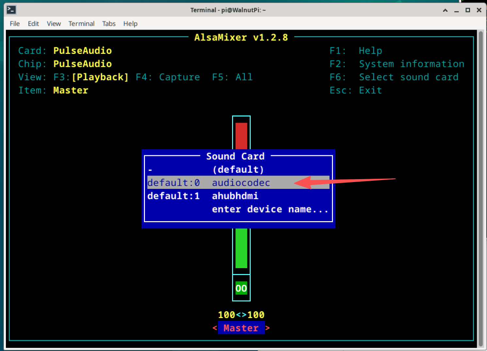

Use the mouse or keyboard left/right arrow keys to select `ADC1` and `ADC1 Gain`, then use the up/down arrow keys to adjust the microphone volume. Press ESC to exit when done.

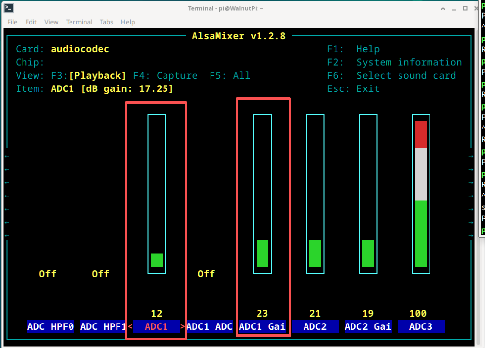

Run the recording and playback commands above again, and you should hear a change in the recorded audio volume.
