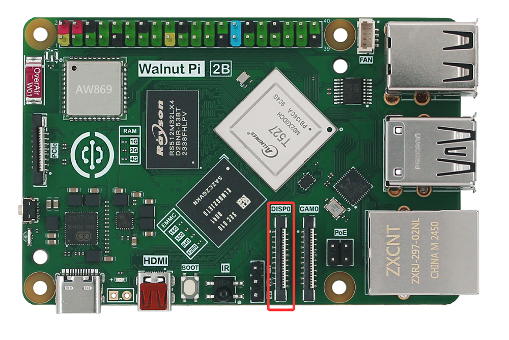
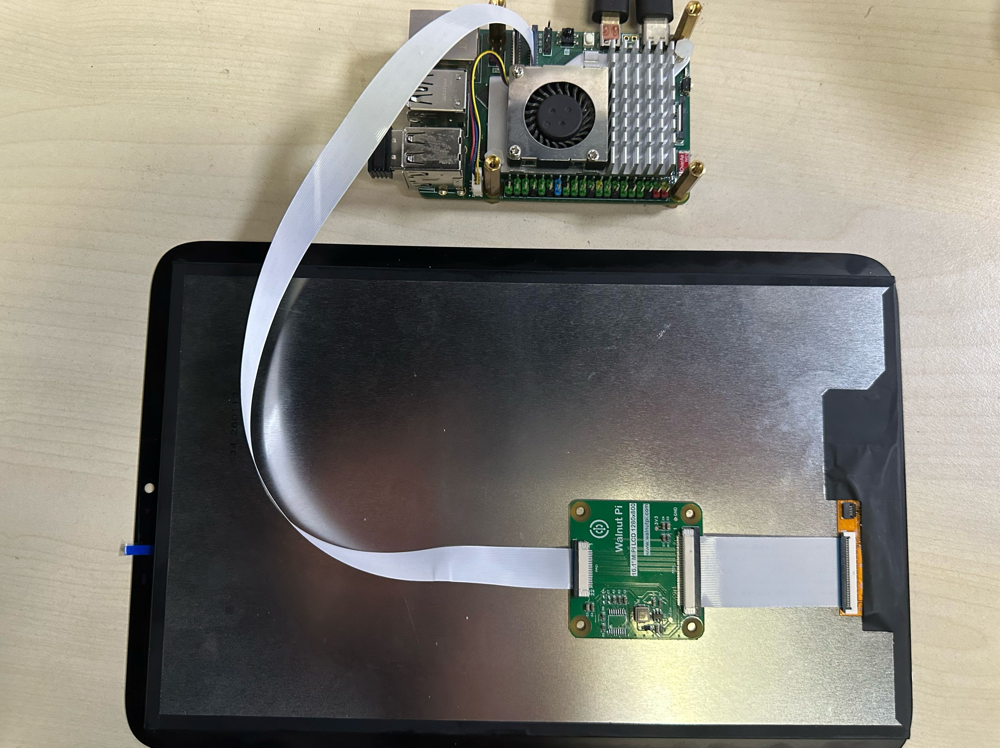
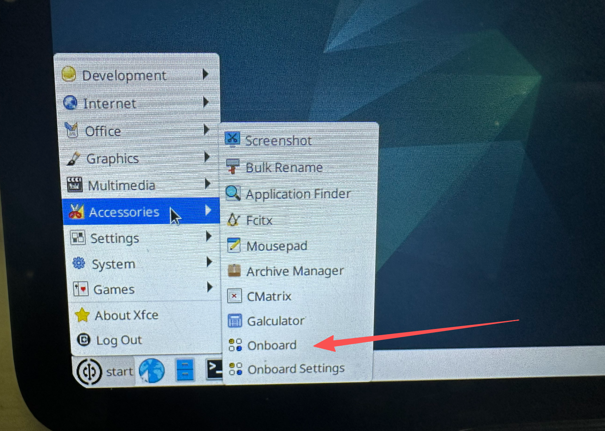
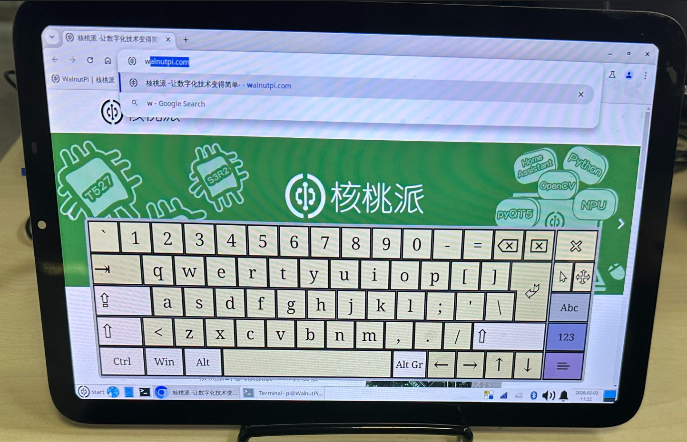
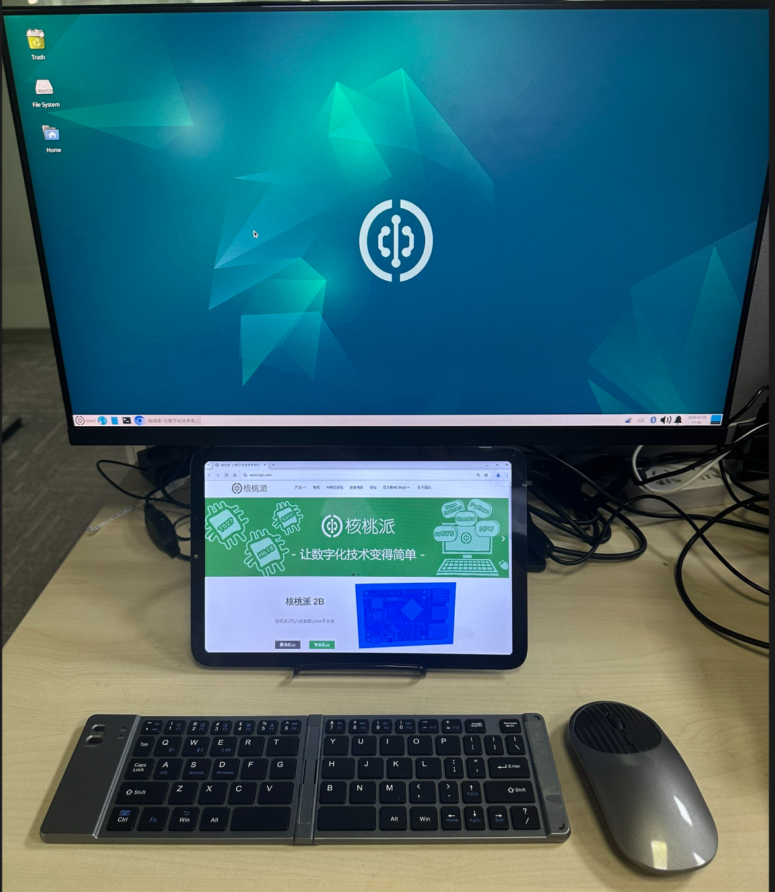

# 10.1寸MIPI屏

核桃派官方推出的10.1寸MIPI屏分辨率为 1280x800。[购买连接>>](https://item.taobao.com/item.htm?id=1021319436340)


|  产品参数 |
|  :---:  | ---  |
| 尺寸  | 10.1寸 |
| 分辨率  | 1280x800 |
| 显示视觉  | IPS（全视角） |
| 接口  | mipi 4lane |
| 触摸  | 电容触摸屏（可选） |
| 工作温度  | -20℃ ~ 60℃ |
| 储存温度  | -30℃ ~ 70℃  |
| 外形尺寸  | 140.24 x 226.85 x 2.4 mm (无触摸)  <br></br> 156.36 x 237.58 x 3.13 mm (带电容触摸) |
| 重量  | 226g (带电容触摸) |

核桃派2B拥有1路MIPI DSI接口（1x4 lane DSI，兼容2 lane）。可外接MIPI显示屏，支持1080P@60fps。接口定义兼容树莓派。



### 组装

记得要断电组装，先将核桃派2B座子DSI 22P黑色卡扣提起，排线金手指如下图所示方向插入，然后下压卡扣锁紧：


另一端接10.1寸MIPI屏，组装后如下图：



将配套的支架如下图所示展开：


将屏放到支架上即可。


至此组装完成。

### 开启LCD显示功能

核桃派系统已经带了相关显示屏驱动，桌面版和无桌面版均支持。使用下面指令即可开启显示桌面：（该指令支持TAB键补全）

```bash
sudo set-lcd dsi-1280x800 install
```

配置成功后重启开发板：

```bash
sudo reboot
```

:::tip 提示：
也可以通过修改 /boot/config.txt文件下的screen参数来配置 `screen=dsi-1280x800`。[config.txt显示屏配置教程](../config.txt.md#显示屏配置)
:::

**配置完成后首次重启时间会久一点。**启动后如下图：


### 调整显示方向

#### 横屏模式

首次配置默认是竖屏，我们可以通过下面方式调整为横屏模式：

打开设置-Display界面：


将方向`rotation`调整为right：


调整后即为下图横屏模式。而且重启系统依然能保持生效。


### 虚拟键盘

可以安装onboard虚拟键盘。

```bash
sudo apt install onboard
```

安装完成后在开始菜单，附件位置：



打开键盘如下图，可以自行设置大小。



### 双屏异显

当同时接入MIPI屏和HDMI时，核桃派桌面版系统启动后自动进入双屏模式。可以通过setting - display 设置异显等任意显示模式。


例：下图将dsi-1窗口拖到HDMI显示器下方，表示将鼠标移动并超出HDMI显示器左下方就能进入MIPI显示屏。跟电脑扩屏类似。




:::tip 提示
无桌面版系统只支持单一显示器显示方式。
:::

### 关闭LCD显示功能

使用下面指令可移除LCD显示功能，从HDMI启动：

```bash
sudo set-lcd dsi-1280x800 remove
```


