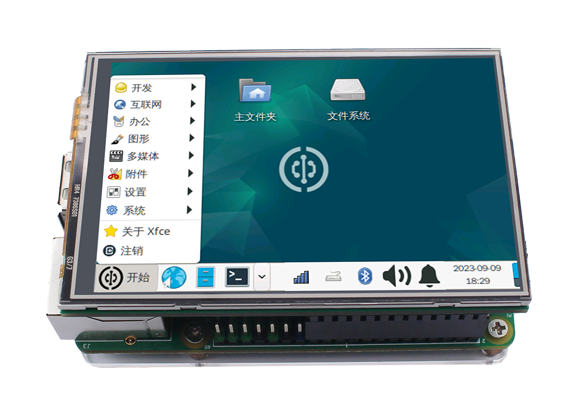
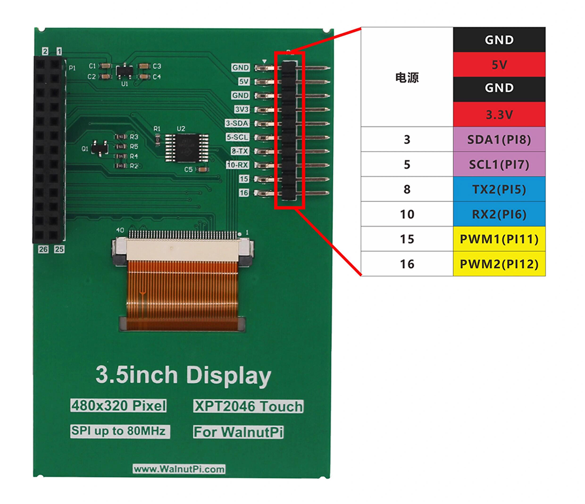

# 3.5-inch Display (Resistive Touch)

- **Video Tutorial**

<iframe src="//player.bilibili.com/player.html?isOutside=true&aid=1653352641&bvid=BV1cE421K7cG&cid=1512596512&p=1" scrolling="no" border="0" frameborder="no" framespacing="0" allowfullscreen="true" width="100%" height="500"></iframe>

<br></br>
<br></br>

The Walnut Pi official 3.5-inch display (resistive touch) uses the SPI bus with a maximum speed of 80MHz. The backlight is controllable, and the official driver supports system desktop display and other UI functions.

::::tip Note

The Walnut Pi does not currently support third-party Raspberry Pi 3.5-inch displays.

::::



The back side exposes GPIO pins via a patch ribbon cable connector, meaning that even when plugged into the Walnut Pi, you can still connect I2C, serial communication devices, and other modules.



|  Specifications |  |
|  :---:  | ---  |
| Resolution  | 480x320 (Pixels) |
| Interface  | 4-wire SPI (max speed: 80MHz)|
| Display IC  | st7796 |
| Touch Panel  | XPT2046 (Resistive Touch) |
| Operating Temperature  | -20℃ ~ 60℃ |
| Storage Temperature  | -30℃ ~ 70℃  |
| Dimensions  | 83x55mm  |
| Weight  | 75g  |

<br></br>

- Pinout:

|  Pin No. |  Label |  Description |
|  ---  | ---  |  ---  |
| 1, 17  | 3.3V | Power Positive (3.3V Input)|
| 2, 4   | 5V | Power Positive (5V Input) |
| 6, 9, 14, 20, 25  | GND | Power Ground |
| 11  | TP_IRQ | Touch Panel Interrupt, LOW when pressed |
| 18  | LCD_DC | Command/Data Select, LOW=Command, HIGH=Data |
| 19  | SPI_MOSI | LCD SPI Data Input |
| 21  | SPI_MISO | Touch Panel SPI Data Output |
| 22  | RST | Reset |
| 23  | SPI_CLK | LCD/Touch Panel Clock Signal |
| 24  | LCD_CS | LCD Chip Select, Active LOW |
| 26  | TP_CS | Touch Panel Chip Select, Active LOW |


## Enabling LCD Display

The Walnut Pi system already includes the relevant display drivers, supported on both Desktop and Server editions. Use the following command to enable desktop display (supports TAB auto-completion):

```bash
sudo set-lcd lcd35-st7796 install
```

After configuration, reboot the board:

```bash
sudo reboot
```

::::tip Note:
You can also configure this by modifying the `screen` parameter in /boot/config.txt: `screen=lcd35-st7796`. [config.txt Display Configuration Tutorial](../config.txt.md#display-configuration)
::::

**Unplug the HDMI cable**, wait patiently for the system to boot, and you will see the desktop interface on the LCD (Server edition displays the terminal), shown in the default orientation below:


<br></br>

::::tip Note

The above command works for both the Walnut Pi Desktop edition and Server edition (the Server edition will display the terminal). After making this configuration, if an HDMI display is also connected, the display will take priority. To show on the LCD, you must unplug the HDMI cable.

::::

## Setting LCD Display Orientation

Use the following command to set the display orientation, supporting angles of 0, 90, 180, and 270 degrees. The default is 270 degrees. For the Desktop edition, 270 or 90 is recommended, as portrait orientation can cause content to be truncated.

```bash
sudo set-lcd lcd35-st7796 set_rotate 270
```

## Disabling LCD Display

Use the following command to remove the LCD display function and boot from HDMI:

```bash
sudo set-lcd lcd35-st7796 remove
```

## Using on Raspberry Pi

The Walnut Pi 3.5-inch touch display provides a driver package adapted for Raspberry Pi. Once installed, it can be used on a Raspberry Pi. For detailed usage instructions, refer to the **README** in the project:

Project link: https://github.com/walnutpi/rpi-lcd


