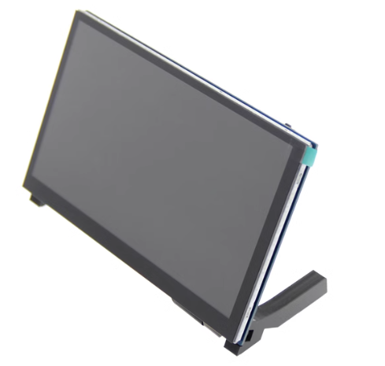
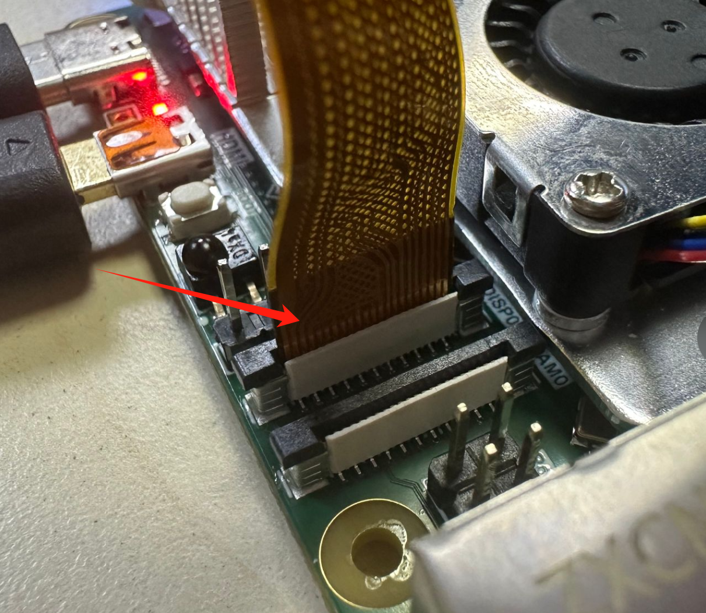
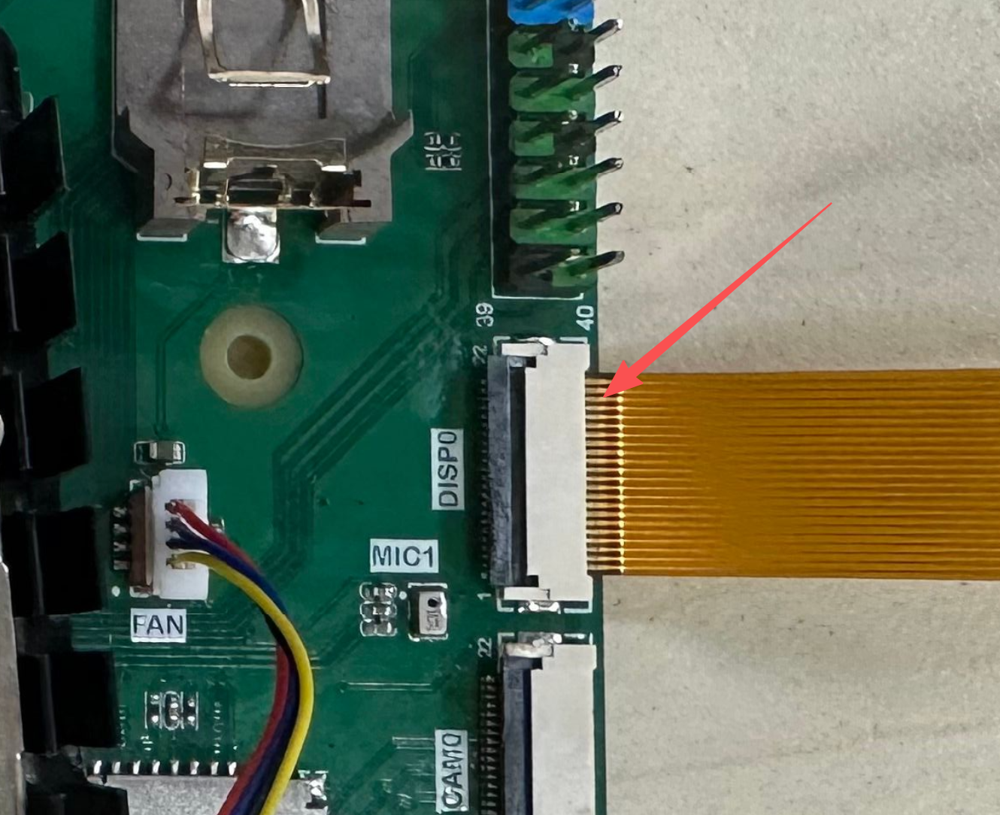
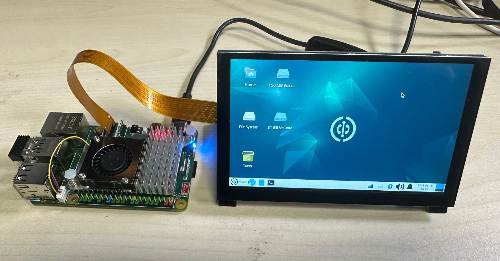
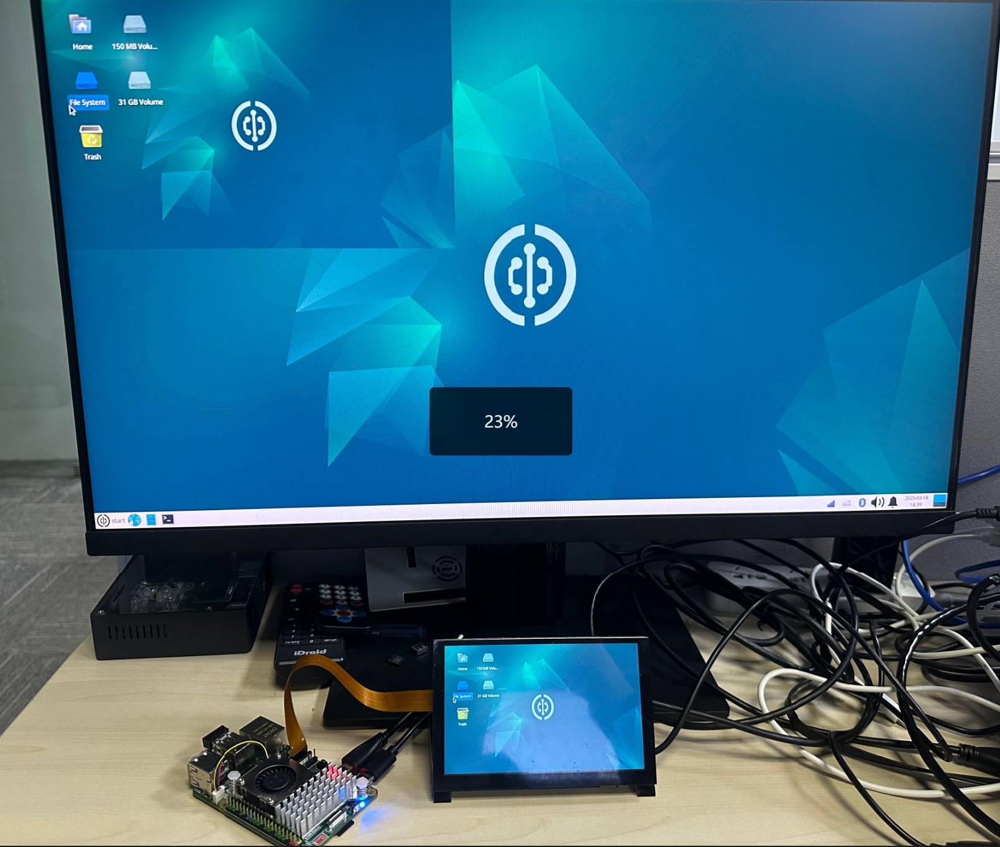
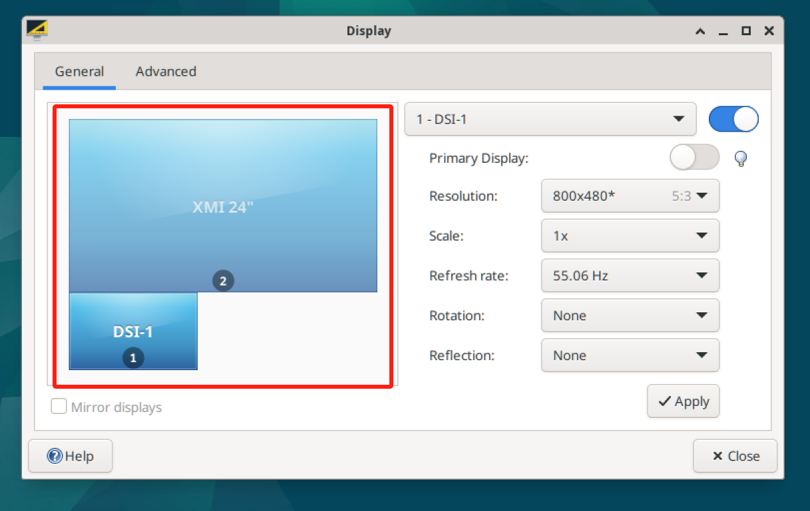

# Raspberry Pi MIPI Display

The Walnut Pi 2B system supports common third-party Raspberry Pi MIPI displays with a resolution of 800x480, available in 4.3-inch, 5-inch, and 7-inch sizes. [Buy now >>](https://item.taobao.com/item.htm?id=627655701617)



### Assembly

The Walnut Pi 2B's DSI interface is a 22-pin 4-lane connector, while most Raspberry Pi MIPI displays use a 15-pin connector. Therefore, you will need a 22-pin to 15-pin adapter ribbon cable for connection (usually provided by the display manufacturer).

Make sure to assemble with power disconnected. Lift the black latch on the Walnut Pi 2B connector, insert the ribbon cable with the gold fingers oriented as shown below, then push the latch down to secure it:



After assembly, it should look like this:


:::::tip
If you are using the CM2 IO baseboard, please insert the ribbon cable with the gold fingers facing up.


:::::

### Enabling LCD Display

The Walnut Pi system already includes the relevant display drivers, supported on both Desktop and Server editions. Use the following command to enable desktop display (supports TAB auto-completion):

```bash
sudo set-lcd dsi-800x480 install
```

After configuration, reboot the board:

```bash
sudo reboot
```

::::tip Note:
You can also configure this by modifying the `screen` parameter in /boot/config.txt: `screen=dsi-800x480`. [config.txt Display Configuration Tutorial](../config.txt.md#display-configuration)
::::

**The first reboot after configuration may take a bit longer.** After booting, it will appear as shown below:



**If no MIPI display is connected or detected after configuration, the system will determine that MIPI display loading has failed and will automatically reboot into the HDMI desktop.**

### Dual Display (Extended Desktop)

When both a MIPI display and HDMI are connected, the Walnut Pi Desktop edition automatically enters dual-display mode upon boot. By default, it mirrors the display as shown below:



You can configure extended display and other display modes through Settings - Display.


Example: In the image below, dragging the dsi-1 window below the HDMI display means that moving the mouse beyond the bottom-left of the HDMI display will enter the MIPI display—similar to extending a desktop on a PC.




::::tip Note
The Server edition only supports a single display mode.
::::

### Disabling LCD Display

Use the following command to remove the LCD display function and boot from HDMI:

```bash
sudo set-lcd dsi-800x480 remove
```
