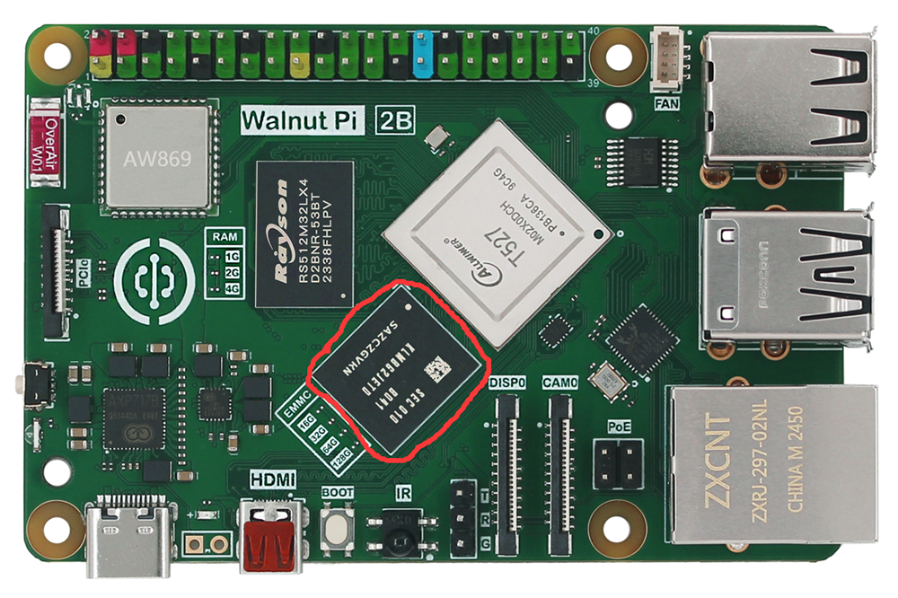
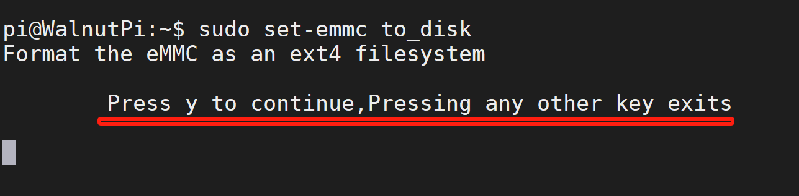
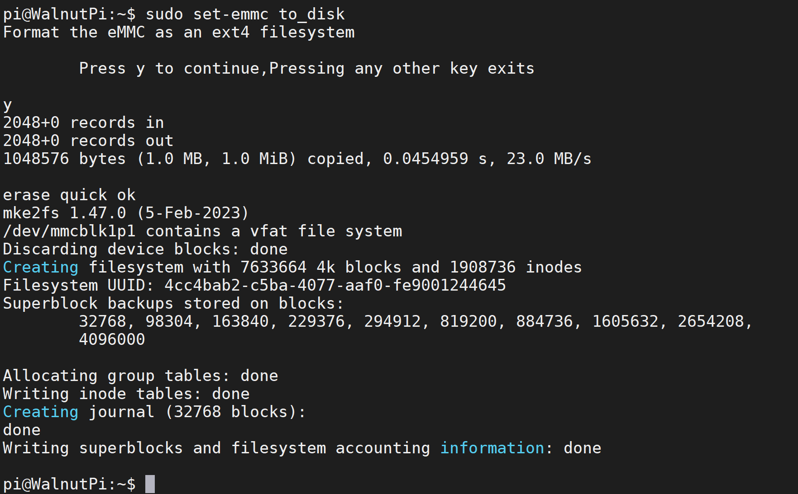
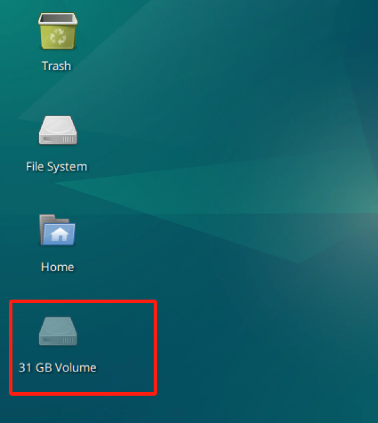
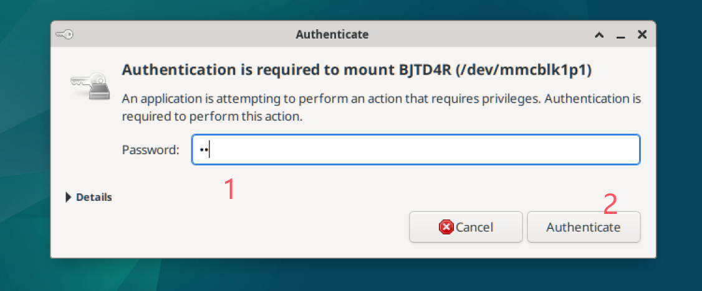

# EMMC Flash Storage

The Walnut Pi 2B is available with an optional EMMC flash storage version, with a default capacity of 32GB. It offers significantly faster transfer speeds compared to an SD card. It can be used to install the Walnut Pi system or as a storage drive.



## EMMC as a System Boot Drive

Burn the Walnut Pi OS to EMMC and boot from it. Refer to: [EMMC Image Burning Method](../getting_start/os-install.md#emmc-burning)

## EMMC as a Storage Drive

When the Walnut Pi 2B boots from an SD card, the EMMC can be configured as a storage drive, giving you a drive with approximately 32GB of capacity.

The Walnut Pi system includes a quick configuration command:

```bash
sudo set-emmc to_disk
```

::::danger Warning
This command configures the EMMC as a storage drive. It will format the EMMC and erase all content. Please back up any important files beforehand.
::::

After running the command, a confirmation prompt will appear. Press "y" to continue:



A successful configuration will appear as shown below:



You will see a ~32GB drive appear on the desktop.



Double-click to mount and use it. When the authentication prompt appears, enter the system password, i.e., `pi`.



## EMMC Formatting

Quick format (recommended):

```bash
sudo set-emmc erase-quick
```

Full format (will be very slow):

```bash
sudo set-emmc erase-overwrite
```
