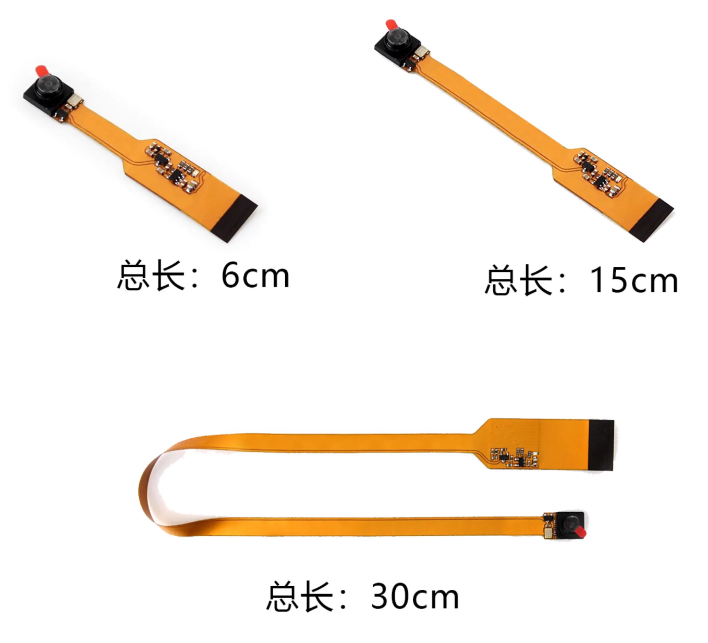
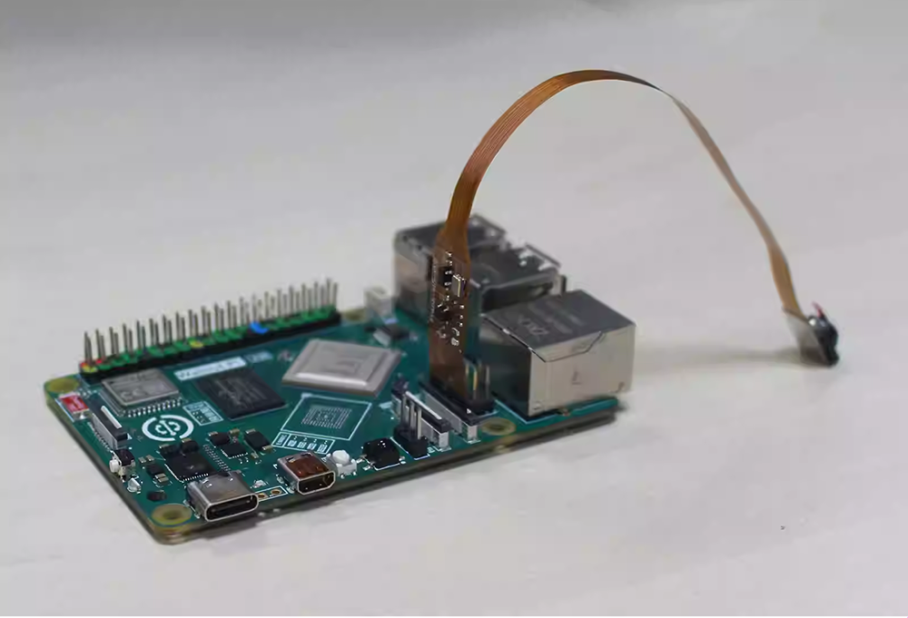

# MIPI摄像头

:::tip 提示:
本节教程功能需要使用核桃派2B V1.6.0以上系统版本。
:::

核桃派2B拥有1路MIPI CSI接口（1x4 lane CSI，兼容2 lane）。可外接MIPI 摄像头，最大支持4K@60fps。接口定义兼容树莓派。


## OV5647

OV5647是各类开发板常用的一款MIPI摄像头，500万像素，性价比较高。[**点击购买>>**](https://item.taobao.com/item.htm?id=1012360780818)



### 产品参数

|  产品参数 |
|  :---:  | ---  |
| 感光芯片  | OV5647 |
| 像素 | 500万 |
| 接口 | MIPI CSI 2lane |
| 视场角  | 72° / 120° (可选) | 
| 接口  | 22P-0.5mm FPC |

|  外观规格 |
|  :---:  | ---  |
| 尺寸  | 6cm/15cm/30cm 长度可选 |

### 使用说明

先将摄像头接入到核桃派2B的MIPI CSI接口。注意金手指方向如下图所示：




然后启动核桃派系统，系统检测到摄像头接入会自动加载相关驱动。

## 获取设备信息

先使用v4l2-ctl查看当前mipi摄像头设备信息，这要安装 v4l ，核桃派大部分软件都可以通过 sudo apt install 方式安装：

```bash
sudo apt install v4l-utils
```

安装完成后运行下面指令查看插入的USB摄像头信息：

```bash
v4l2-ctl --list-devices
```

这里的 sunxi-vin() 就是核桃派2B的MIPI摄像头，编号为 video0 ;


:::tip 提示
当前MIPI摄像头需要用到主控的ISP（图像信号处理器）只支持`video0`设备，如果同时插入USB摄像头和MIPI摄像头开机，系统会优先分配video0给USB摄像头从而导致MIPI摄像头无法使用。因此针对需要同时使用MIPI和USB摄像头的情景，请先接入Mipi摄像头等系统启动后再插入USB摄像头，保证MIPI摄像头的编号为`video0`即可。
:::

## 测试摄像头

这里可以基于OpenCV代码进行快速测试。

```python
'''
实验名称：MIPI摄像头使用
实验平台：核桃派2B
说明：通过openmv库读取MIPI摄像头
注意事项：确保MIPI摄像头设备编号为video0，即上电后第一个加载的video设备。
（如需同时使用USB摄像头，USB摄像头请在系统启动后插入）
'''

import cv2
from walnutpi import isp

cam = cv2.VideoCapture(0) # 打开摄像头，确认好编号。video0

# 声明摄像头使用的是NV12格式进行传输
cam.set(cv2.CAP_PROP_FOURCC, cv2.VideoWriter.fourcc('N','V','1','2')) 
isp.start(camera=0) # 与上方摄像头编号一致。video0

# 设置分辨率,不设置默认为640x480
#cam.set(cv2.CAP_PROP_FRAME_WIDTH, 1920)
#cam.set(cv2.CAP_PROP_FRAME_HEIGHT, 1080)

while (cam.isOpened()): # 确认被打开
    
    retval, img = cam.read() # 从摄像头中实时读取图像
    
    cv2.imshow("Video", img) # 在窗口中显示读取到的图像
    
    key = cv2.waitKey(1) # 窗口的图像刷新时间为1毫秒，防止阻塞
    
    if key == 32: # 如果按下空格键，打断
        break
    
capture.release() # 关闭摄像头
cv2.destroyAllWindows() # 销毁显示摄像头视频的窗口
```

运行代码，可以看到实验结果如下：


上述代码和 [OpenCV USB 摄像头](../opencv/usb_cam.md) 的主要区别是 MIPI摄像头使用了T527内部的ISP(Image Signal Processor)，即图像信号处理器，实现各种功能。核桃派2B系统已经将ISP库封装后，通过下面代码调用：

**相比于USB摄像头，需要增加如下代码：**

- 导入ISP相关库：
```python
from walnutpi import isp
```

- 声明摄像头使用的是NV12格式进行传输
```python
cam.set(cv2.CAP_PROP_FOURCC, cv2.VideoWriter.fourcc('N','V','1','2')) 
```

- 开启ISP功能
```python
isp.start(camera=0) # 与上方摄像头编号一致。video0
```

更多OpenCV教程案例请看 [OpenCV](../opencv/intro.md) 章节内容。


