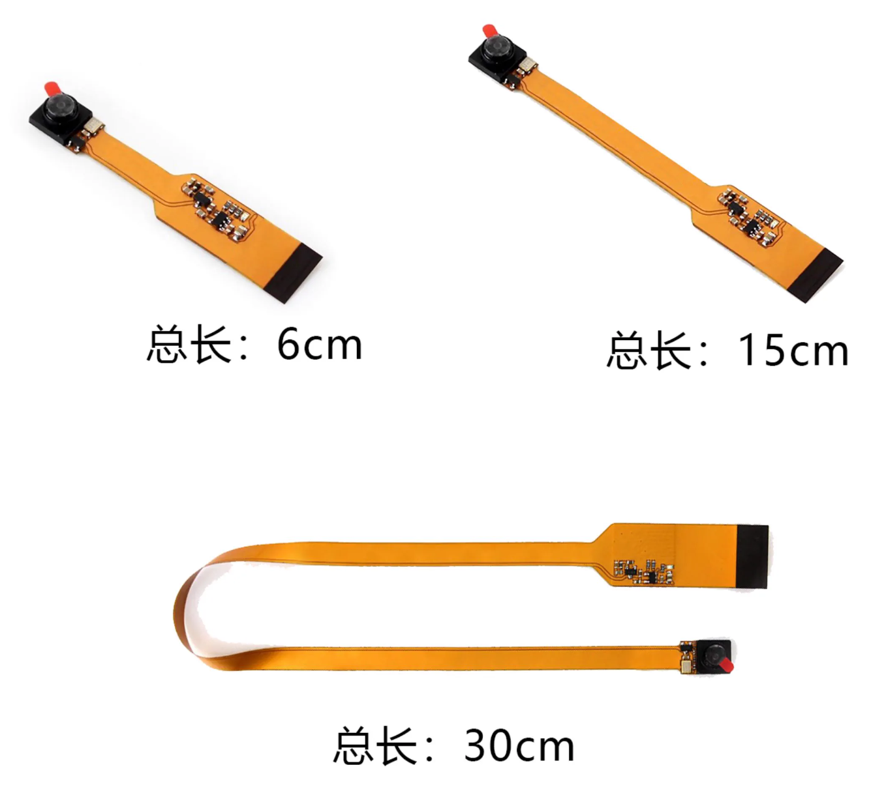
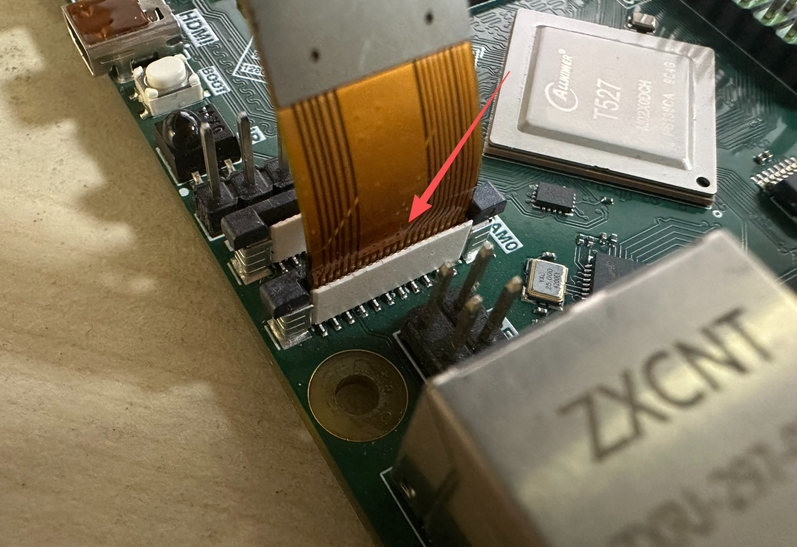
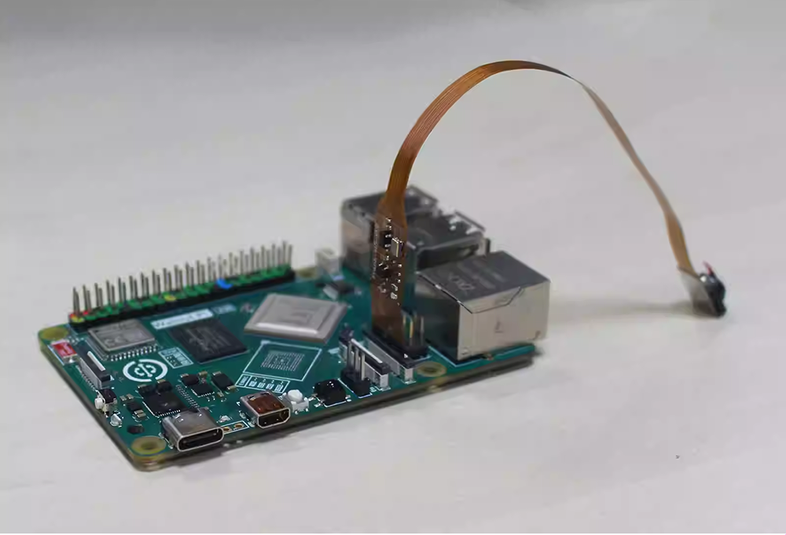
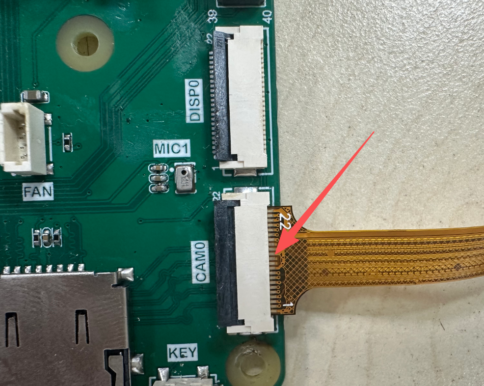
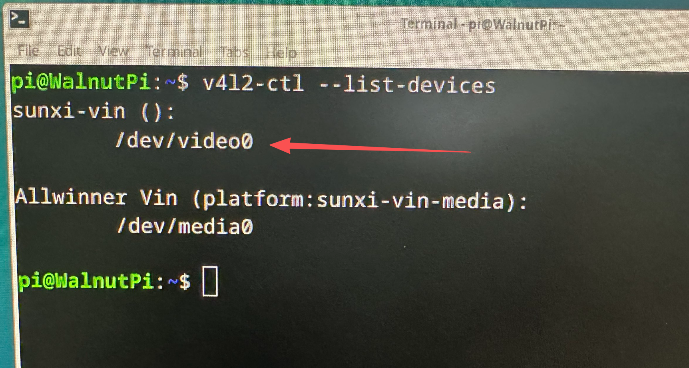

# MIPI Camera

::::tip Note:
This tutorial requires Walnut Pi 2B system version V1.6.0 or later.
::::

The Walnut Pi 2B has 1 MIPI CSI interface (1x4 lane CSI, 2 lane compatible), which can connect external MIPI cameras with support up to 4K@60fps. The interface definition is compatible with Raspberry Pi.


## OV5647

The OV5647 is a commonly used MIPI camera on various development boards, featuring 5 megapixels and high cost-effectiveness. [**Click to buy >>**](https://item.taobao.com/item.htm?id=1012360780818)



### Specifications

|  Specifications |  |
|  :---:  | ---  |
| Sensor  | OV5647 |
| Pixels | 5MP |
| Interface | MIPI CSI 2 lane |
| Field of View  | 72° / 120° (Optional) |
| Connector  | 22P-0.5mm FPC |

|  Physical Specifications |  |
|  :---:  | ---  |
| Dimensions  | 6cm/15cm/30cm cable length options |

### Usage Instructions

First, connect the camera to the Walnut Pi 2B's MIPI CSI interface. Ensure the gold fingers are oriented as shown below:





Then power on the Walnut Pi system. The system will automatically load the relevant drivers upon detecting the camera connection.

:::::tip
If you are using the CM2 IO baseboard, please insert the ribbon cable with the gold fingers facing up.


:::::

## Getting Device Information

First, use `v4l2-ctl` to view the current MIPI camera device information. Install v4l—most Walnut Pi software can be installed via `sudo apt install`:

```bash
sudo apt install v4l-utils
```

After installation, run the following command to view the connected USB camera information:

```bash
v4l2-ctl --list-devices
```

Here, `sunxi-vin()` is the Walnut Pi 2B's MIPI camera, assigned as video0:



::::tip Note
The current MIPI camera requires the chipset's ISP (Image Signal Processor) and only supports the `video0` device. If both a USB camera and a MIPI camera are connected at boot, the system will prioritize assigning video0 to the USB camera, preventing the MIPI camera from functioning. Therefore, when using both MIPI and USB cameras simultaneously, connect the MIPI camera first, wait for the system to boot, and then plug in the USB camera to ensure the MIPI camera is assigned to `video0`.
::::

## Testing the Camera

You can quickly test it using OpenCV code:

```python
'''
Experiment: MIPI Camera Usage
Platform: Walnut Pi 2B
Description: Read the MIPI camera using the OpenCV library
Note: Ensure the MIPI camera is assigned to video0, i.e., the first video device loaded at boot.
(If using a USB camera simultaneously, plug it in after the system boots)
'''

import cv2
from walnutpi import isp

cam = cv2.VideoCapture(0) # Open camera, confirm the device number. video0

# Declare that the camera uses NV12 format for transfer
cam.set(cv2.CAP_PROP_FOURCC, cv2.VideoWriter.fourcc('N','V','1','2')) 
isp.start(camera=0) # Matches the camera device number above. video0

# Set resolution, defaults to 640x480 if not set
#cam.set(cv2.CAP_PROP_FRAME_WIDTH, 1920)
#cam.set(cv2.CAP_PROP_FRAME_HEIGHT, 1080)

while (cam.isOpened()): # Confirm it is opened
    
    retval, img = cam.read() # Read image from camera in real time
    
    cv2.imshow("Video", img) # Display the captured image in a window
    
    key = cv2.waitKey(1) # Window refresh interval of 1ms to prevent blocking
    
    if key == 32: # If the spacebar is pressed, quit
        break
    
capture.release() # Close the camera
cv2.destroyAllWindows() # Destroy the camera video window
```

Run the code to see the results as shown below:


The main difference between the above code and [OpenCV USB Camera](../opencv/usb_cam.md) is that the MIPI camera uses the T527's internal ISP (Image Signal Processor) to implement various functions. The Walnut Pi 2B system has encapsulated the ISP library and calls it with the following code:

**Compared to a USB camera, the following additional code is needed:**

- Import the ISP-related library:
```python
from walnutpi import isp
```

- Declare that the camera uses NV12 format for transfer:
```python
cam.set(cv2.CAP_PROP_FOURCC, cv2.VideoWriter.fourcc('N','V','1','2')) 
```

- Enable ISP functionality:
```python
isp.start(camera=0) # Matches the camera device number above. video0
```

For more OpenCV tutorial examples, see the [OpenCV](../opencv/intro.md) chapter.
