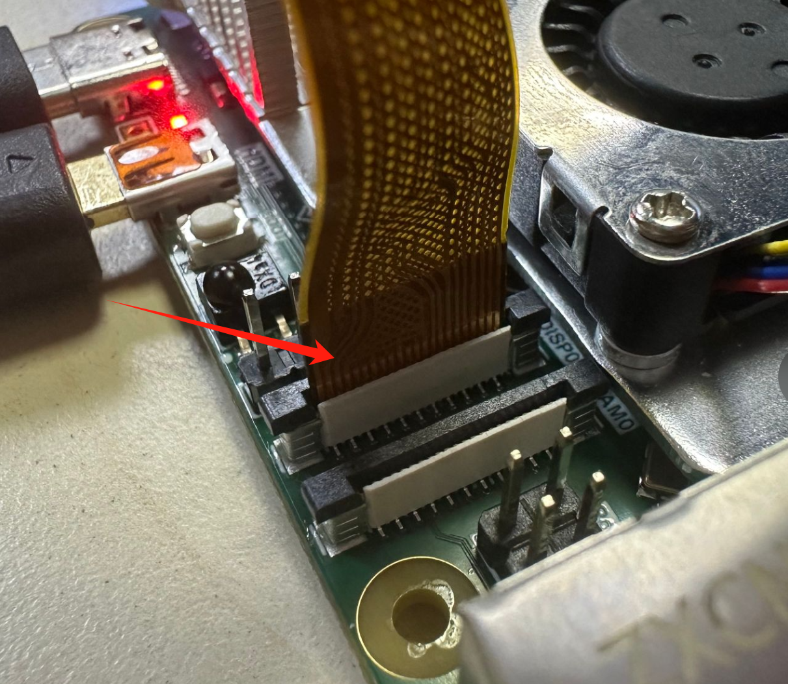

# MIPI显示屏

:::tip 提示:
本节教程功能需要使用核桃派2B V1.2.0以上系统版本。
:::

核桃派2B拥有1 MIPI DSI接口（1x4 lane CSI，兼容2 lane）。可外接MIPI显示屏，支持1080P@60fps。接口定义兼容树莓派。


## 树莓派MIPI屏

核桃派2B系统适配了当前市面上分辨率为800x480的树莓派MIPI屏，, 有4.3寸、5寸和7寸可以选购。[购买连接>>](https://item.taobao.com/item.htm?id=627655701617)


核桃派2B的DSI是22P 4Lane 接口，大部分树莓派MIPI屏是15Pin接口，因此你需要一根22P转15P排线用于连接（通常屏厂家会提供）。

记得要断电组装，将核桃派2B座子黑色卡扣提起，排线金手指如下图所示方向插入，然后下压卡扣锁紧：



组装后如下图：


### 开启LCD显示功能

核桃派系统已经带了相关显示屏驱动，桌面版和无桌面版均支持。使用下面指令即可开启显示桌面：（该指令支持TAB键补全）

```bash
sudo set-lcd dsi-800x480 install
```

配置成功后重启开发板：

```bash
sudo reboot
```

:::tip 提示：
也可以通过修改 /boot/config.txt文件下的screen参数来配置 `screen=dsi-800x480`。[config.txt显示屏配置教程](./config.txt.md#显示屏配置)
:::

**配置完成后首次重启时间会久一点。**启动后如下图：


**如果配置后没有插入mipi显示屏或者没检测到mipi显示屏，系统判断加载mipi屏失败将自动重启并从hdmi进入桌面。**

### 关闭LCD显示功能

使用下面指令可移除LCD显示功能，从HDMI启动：

```bash
sudo set-lcd dsi-800x480 remove
```

## 双屏异显

当同时接入MIPI屏和HDMI时，核桃派桌面版系统启动后自动进入双屏模式。默认同屏显示，如下图所示：


可以通过setting - display 设置异显等任意显示模式。


例：下图将dsi-1窗口拖到HDMI显示器下方，表示将鼠标移动并超出HDMI显示器左下方就能进入MIPI显示屏。跟电脑扩屏类似。


:::tip 提示
无桌面版系统只支持单一显示器显示。
:::


