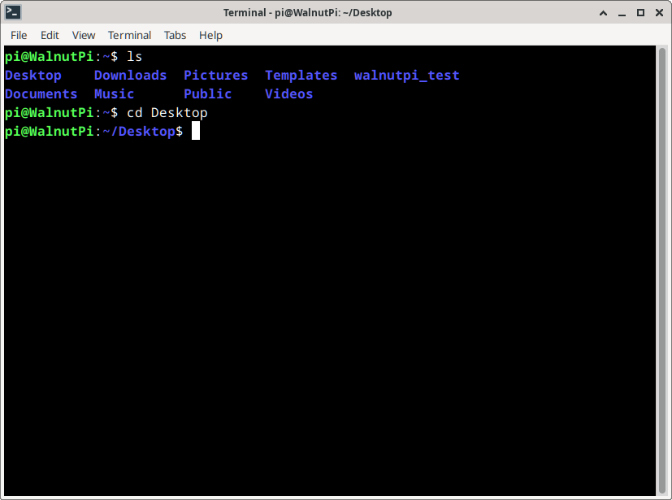
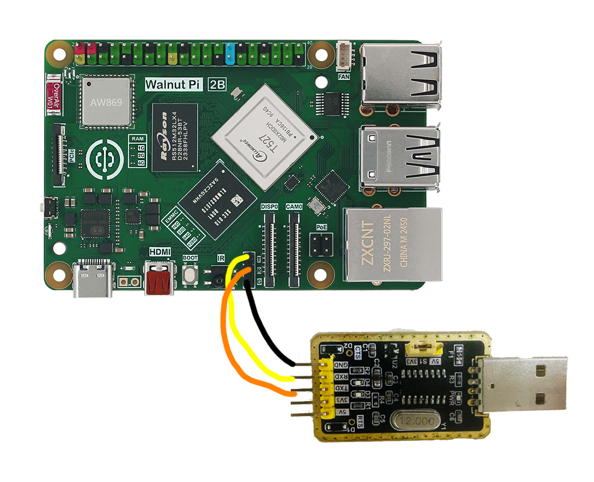
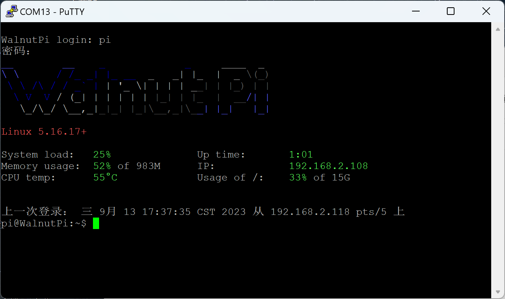
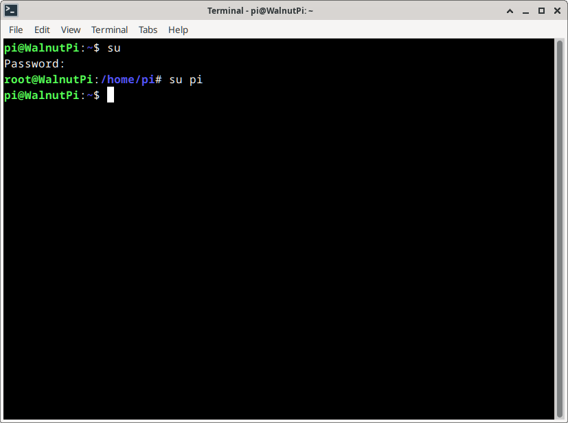

# Terminal and Common Commands

## Opening Terminal on Desktop Edition
The terminal traces back to the early days of computing when there was no visual desktop, and most computer operations were performed via terminal commands. Even today, we still use terminals in many scenarios and for debugging. Mastering common Linux terminal commands can greatly boost your development efficiency. **(The Server edition only displays this terminal after booting.)**

Click the third item **"Terminal"** in the Launch Bar to open the terminal. **Browser, File Manager, Terminal**


The first thing you see in the terminal is the prompt, waiting for your input. The prompt looks like this:

<font color='#06fe00'>pi@WalnutPi</font>:~$

pi indicates the username;

WalnutPi after @ indicates the hostname;

~ indicates the current directory;

**$** indicates a non-privileged user.

Let's do a simple terminal test. Type `ls` and press Enter to see the files and folders listed in the current directory (**The Server edition's pi directory has no files by default**):
```bash
ls
```


Type `cd Desktop` and press Enter to see the current directory change to Desktop:
```bash
cd Desktop
```


## Opening Terminal via Debug Serial Port

Connect to the Walnut Pi's reserved serial terminal header pins using a USB-to-TTL adapter to your computer, then use terminal software like PuTTY to log in:

The debug serial header pins on the Walnut Pi 2B are labeled T, R, G, corresponding to TXD, RXD, and GND respectively.

::::tip Note

You can use this feature to observe boot information when the system fails to boot normally. Note that TX and RX are cross-connected. USB TTL adapters with voltage switching must be set to 3.3V.

::::



Check the COM port number in Device Manager:


Open PuTTY:


Enter the COM port number found for your computer, set the baud rate to 115200, then click Open:


You will then see a login prompt. Enter "pi" for both username and password. **If nothing appears, try pressing the Enter key**. Upon successful login, the Walnut Pi terminal information will appear.



## User Switching
The Walnut Pi system has 2 preset users:
- **Normal User (Desktop Edition Default)** Username: pi Password: pi
- **Root** Username: root Password: root

Some terminal commands require root privileges. You can execute them using **sudo + command** in the terminal. To switch directly to the root account in the terminal, use the `su` command.

**Switch to root:** Type `su` in the terminal, press Enter, then enter the password **root** when prompted at Password: (the password will not be displayed; pay attention to case). Press Enter again to switch to the root user.
```bash
su
```


**Switch to a normal user:** Type `su` followed by the username and press Enter. For example, to switch to the pi user:
```bash
su pi
```


## Common Linux Commands

|  # | Command | Full Name | Function |  
|  :---:  | :---:  | ---  | ---  |
| 1  | ls | list | List files in the current directory |
| 2  | pwd | print working directory | Print the current directory |
| 3  | cd | change directory | Change directory |
| 4  | mkdir | make directory | Create a new directory |
| 5  | cat | concatenate | Display or concatenate file contents |
| 6  | rm | remove | Delete files |
| 7  | rmdir | remove directory | Delete directories |
| 8  | mv | move | Move/rename files or directories |
| 9  | cp | copy | Copy files or directories |
| 10  | echo |   | Display input content in the terminal |
| 11  | date |  | Read system date and time |
| 12  | grep | global search regular <br/> expression and print | Search for a pattern and print matching lines |
| 13  | man | manual  | Display command manual |
| 14  | sudo | super user do | Execute with root privileges |
| 15  | chmod | change mode | Change file read/write permissions |
| 16  | ./program |   | Run the program executable |
| 17  | apt | advance package tool | Install/remove software packages |
| 18  | exit |  | Exit |
| 19  | reboot |   | Reboot |
| 20 | poweroff |  | Shutdown |
