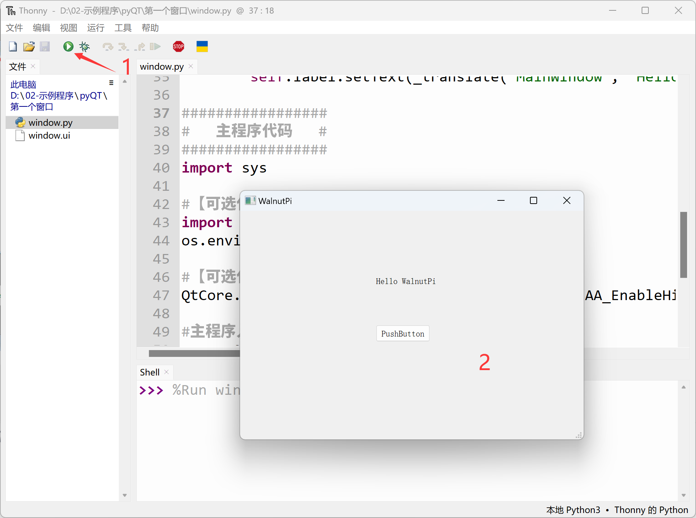
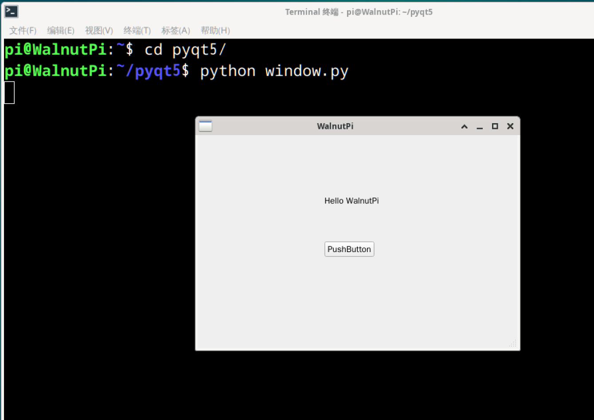
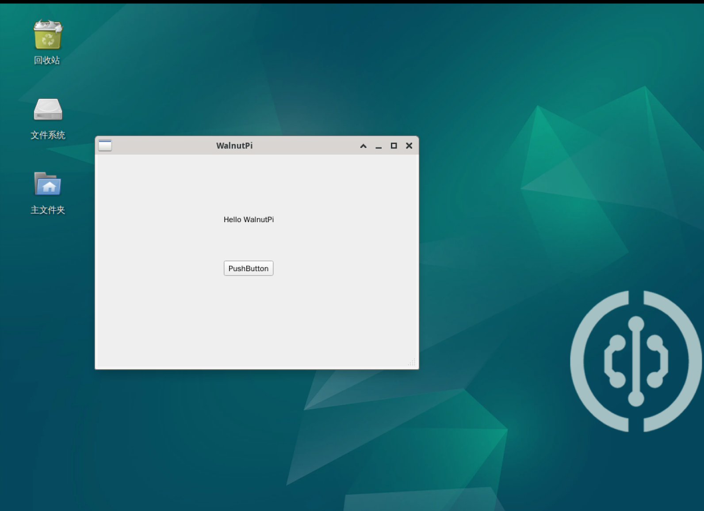
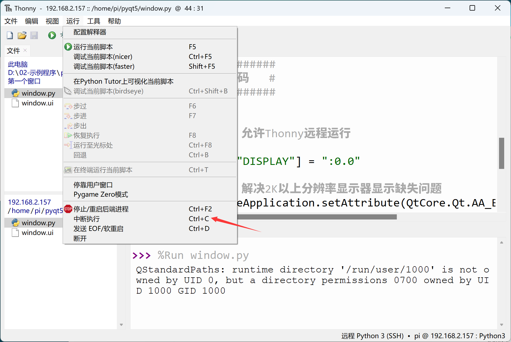
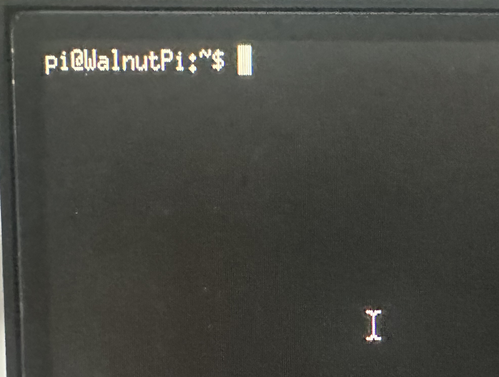

# Code Writing and Execution

## WalnutPi Local

In the previous section, we designed the UI window using Qt Designer and converted it to Python code. Since this is Python programming, we can open the Python code on the WalnutPi development board for programming.

On WalnutPi, it is recommended to use Thonny for writing Python files. Refer to: [**Thonny IDE**](../python/python_run#thonny-ide).

Open the window.py file generated in the previous section and add the following program entry code at the end. The complete code after adding is as follows:

```python
# -*- coding: utf-8 -*-

# pyQT5 For WalnutPi

from PyQt5 import QtCore, QtGui, QtWidgets

class Ui_MainWindow(object):
    def setupUi(self, MainWindow):
        MainWindow.setObjectName("MainWindow")
        MainWindow.resize(480, 320)
        self.centralwidget = QtWidgets.QWidget(MainWindow)
        self.centralwidget.setObjectName("centralwidget")
        self.pushButton = QtWidgets.QPushButton(self.centralwidget)
        self.pushButton.setGeometry(QtCore.QRect(190, 160, 75, 23))
        self.pushButton.setObjectName("pushButton")
        self.label = QtWidgets.QLabel(self.centralwidget)
        self.label.setGeometry(QtCore.QRect(190, 90, 91, 16))
        self.label.setObjectName("label")
        MainWindow.setCentralWidget(self.centralwidget)
        self.menubar = QtWidgets.QMenuBar(MainWindow)
        self.menubar.setGeometry(QtCore.QRect(0, 0, 480, 22))
        self.menubar.setObjectName("menubar")
        MainWindow.setMenuBar(self.menubar)
        self.statusbar = QtWidgets.QStatusBar(MainWindow)
        self.statusbar.setObjectName("statusbar")
        MainWindow.setStatusBar(self.statusbar)

        self.retranslateUi(MainWindow)
        QtCore.QMetaObject.connectSlotsByName(MainWindow)

    def retranslateUi(self, MainWindow):
        _translate = QtCore.QCoreApplication.translate
        MainWindow.setWindowTitle(_translate("MainWindow", "WalnutPi"))
        self.pushButton.setText(_translate("MainWindow", "PushButton"))
        self.label.setText(_translate("MainWindow", "Hello WalnutPi"))

#################
#   Main Program Code   #
#################
import sys

#【Optional Code】Allow Thonny remote execution
import os
os.environ["DISPLAY"] = ":0.0"

#【Optional Code】Fix display issues on monitors with 2K+ resolution
QtCore.QCoreApplication.setAttribute(QtCore.Qt.AA_EnableHighDpiScaling)

# Program entry point: build the window and display it
app = QtWidgets.QApplication(sys.argv)
MainWindow = QtWidgets.QMainWindow() # Build window object
ui = Ui_MainWindow() # Build PyQt5-designed window object
ui.setupUi(MainWindow) # Initialize window
MainWindow.show() # Display window

#【Recommended Code】Allow terminal to interrupt window with ctrl+c for easier debugging
import signal
signal.signal(signal.SIGINT, signal.SIG_DFL)
timer = QtCore.QTimer()
timer.start(100)  # You may change this if you wish.
timer.timeout.connect(lambda: None)  # Let the interpreter run each 100 ms

sys.exit(app.exec_()) # Exit process when program closes

```

Click the run button in Thonny on the WalnutPi desktop, and you will see the first window we designed in the previous section pop up. (Terminal warnings can be ignored.)



You can also run the modified window.py file via the python command in the terminal, with the same result.



Clicking the close button on the window will terminate the process. For windows without a close button, you can press Ctrl+C in the terminal to interrupt the window process.

:::tip Note

Since PyQt5 is cross-platform compatible, operations on Windows locally are exactly the same as above.

:::

## Thonny Remote Development (Based on Windows)

Above, we used the Thonny IDE within the WalnutPi system for programming. Similarly, we can use the Thonny IDE on Windows to remotely connect to WalnutPi for Python programming. The WalnutPi factory system comes with the SSH service pre-installed, allowing remote control via SSH. This method is suitable for remote development using your own computer. For the remote method, refer to the Python embedded programming section: [Thonny Remote](../python/python_run#thonny-remote-connection-windows-based). This will not be repeated here.

Note that when using Thonny remotely, you must include the following code for it to run properly:

```python
# Allow Thonny remote execution
import os
os.environ["DISPLAY"] = ":0.0"
```

Remotely open the window.py file on WalnutPi (the complete code above) and click run:


The window will then pop up on the WalnutPi development board's desktop.



You can exit the window program by going to the Thonny main menu **Run--Interrupt** or pressing ctrl+c in the bottom terminal.




## Display via 3.5-inch LCD

The above method can display on both the WalnutPi HDMI monitor and the 3.5-inch LCD. For instructions on using the 3.5-inch display, see: [3.5-inch Touch Display](../os_software/display/3.5_LCD.md)


## Running PyQt5 Without a Desktop System

For a headless (non-desktop) system, you need to enable the **xterm terminal with mouse support** to enter QT debugging mode.

```bash
sudo systemctl enable lightdm.service
```

A reboot is required after execution for it to take effect:
```bash
sudo reboot
```

After rebooting, it automatically logs into pi. The command line is in the upper left corner, and you can see the mouse cursor, as shown below:



At this point, you can run PyQt5 Python code locally or remotely:


The following command can disable this feature:
```bash
sudo systemctl disable lightdm.service
```

A reboot is also required to return to normal terminal mode:
```bash
sudo reboot
```
