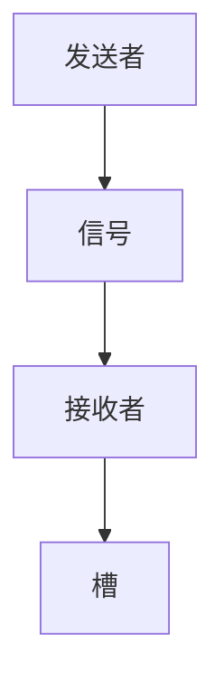
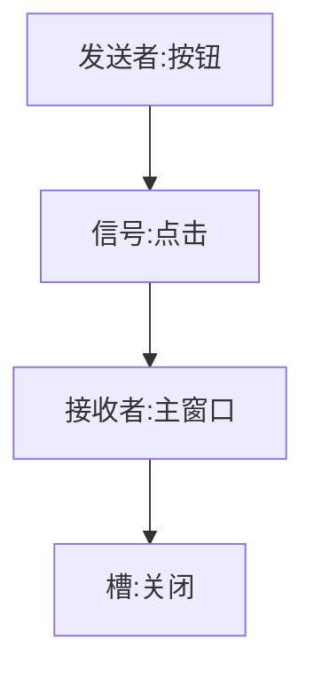
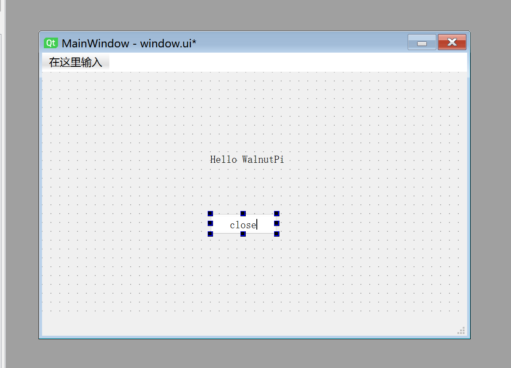
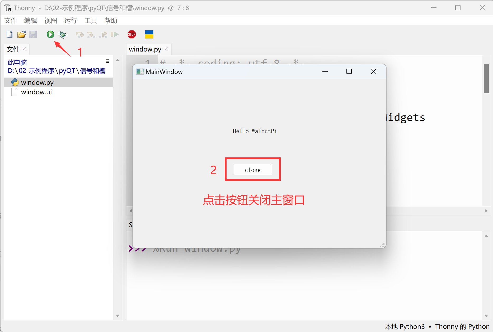

# 信号和槽

## 什么是信号和槽

信号（signal）和槽（slot）是PyQt5对象之间通讯纽带。一个完整的信号和槽流程有4个内容：**发送者、信号、接收者、槽。**他们之间最简单的流程如下：



<br></br>

举个例子：在前面第一个窗口章节内容我们新建了按键，但它是孤立的，也就是点击按键不会有任何反应。
<br></br>


这时候如果我们希望点击按键后关闭当前窗口，那么就可以通过编辑它们的信号和槽来实现。上面的流程图则变成了：



<br></br>

由此不难理解信号和槽机制主要就是给QObject对象（控件和窗口）使用，发送者发出的信号可以理解成是动作（点击），接收者接收到信号后执行相应的槽函数（关闭窗口）。

**PyQt5中信号与槽特点：**

- 一个信号可以发送给多个槽。
- 一个槽可以接收多个信号。

## 信号和槽编辑

我们使用信号和槽实现点击按钮关闭主窗口的功能：

使用Qt Designer打开上一节**第一个窗口**保存的window.ui文件。


双击PushButton按钮，将按钮名称改成close：



接下来点击菜单栏**编辑--编辑信息/槽**


接下来注意：用鼠标点击按钮不放开，拖动到窗口空白的地方，然后再放手，松开后如下图：


这时候会弹出一个设置对话框，勾选左下角的**继承信号和槽**：


左边为按钮控件，点击**clicked()** ； 右边为主窗口，点击**close()** ，然后点击OK。


可以看到主窗口和右下角信号/槽编辑器位置都出现了刚刚配置的信息：


保存窗口，在文件目录使用终端执行下面指令将window.ui文件转成py文件：

```bash
python -m PyQt5.uic.pyuic window.ui -o window.py
```

打开window.py，添加主程序代码，添加后完整代码如下：

```python
# -*- coding: utf-8 -*-

# pyQT5 For WalnutPi

from PyQt5 import QtCore, QtGui, QtWidgets

#【可选代码】允许Thonny远程运行
import os
os.environ["DISPLAY"] = ":0.0"

class Ui_MainWindow(object):
    def setupUi(self, MainWindow):
        MainWindow.setObjectName("MainWindow")
        MainWindow.resize(480, 320)
        self.centralwidget = QtWidgets.QWidget(MainWindow)
        self.centralwidget.setObjectName("centralwidget")
        self.pushButton = QtWidgets.QPushButton(self.centralwidget)
        self.pushButton.setGeometry(QtCore.QRect(190, 160, 75, 23))
        self.pushButton.setObjectName("pushButton")
        self.label = QtWidgets.QLabel(self.centralwidget)
        self.label.setGeometry(QtCore.QRect(190, 90, 91, 16))
        self.label.setObjectName("label")
        MainWindow.setCentralWidget(self.centralwidget)
        self.menubar = QtWidgets.QMenuBar(MainWindow)
        self.menubar.setGeometry(QtCore.QRect(0, 0, 480, 22))
        self.menubar.setObjectName("menubar")
        MainWindow.setMenuBar(self.menubar)
        self.statusbar = QtWidgets.QStatusBar(MainWindow)
        self.statusbar.setObjectName("statusbar")
        MainWindow.setStatusBar(self.statusbar)

        self.retranslateUi(MainWindow)
        self.pushButton.clicked.connect(MainWindow.close) # 信号和槽定义
        QtCore.QMetaObject.connectSlotsByName(MainWindow)

    def retranslateUi(self, MainWindow):
        _translate = QtCore.QCoreApplication.translate
        MainWindow.setWindowTitle(_translate("MainWindow", "MainWindow"))
        self.pushButton.setText(_translate("MainWindow", "close"))
        self.label.setText(_translate("MainWindow", "Hello WalnutPi"))

#################
#   主程序代码   #
#################
import sys

#【可选代码】允许Thonny远程运行
import os
os.environ["DISPLAY"] = ":0.0"

#【可选代码】解决2K以上分辨率显示器显示缺失问题
QtCore.QCoreApplication.setAttribute(QtCore.Qt.AA_EnableHighDpiScaling)

#主程序入口，构建窗口并显示
app = QtWidgets.QApplication(sys.argv)
MainWindow = QtWidgets.QMainWindow() #构建窗口对象
ui = Ui_MainWindow() #构建pyQT5设计的窗口对象
ui.setupUi(MainWindow) #初始化窗口
MainWindow.show() #显示窗口

#【建议代码】允许终端通过ctrl+c中断窗口，方便调试
import signal
signal.signal(signal.SIGINT, signal.SIG_DFL)
timer = QtCore.QTimer()
timer.start(100)  # You may change this if you wish.
timer.timeout.connect(lambda: None)  # Let the interpreter run each 100 ms

sys.exit(app.exec_()) #程序关闭时退出进程

```

从上面代码可以看到，增加的代码就是下面这句，实现了按钮和主窗口之间的信号和槽：

```python

self.pushButton.clicked.connect(MainWindow.close) # 信号和槽定义

```

运行代码，在弹出的窗口中点击**close**按钮，可以看到窗口被关闭。

