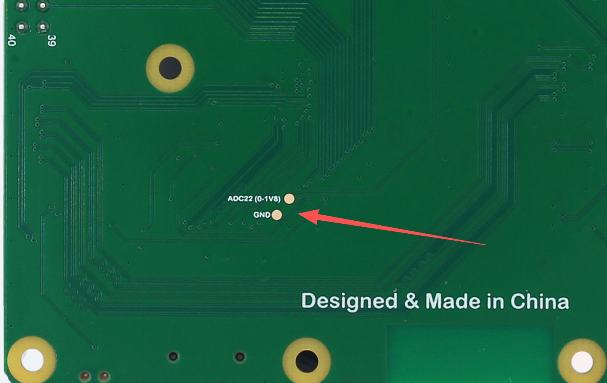
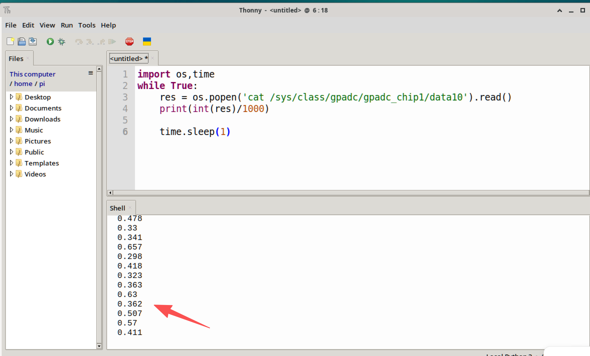

# ADC (Voltage Measurement)

## Introduction

ADC (analog to digital conversion) converts analog signals into digital signals. Since a single-board computer can only recognize binary numbers, external analog signals are often converted through an ADC into digital information it can recognize. A common application is converting a varying voltage into a digital signal to measure the voltage value.

It can be used to measure battery level or other related ADC input devices.

## Experiment Objective

Use Python programming to implement ADC measurement.

## Experiment Explanation

Currently, only the [CM2 Compute Module](../../intro/hw-parameter.md#walnut-pi-cm2) has an ADC pin: ADC22. **Note that the range is only 1.8V. For voltages beyond this, add an external resistor divider circuit.**


There is a pad on the back of the IO baseboard. You can solder wires to it for testing.



You can get the ADC22 voltage value in real time using the following terminal command:

```bash
cat /sys/class/gpadc/gpadc_chip1/data10
```

Divide the obtained value by 1000 to get the actual voltage value. As shown in the figure below, the voltage value is 0.409V (there will be fluctuations when left floating).


## Reference Code

In Python, you can use the [Calling Terminal Commands from Python](../skills/command.md) method to obtain the voltage value.

```python
import os, time

while True
    res = os.popen('cat /sys/class/gpadc/gpadc_chip1/data10').read()
    print(int(res)/1000) # Divide the result by 1000 to get the actual voltage value
    
    time.sleep(1)
```

## Experiment Result

Run the Python code above, and you will see the ADC sampling result printed every second.



::::danger
The maximum range is 1.8V. Do not input a voltage exceeding the 1.8V range, otherwise the main chip may be damaged.
::::
