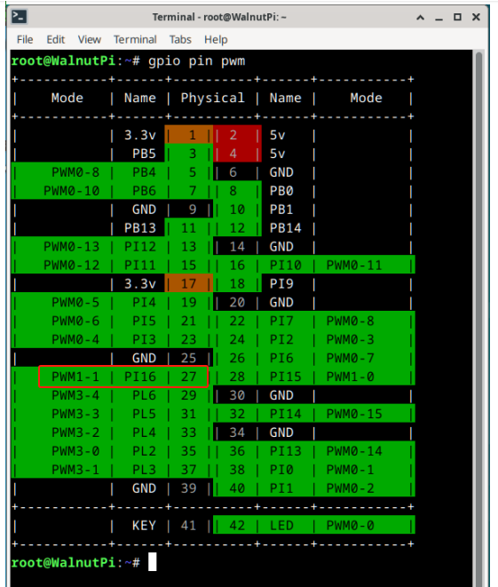
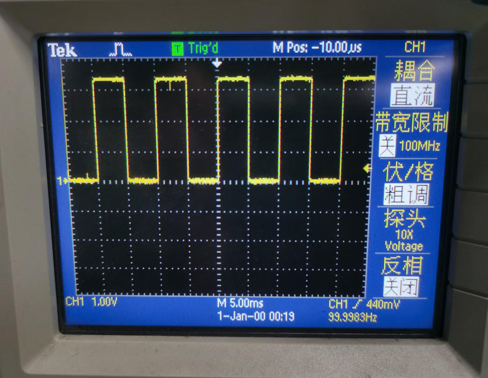

# PWM

## Introduction

PWM is commonly used for motor and servo control. The Walnut Pi 2B has multiple PWM pins, allowing users to control various servos and motors by connecting motor driver boards. This section explains how to use Python programming to implement PWM output.

## Experiment Objective

Use Python programming to implement PWM output.

## Experiment Explanation

In Linux, everything is a file. In the previous [**GPIO Application - PWM**](../../gpio/pwm.md) chapter, hardware PWM was operated by writing values to specified files. If you want to control PWM with Python, simply call Python's file read/write functions to operate those files.

## Reference Code

```python
'''
Experiment Name: PWM Output
Experiment Platform: Walnut Pi 2B
Description: Output a 100Hz, 50% duty cycle square wave on PWM1-1 pin.
'''

control_path = {
    0: "/sys/class/pwm/pwmchip0",
    1: "/sys/class/pwm/pwmchip16",
    2: "/sys/class/pwm/pwmchip20",
    3: "/sys/class/pwm/pwmchip22",
}

def write_to_file(path: str, value: str) -> None:
    with open(path, "w") as f:
        f.write(value)

def pwm_export(control: int, channel: int) -> None:
    """Export PWM channel
    @param control Controller number 0 1 2 3
    @param channel PWM channel number
    """
    write_to_file(f"{control_path[control]}/export", str(channel))

def pwm_config(control: int, channel: int, period: int, duty_cycle: int) -> None:
    """Configure PWM channel parameters.
    @param control Controller number 0 1 2 3
    @param channel PWM channel number
    @param period PWM signal period, in nanoseconds.
    @param duty_cycle PWM signal high-level duration.
    """
    write_to_file(f"{control_path[control]}/pwm{channel}/period", str(period))
    write_to_file(f"{control_path[control]}/pwm{channel}/duty_cycle", str(duty_cycle))
    write_to_file(f"{control_path[control]}/pwm{channel}/polarity", "normal")

def pwm_enable(control: int, channel: int) -> None:
    """Enable PWM channel output.
    @param control Controller number 0 1 2 3
    @param channel PWM channel number
    """
    write_to_file(f"{control_path[control]}/pwm{channel}/enable", "1")

def pwm_disable(control: int, channel: int) -> None:
    """Disable PWM channel output.
    @param control Controller number 0 1 2 3
    @param channel PWM channel number
    """
    write_to_file(f"{control_path[control]}/pwm{channel}/enable", "0")

pwm_export(1, 1)  # Export PWM channel
pwm_config(1, 1, 10000000, 5000000)  # Configure PWM period and duty cycle
pwm_enable(1, 1)  # Enable PWM output

```

In the code above, PWM output is configured via the following 3 statements, including **pwm_config(1, 1, 10000000, 5000000);**

- (1,1) means timer 1, channel 1
- Period time 10000000ns, i.e., 10ms, frequency: 1s/10ms=100Hz;
- High-level time 5000000ns, i.e., 5ms, duty cycle: 5ms/10ms = 50%

## Experiment Results

Below is the output pin and result:





This provides the most basic control method. Users can encapsulate it into various library usages in Python on their own.
