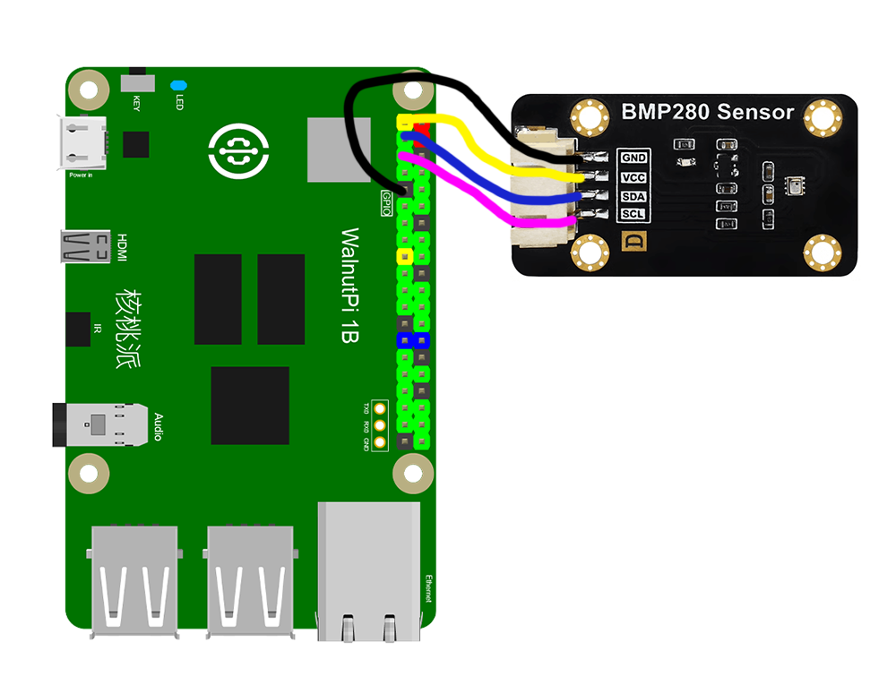
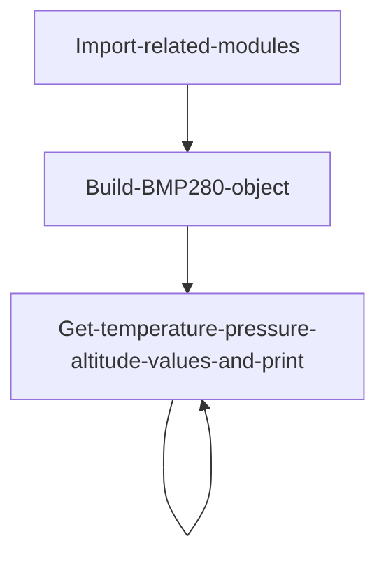
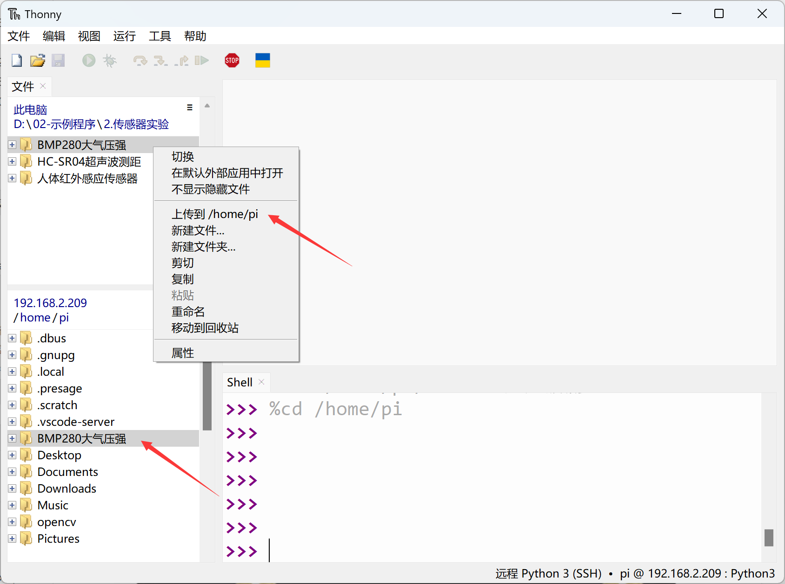
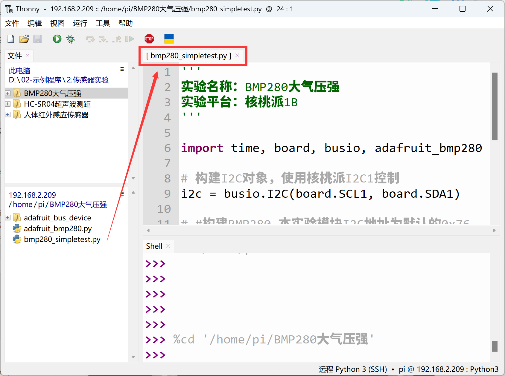
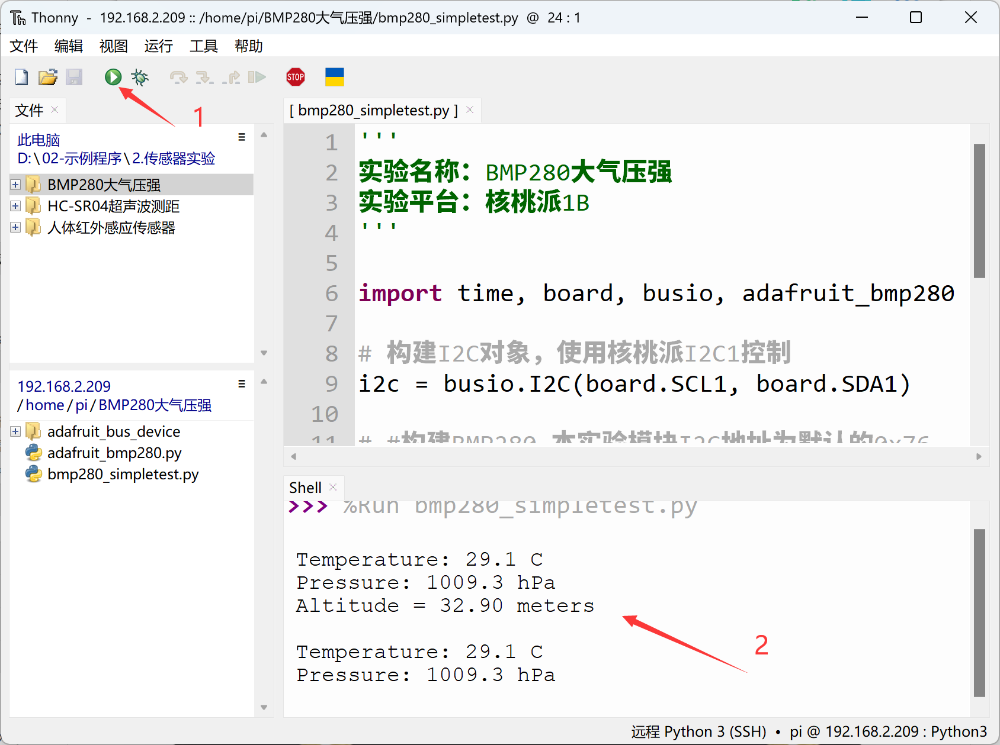

# BMP280 Atmospheric Pressure

## Introduction
In this experiment, the atmospheric pressure sensor module used is the BMP280, a high-precision barometric pressure sensor designed for mobile applications. The sensor module features an extremely compact package. Its small size and low power consumption make it suitable for battery-powered devices such as mobile phones, GPS modules, and watches. In addition to measuring atmospheric pressure, the BMP280 sensor can also measure temperature (with moderate accuracy) and calculate altitude through formulas.

## Experiment Objective
Use Python programming to measure the current environmental atmospheric pressure and temperature, calculate altitude from atmospheric pressure using the formula, and create your own barometer!

## Experiment Explanation

Most BMP280 modules on the market are universal and use I2C bus communication. The image below shows a BMP280 sensor module:


|  Module Parameters |  |
|  :---:  | ---  |
| Supply Voltage  | 3.3V |
| Operating Current  | \<20mA |
| Communication Method  | I2C Bus |
| I2C Address  | 0x76 (BMP280 SDO default pull-down); <br></br> When BMP280 SDO pin is pulled up, I2C address is: 0x77 |
| Pin Description  | `VCC`: Connect to 3.3V <br></br> `GND`: Ground <br></br>  `SDA`: I2C data pin  <br></br> `SCL`: I2C clock pin |

<br></br>

From the description above, we can see that the BMP280 is a sensor driven via an I2C interface. We can program the Walnut Pi's I2C interface to communicate with this module.

**Altitude Calculation:**

Standard atmospheric pressure refers to the pressure at sea level (0 meters altitude) at 0°C and latitude 45°, with a value of 101325 Pascals (Pa).

Relationship between atmospheric pressure and altitude: P=P0×(1-H/44300)^5.256

Therefore, the altitude calculation formula is: H=44300*(1- (P/P0)^(1/5.256) )

In the formula: H is altitude, P0 = standard atmospheric pressure (0°C, 101325Pa)

From the formula above, we can see that altitude is converted from atmospheric pressure. From a physics perspective, the higher the altitude, the thinner the air, and the lower the atmospheric pressure. By measuring pressure changes, we can calculate altitude. However, this is conditional — at a temperature of 0°C. The higher the temperature, the thinner the air and the lower the pressure. Therefore, altitude data theoretically needs temperature compensation, meaning there will be some error in this experiment's altitude conversion. Interested users can research this topic further on their own.

This example uses the Walnut Pi's I2C1 to connect the BMP280 sensor:





The power of Python lies in its rich modules and function libraries. Once a module is established, subsequent users can use it very easily without needing to develop underlying drivers. This enables object-oriented programming, while still allowing modification of the underlying code when needed — it's both accessible and flexible. Here, we directly use a pre-written Python driver file that implements measurement and calculation of atmospheric pressure, temperature, and altitude. Users can use it directly, as follows:


## Enable I2C1

Enter the following command in the terminal:
```bash
sudo set-device enable i2c1
```

Restart the development board:
```bash
sudo reboot
```

Check the status after startup:
```bash
gpio pins
```

The following output indicates successful activation:


For more GPIO configuration tutorials, see: [GPIO Device Configuration](../../gpio/gpio_config.md)

## BMP280 Object

In CircuitPython, you can directly use a pre-written Python library to obtain BMP280 atmospheric pressure sensor data. Details are as follows:

### Constructor
```python
bmp280 = adafruit_bmp280.Adafruit_BMP280_I2C(i2c,address=0x76)
```
Build a BMP280 object.

Parameter description:
- `i2c` You need to build an I2C object. Refer to: [I2C Object Description](../gpio/i2c_oled#i2c-object); not repeated here.
- `address` Module I2C address. Default: 0x76;

### Usage

```python
bmp280.sea_level_pressure = 1013.25
```
Set local sea-level standard atmospheric pressure value, unit hPa

<br></br>

```python
bmp280.temperature
```
Returns temperature value, unit °C, data type `float`

<br></br>

```python
bmp280.pressure
```
Returns atmospheric pressure value, unit hPa (1hPa = 100Pa), data type `float`

<br></br>

```python
bmp280.altitude
```
Returns altitude value, unit m, data type `float`

<br></br>

After understanding the BMP280 sensor principles and object usage, we can outline the programming logic. The flow chart is as follows:



## Reference Code

```python
'''
Experiment Name: BMP280 Atmospheric Pressure
Experiment Platform: Walnut Pi 2B
'''

import time, board, busio, adafruit_bmp280

# Build I2C object, controlled with Walnut Pi I2C1
i2c = busio.I2C(board.SCL1, board.SDA1)

# #Build BMP280, the module I2C address in this experiment is the default 0x76.
bmp280 = adafruit_bmp280.Adafruit_BMP280_I2C(i2c,address=0x76)

# Local sea-level standard atmospheric pressure
bmp280.sea_level_pressure = 1013.25

while True:
    
    print("\nTemperature: %0.1f C" % bmp280.temperature)
    print("Pressure: %0.1f hPa" % bmp280.pressure)
    print("Altitude = %0.2f meters" % bmp280.altitude)
    
    time.sleep(1)
```

## Experiment Results

Enter the following command in the terminal to confirm I2C1 activation:
```bash
gpio pins
```

The following output indicates successful activation:


If not enabled, follow the steps above to enable: [Enable I2C1](#enable-i2c1)

Connect the BMP280 sensor to the Walnut Pi as follows: SDA1 to module SDA pin, SCL1 to module SCL pin:


Since this example code depends on other Python libraries, the entire example folder needs to be uploaded to the Walnut Pi:



After successful transfer, you need to open and run the Python file from the remote directory (Walnut Pi), because running it will import other library files within the folder. Therefore, this type of code cannot run locally on the computer.



Here we use Thonny to remotely run the above Python code on the Walnut Pi. For instructions on running Python code on the Walnut Pi, please refer to: [Running Python Code](../python_run.md). After successful execution, you can see the temperature, atmospheric pressure, and altitude information printed in the terminal:


