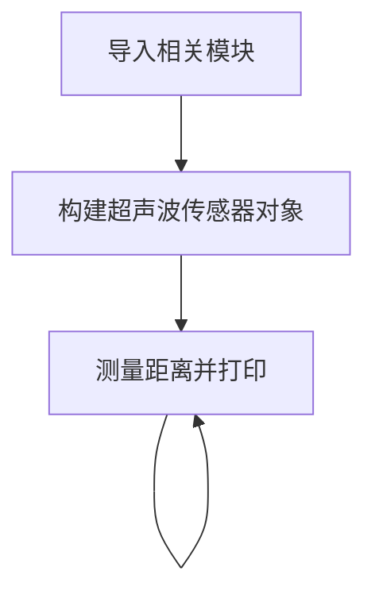
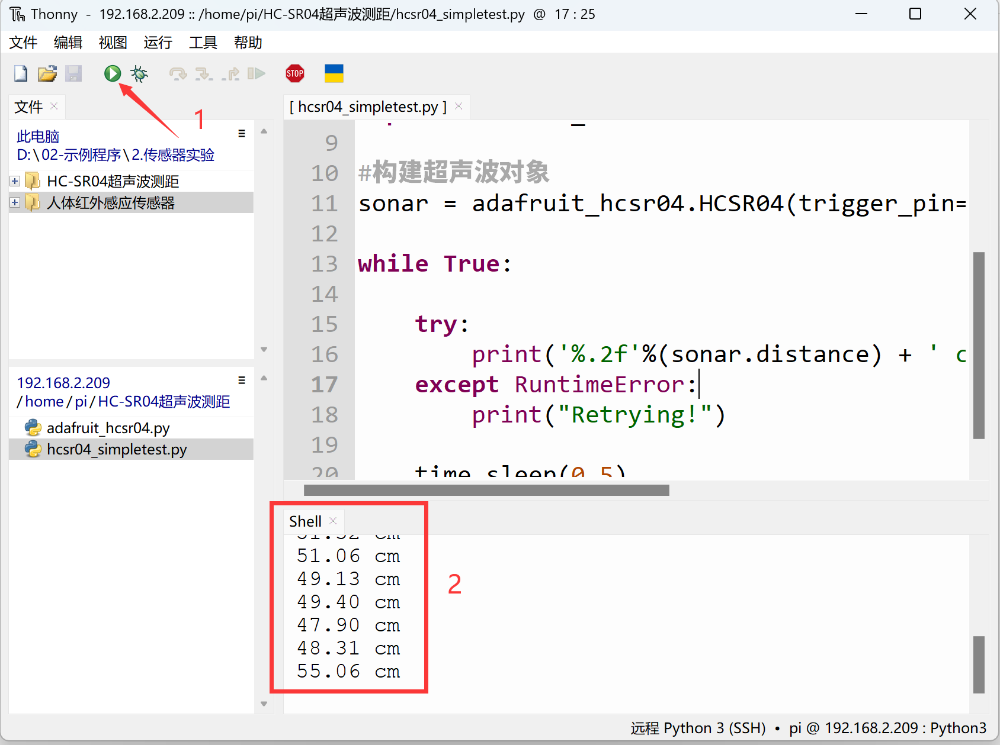

# HC-SR04超声波测距

## 前言
超声波传感器是一款测量距离的传感器。其原理是利用声波在遇到障碍物反射接收结合声波在空气中传播的速度计算的得出。在测量、避障小车，无人驾驶等领域都有相关应用。

## 实验目的
通过python编程实现超声波传感器测距。

## 实验讲解

下图是一款市面上常用的HCSR04超声波模块：

 

|  模块参数 |
|  :---:  | ---  |
| 供电电压  | 3.3V~5V （核桃派需要使用支持3.3V的） |
| 测量距离  | 2cm~450cm |
| 测量精度  | 0.5cm | 
| 引脚说明  | `VCC`: 接3.3V <br></br> `GND`: 接地 <br></br>  `Trig`: 发射引脚  <br></br> `Echo`: 接收引脚 |

<br></br>

超声波传感器模块使用两个IO口分别控制超声波发送和接收，工作原理如下：

1. 给超声波模块接入电源和地；
2. 给脉冲触发引脚（trig）输入一个长为20us的高电平方波；
3. 输入方波后，模块会自动发射8个40KHz的声波，与此同时回波引脚（echo）端的电平会由0变为1；（此时应该启动定时器计时）
4. 当超声波返回被模块接收到时，回波引 脚端的电平会由1变为0；（此时应该停止定时器计数），定时器记下的这个时间即为超声波由发射到返回的总时长；
5. 根据声音在空气中的速度为340米/秒，即可计算出所测的距离。

下面是超声波传感器HCSR04的时序触发图：

 

我们可以任意使用2个普通GPIO口来连接超声波传感器，这里使用PB13连接到Trig引脚, PI12连接到Echo引脚：

 

<br></br>

 

## HCSR04对象

在CircuitPython中可以直接使用写好的Python库来获取超声波传感器测量的距离值。具体介绍如下：

### 构造函数
```python
sonar=adafruit_hcsr04.HCSR04(trigger_pin=board.PB13, echo_pin=board.PI12)
```
构建超声波模块对象，主要是初始化连接超声波传感器的2个引脚。

参数说明：
- `trigger_pin` 开发板引脚编号。例：board.PB13；
- `echo_pin` 开发板引脚编号。例：board.PI12；

### 使用方法
```python
value = sonar.distance
```
返回测量距离值，单位cm，数据类型为`float`

<br></br>

我们构建对象后就可以一直循环获取超声波距离信息了，代码编写流程如下：



## 参考代码

```python
'''
实验名称：HC-SR04超声波测距
实验平台：核桃派2B
'''

import time
import board
import adafruit_hcsr04

#构建超声波对象
sonar = adafruit_hcsr04.HCSR04(trigger_pin=board.PB13, echo_pin=board.PI12)

while True:
    
    try:
        print('%.2f'%(sonar.distance) + ' cm') #打印距离信息，单位cm，保留2位小数。
    except RuntimeError:
        print("Retrying!")
        
    time.sleep(0.5)
```

## 实验结果

将HC-SR04超声波传感器按下图连接到核桃派， PC9连接到Trig引脚, PC11连接到Echo引脚：

 

由于本例程代码依赖其它py库，所以需要将整个例程文件夹上传到核桃派：

 

发送成功后需要打开远程目录（核桃派）的py文件来运行，因为运行会导入文件夹里面的其它库文件，因此这类型代码在电脑本地运行是无效的。

 

这里使用Thonny远程核桃派运行以上Python代码，关于核桃派运行python代码方法请参考： [运行Python代码](../python_run.md)。运行成功后可以看到终端打印超声波传感器距离信息。

 
