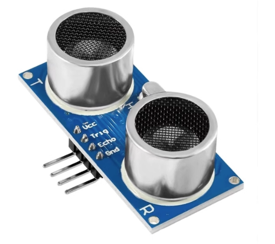
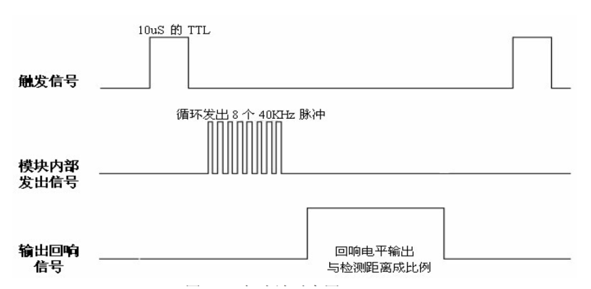
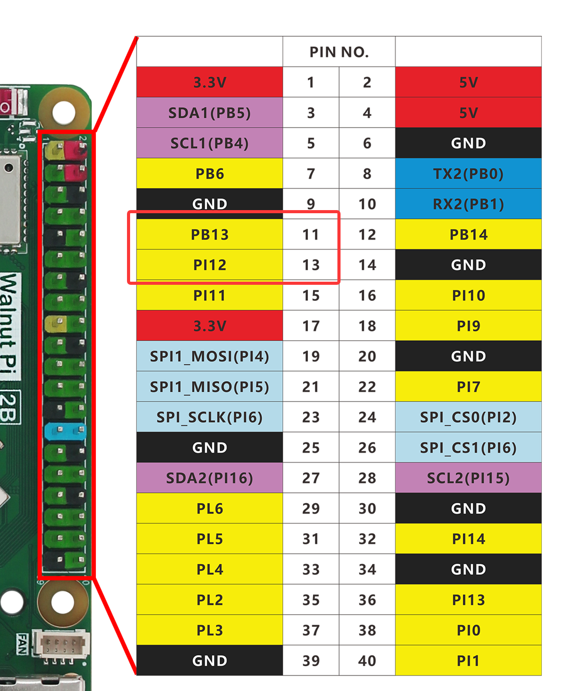
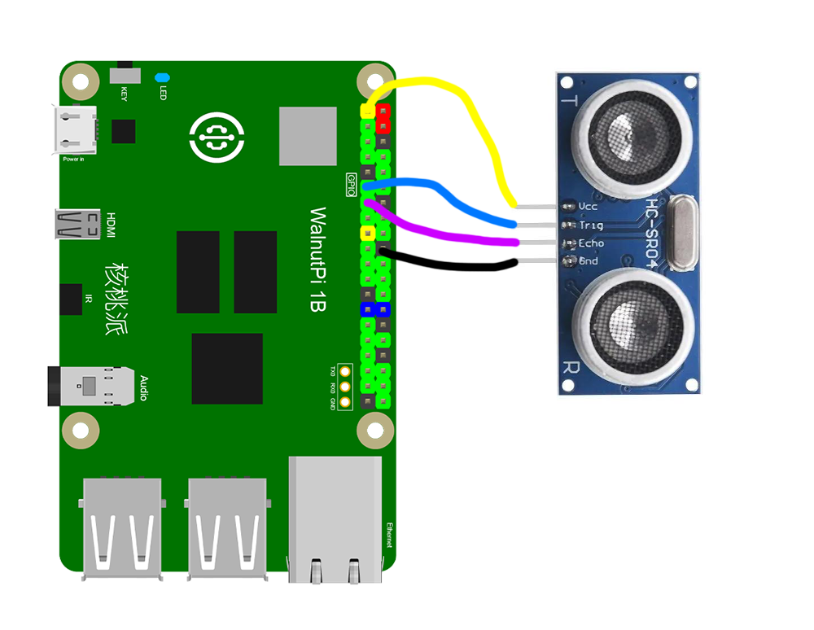
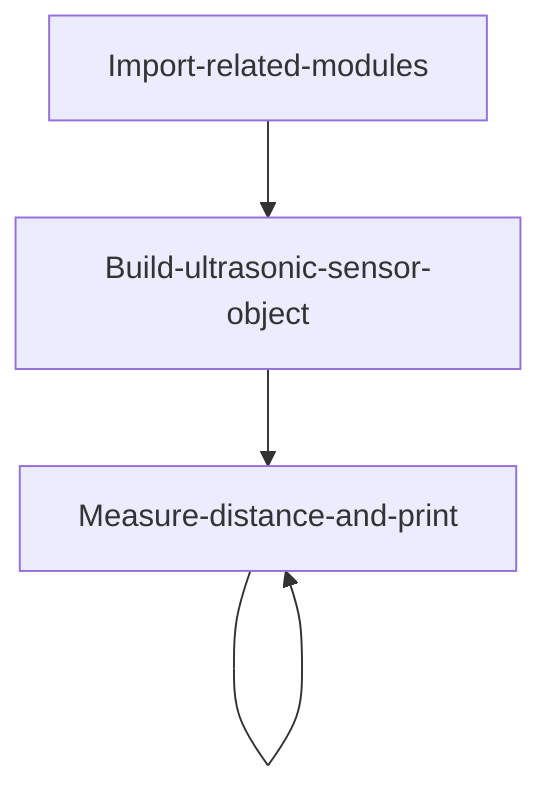
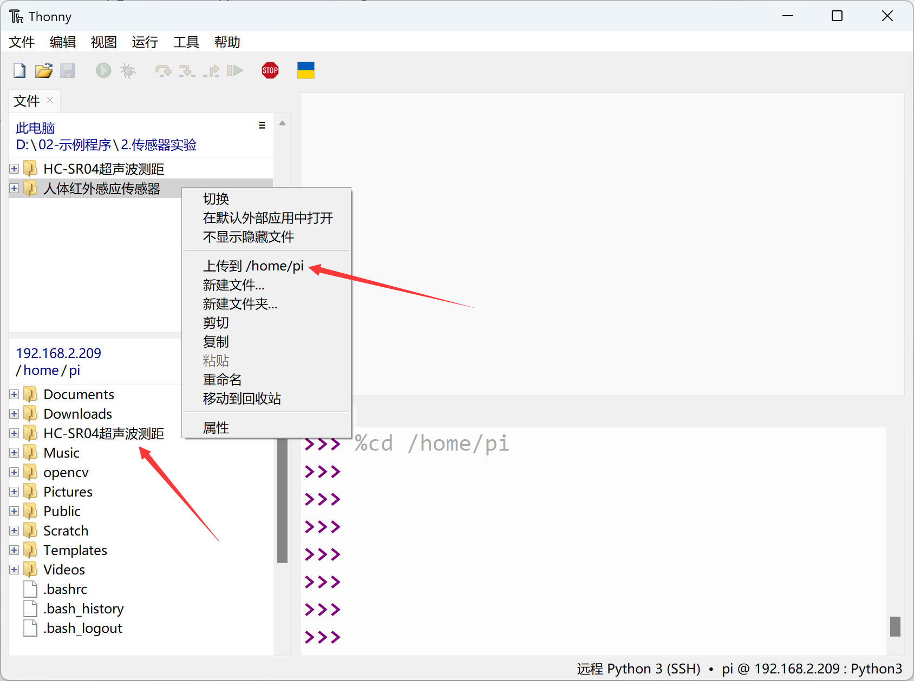
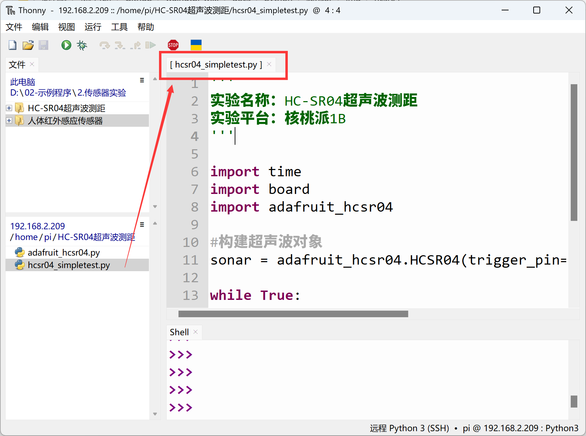
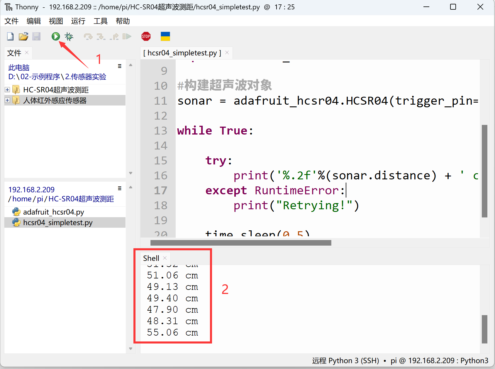

# HC-SR04 Ultrasonic Distance Measurement

## Introduction
An ultrasonic sensor is a device for measuring distance. Its principle involves using sound waves that reflect off obstacles, combined with the speed of sound in air, to calculate distance. It is used in fields such as measurement, obstacle-avoidance vehicles, and autonomous driving.

## Experiment Objective
Use Python programming to implement distance measurement with an ultrasonic sensor.

## Experiment Explanation

The image below shows a commonly used HC-SR04 ultrasonic module:



|  Module Parameters |  |
|  :---:  | ---  |
| Supply Voltage  | 3.3V~5V (Walnut Pi requires 3.3V compatible version) |
| Measuring Distance  | 2cm~450cm |
| Measurement Accuracy  | 0.5cm |
| Pin Description  | `VCC`: Connect to 3.3V <br></br> `GND`: Ground <br></br>  `Trig`: Trigger pin  <br></br> `Echo`: Echo pin |

<br></br>

The ultrasonic sensor module uses two I/O pins to control ultrasonic transmission and reception separately, working as follows:

1. Connect power and ground to the ultrasonic module;
2. Input a 20us high-level square wave to the trigger pin (Trig);
3. After the square wave input, the module automatically emits 8 bursts of 40KHz sound waves, and at the same time, the echo pin level changes from 0 to 1 (a timer should start counting at this point);
4. When the returning ultrasound is received by the module, the echo pin level changes from 1 to 0 (the timer should stop counting at this point). The time recorded by the timer is the total time from transmission to return of the ultrasound;
5. Based on the speed of sound in air being 340 meters/second, the measured distance can be calculated.

Below is the timing trigger diagram for the HC-SR04 ultrasonic sensor:



We can use any two regular GPIO pins to connect the ultrasonic sensor. Here, PB13 is connected to the Trig pin, and PI12 to the Echo pin:



<br></br>



## HCSR04 Object

In CircuitPython, you can directly use a pre-written Python library to obtain the distance values measured by the ultrasonic sensor. Details are as follows:

### Constructor
```python
sonar=adafruit_hcsr04.HCSR04(trigger_pin=board.PB13, echo_pin=board.PI12)
```
Build an ultrasonic module object, primarily initializing the two pins connected to the ultrasonic sensor.

Parameter description:
- `trigger_pin` Development board pin number. Example: board.PB13;
- `echo_pin` Development board pin number. Example: board.PI12;

### Usage
```python
value = sonar.distance
```
Returns the measured distance value, unit cm, data type `float`

<br></br>

After building the object, we can continuously retrieve ultrasonic distance information in a loop. The code flow is as follows:


```mermaid
graph TD
    Import-related-modules-->Build-ultrasonic-sensor-object-->Measure-distance-and-print-->Measure-distance-and-print;
```

## Reference Code

```python
'''
Experiment Name: HC-SR04 Ultrasonic Distance Measurement
Experiment Platform: Walnut Pi 2B
'''

import time
import board
import adafruit_hcsr04

# Build ultrasonic object
sonar = adafruit_hcsr04.HCSR04(trigger_pin=board.PB13, echo_pin=board.PI12)

while True:
    
    try:
        print('%.2f'%(sonar.distance) + ' cm') # Print distance info, unit cm, 2 decimal places.
    except RuntimeError:
        print("Retrying!")
        
    time.sleep(0.5)
```

## Experiment Results

Connect the HC-SR04 ultrasonic sensor to the Walnut Pi as follows: PC9 to Trig pin, PC11 to Echo pin:


Since this example code depends on other Python libraries, the entire example folder needs to be uploaded to the Walnut Pi:



After successful transfer, you need to open and run the Python file from the remote directory (Walnut Pi), because running it will import other library files within the folder. Therefore, this type of code cannot run locally on the computer.



Here we use Thonny to remotely run the above Python code on the Walnut Pi. For instructions on running Python code on the Walnut Pi, please refer to: [Running Python Code](../python_run.md). After successful execution, you can see the ultrasonic sensor distance information printed in the terminal.

 
