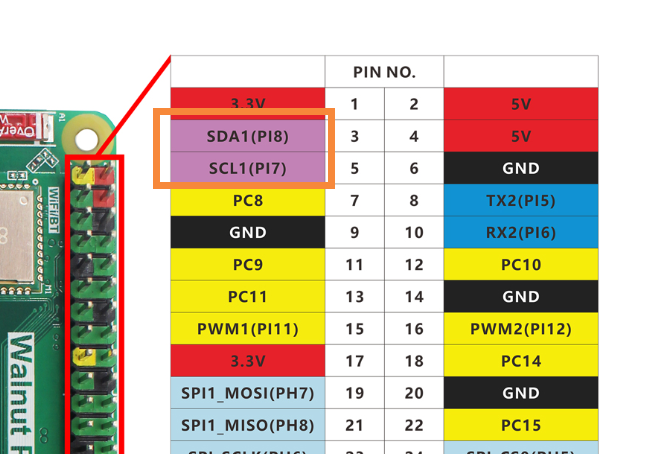
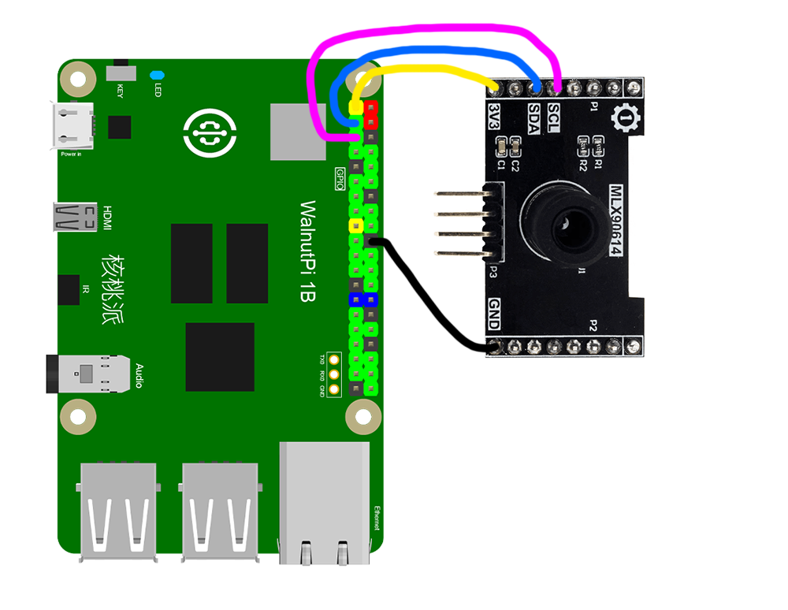
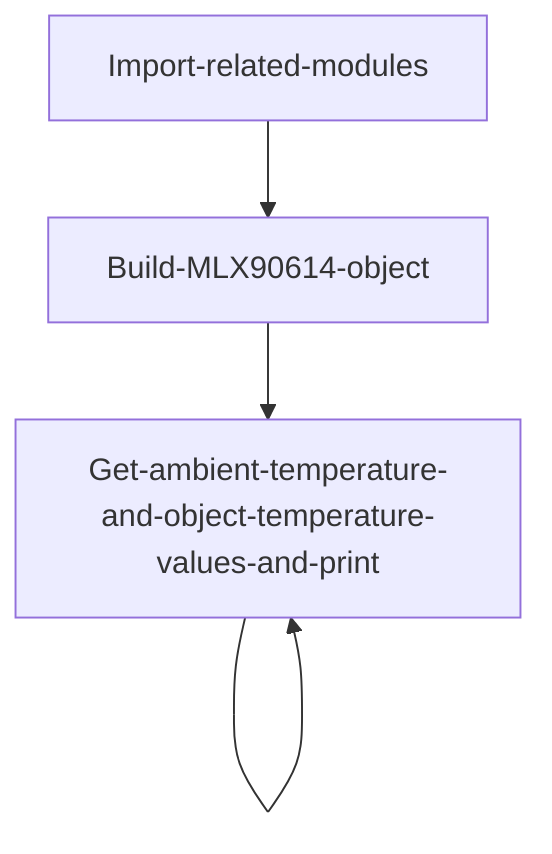
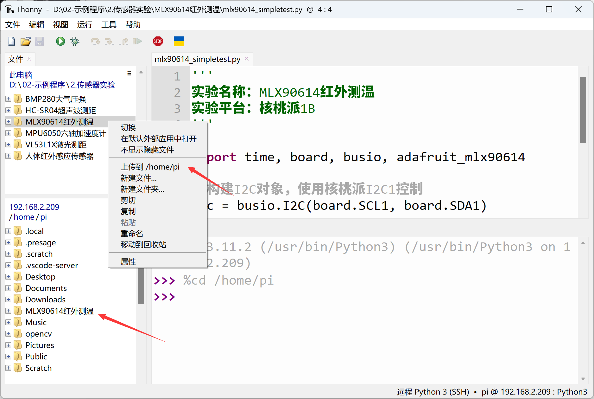
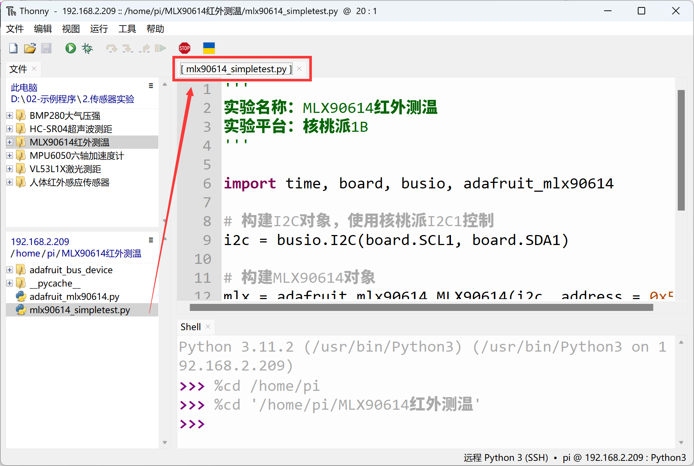
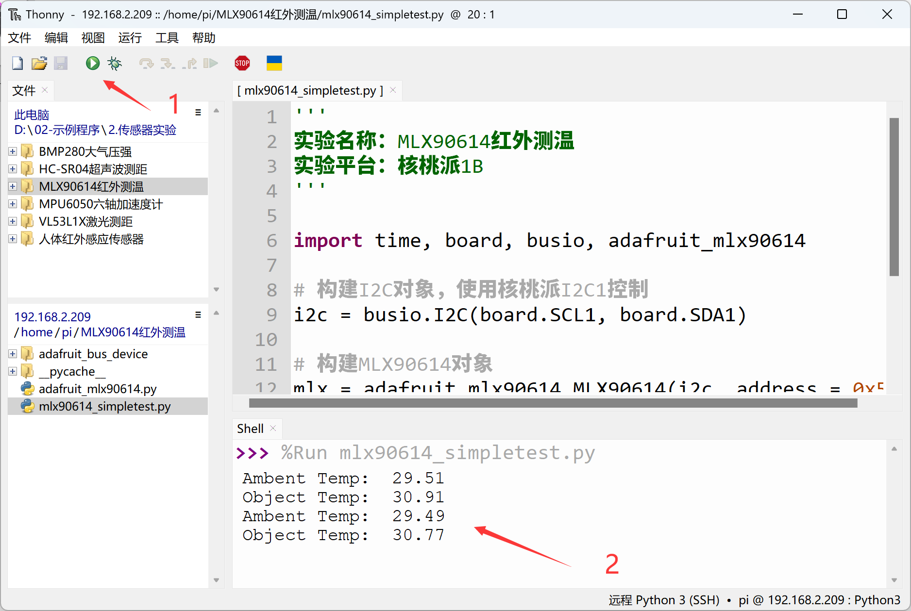

# MLX90614 Infrared Thermometer

## Introduction
The MLX90614 is an infrared thermometer for non-contact temperature measurement, capable of measuring objects between -70 and 380°C. The sensor uses an infrared-sensitive thermopile detector chip and can measure temperature with a resolution of 0.02°C across the temperature range.

## Experiment Objective
Use Python programming to implement MLX90614 non-contact temperature measurement.

## Experiment Explanation

Most MLX90614 modules on the market are universal and use I2C bus communication. The image below shows an MLX90614 sensor module, available in DCC (short distance 10cm) and DCI (long distance 100cm) versions, with universal code.


|  Module Parameters |  |
|  :---:  | ---  |
| Supply Voltage  | 3.3V |
| Measuring Distance  | DCC (10cm) and DCI (100cm) |
| Measurement Range  | -70°C - 382°C |
| Measurement Accuracy  | 0.5°C |
| Communication Method  | I2C Bus (default address: 0x5a) |
| Pin Description  | `VCC`: Connect to 3.3V <br></br> `GND`: Ground <br></br>  `SDA`: I2C data pin  <br></br> `SCL`: I2C clock pin |

<br></br>

From the description above, we can see that the MLX90614 is a sensor driven via an I2C interface. We can program the Walnut Pi's I2C interface to communicate with this module.

This example uses the Walnut Pi's I2C1 to connect the MLX90614 sensor:





## Enable I2C1

Enter the following command in the terminal:
```bash
sudo set-device enable i2c1
```

Restart the development board:
```bash
sudo reboot
```

Check the status after startup:
```bash
gpio pins
```

The following output indicates successful activation:


For more GPIO configuration tutorials, see: [GPIO Device Configuration](../../gpio/gpio_config.md)

## MLX90614 Object

In CircuitPython, you can directly use a pre-written Python library to obtain MLX90614 sensor data. Details are as follows:

### Constructor
```python
mlx = adafruit_mlx90614.MLX90614(i2c, address=0x5a)
```
Build an MLX90614 object.

Parameter description:
- `i2c` You need to build an I2C object. Refer to: [I2C Object Description](../gpio/i2c_oled#i2c-object); not repeated here.
- `address` Module I2C address. Default: 0x5a;

### Usage

```python
mlx.ambient_temperature
```
Read ambient temperature, unit °C, data type: `float`.
<br></br>

```python
mlx.object_temperature
```
Read object temperature, unit °C, data type: `float`.

<br></br>

After understanding the MLX90614 sensor principles and object usage, we can outline the programming logic. The flow chart is as follows:



## Reference Code
```python
'''
Experiment Name: MLX90614 Infrared Thermometer
Experiment Platform: Walnut Pi 2B
'''

import time, board, busio, adafruit_mlx90614

# Build I2C object, controlled with Walnut Pi I2C1
i2c = busio.I2C(board.SCL1, board.SDA1)

# Build MLX90614 object
mlx = adafruit_mlx90614.MLX90614(i2c, address=0x5a)

while True:
    
    print("Ambent Temp: ", '%.2f'% mlx.ambient_temperature) # Measure ambient temperature
    print("Object Temp: ", '%.2f'% mlx.object_temperature) # Measure object temperature
    
    time.sleep(1)
```

## Experiment Results

Enter the following command in the terminal to confirm I2C1 activation:
```bash
gpio pins
```

The following output indicates successful activation:


If not enabled, follow the steps above to enable: [Enable I2C1](#enable-i2c1)


Connect the MLX90614 sensor to the Walnut Pi as follows: SDA1 to module SDA pin, SCL1 to module SCL pin:


Since this example code depends on other Python libraries, the entire example folder needs to be uploaded to the Walnut Pi:



After successful transfer, you need to open and run the Python file from the remote directory (Walnut Pi), because running it will import other library files within the folder. Therefore, this type of code cannot run locally on the computer.



Here we use Thonny to remotely run the above Python code on the Walnut Pi. For instructions on running Python code on the Walnut Pi, please refer to: [Running Python Code](../python_run.md). After successful execution, you can see the ambient temperature and object temperature information printed in the terminal:


