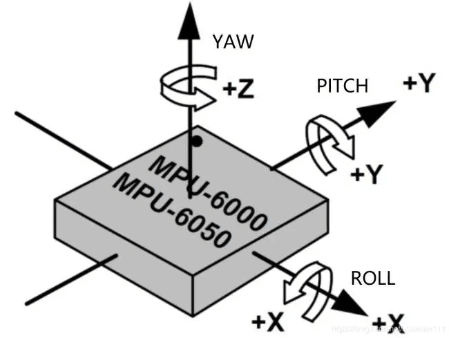
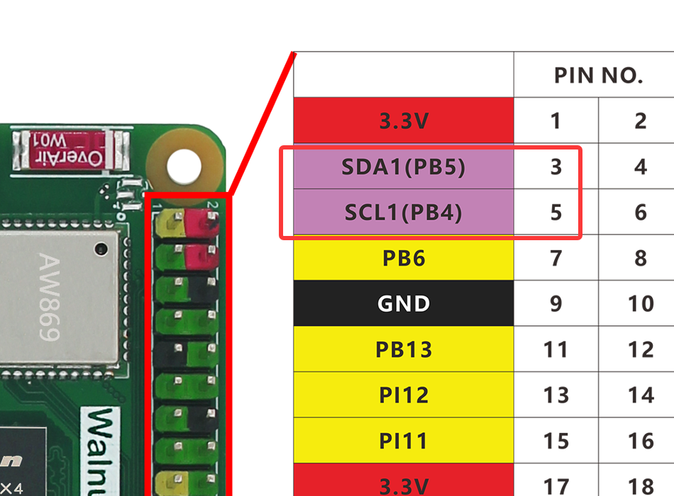
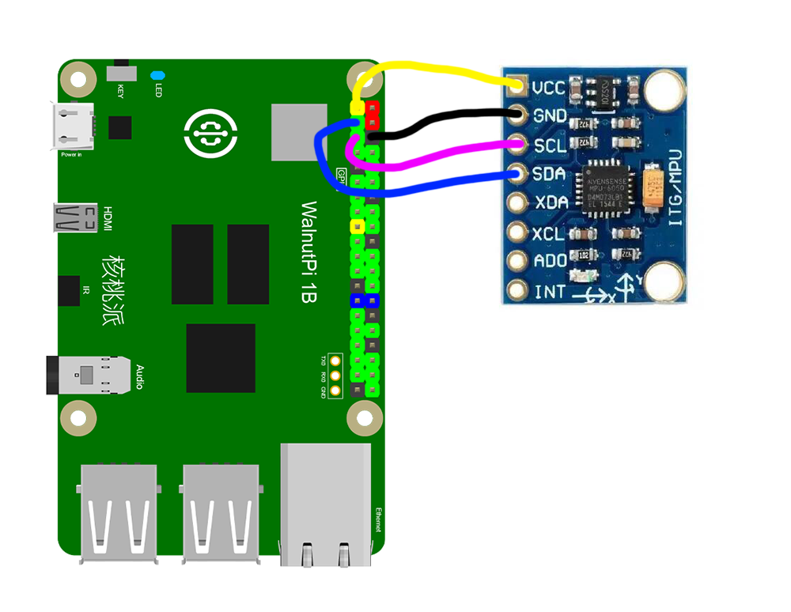
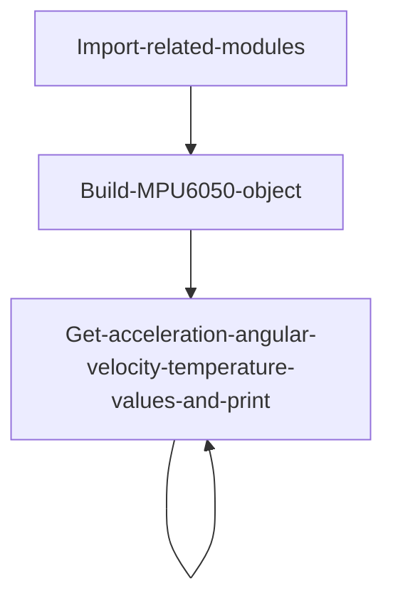
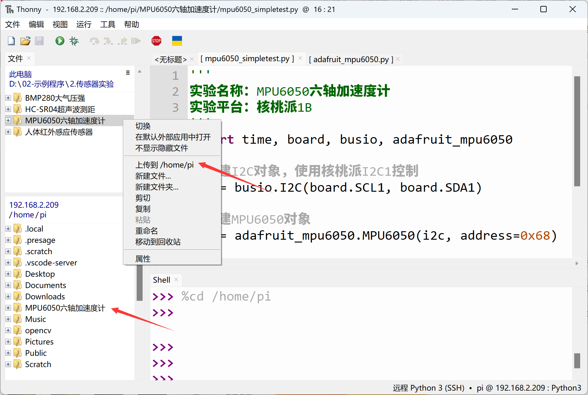
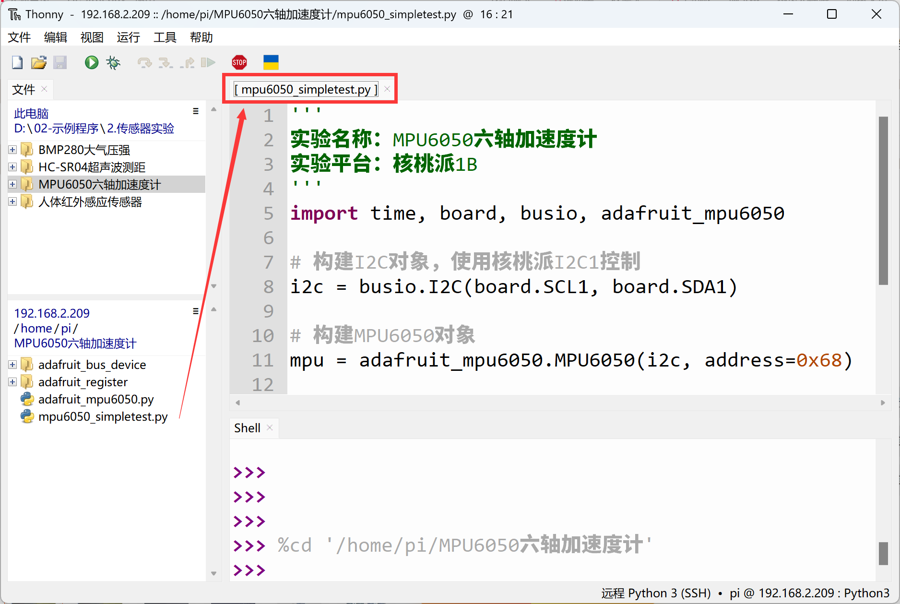
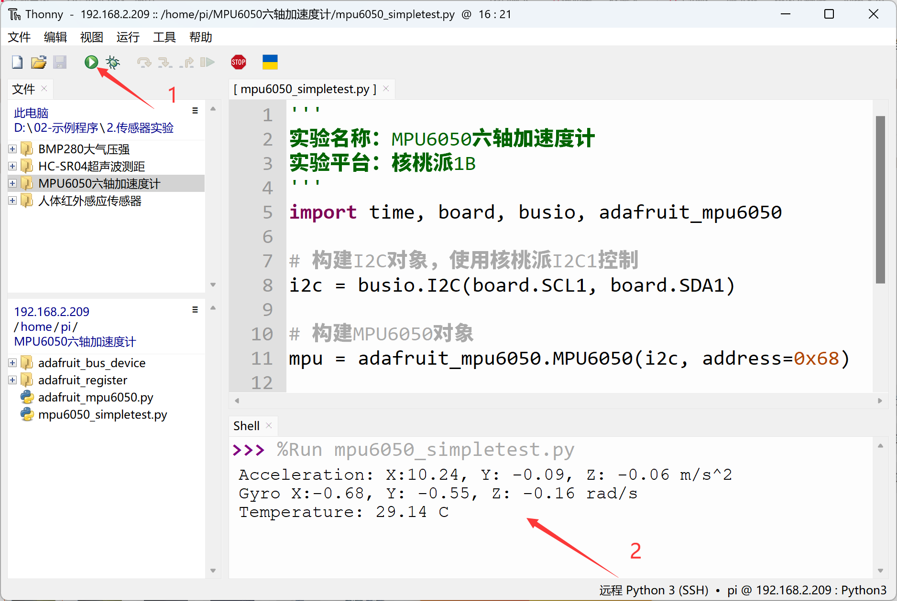

# MPU6050 6-Axis Accelerometer and Gyroscope

## Introduction
The MPU6050 is a high-performance 6-axis (3-axis accelerometer + 3-axis gyroscope) sensor module used for testing object motion attitude. It uses an I2C interface and is commonly used in quadcopter flight controllers, self-balancing vehicles, and similar applications.

## Experiment Objective
Use Python programming to measure MPU6050 acceleration, angular velocity, and temperature values!

## Experiment Explanation

Most MPU6050 modules on the market are universal and use I2C bus communication. The image below shows an MPU6050 sensor module:


|  Module Parameters |  |
|  :---:  | ---  |
| Supply Voltage  | 3.3V |
| Communication Method  | I2C Bus (default address: 0x68) |
| Measurement Dimensions  | Acceleration: 3D <br></br> Gyroscope: 3D |
| Acceleration Measurement Range  | ±2/±4/±8/±16g |
| Gyroscope Measurement Range  | ±250/±500/±1000/±2000°/s |
| Temperature Sensor  | Measurement range: -40°C~85°C (accuracy: ±1°C) |
| Pin Description  | `VCC`: Connect to 3.3V <br></br> `GND`: Ground <br></br>  `SDA`: I2C data pin  <br></br> `SCL`: I2C clock pin |

<br></br>

**MPU6050 6-axis orientation description:**



From the description above, we can see that the MPU6050 is a sensor driven via an I2C interface. We can program the Walnut Pi's I2C interface to communicate with this module.

This example uses the Walnut Pi's I2C1 to connect the MPU6050 sensor:




## Enable I2C1

Enter the following command in the terminal:
```bash
sudo set-device enable i2c1
```

Restart the development board:
```bash
sudo reboot
```

Check the status after startup:
```bash
gpio pins
```

The following output indicates successful activation:


For more GPIO configuration tutorials, see: [GPIO Device Configuration](../../gpio/gpio_config.md)

## MPU6050 Object

In CircuitPython, you can directly use a pre-written Python library to obtain MPU6050 sensor data. Details are as follows:

### Constructor
```python
mpu = adafruit_mpu6050.MPU6050(i2c, address=0x68)
```
Build an MPU6050 object.

Parameter description:
- `i2c` You need to build an I2C object. Refer to: [I2C Object Description](../gpio/i2c_oled#i2c-object); not repeated here.
- `address` Module I2C address. Default: 0x68;

### Usage

```python
mpu.acceleration
```
Returns x, y, z acceleration values, unit m/s^2, data type `float`

<br></br>

```python
mpu.gyro
```
Returns x, y, z angular velocity values, unit rad/s, data type `float`

<br></br>

```python
mpu.temperature
```
Returns temperature value, unit °C, data type `float`

<br></br>

After understanding the MPU6050 sensor principles and object usage, we can outline the programming logic. The flow chart is as follows:



## Reference Code

```python
'''
Experiment Name: MPU6050 6-Axis Accelerometer and Gyroscope
Experiment Platform: Walnut Pi 2B
'''
import time, board, busio, adafruit_mpu6050

# Build I2C object, controlled with Walnut Pi I2C1
i2c = busio.I2C(board.SCL1, board.SDA1)

# Build MPU6050 object
mpu = adafruit_mpu6050.MPU6050(i2c, address=0x68)

while True:
    print("Acceleration: X:%.2f, Y: %.2f, Z: %.2f m/s^2" % (mpu.acceleration))
    print("Gyro X:%.2f, Y: %.2f, Z: %.2f rad/s" % (mpu.gyro))
    print("Temperature: %.2f C" % mpu.temperature)
    print("")
    time.sleep(1)
```

## Experiment Results

Enter the following command in the terminal to confirm I2C1 activation:
```bash
gpio pins
```

The following output indicates successful activation:


If not enabled, follow the steps above to enable: [Enable I2C1](#enable-i2c1)

Connect the MPU6050 sensor to the Walnut Pi as follows: SDA1 to module SDA pin, SCL1 to module SCL pin:


Since this example code depends on other Python libraries, the entire example folder needs to be uploaded to the Walnut Pi:



After successful transfer, you need to open and run the Python file from the remote directory (Walnut Pi), because running it will import other library files within the folder. Therefore, this type of code cannot run locally on the computer.



Here we use Thonny to remotely run the above Python code on the Walnut Pi. For instructions on running Python code on the Walnut Pi, please refer to: [Running Python Code](../python_run.md). After successful execution, you can see the temperature, atmospheric pressure, and altitude information printed in the terminal:


