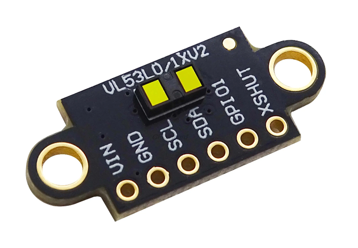
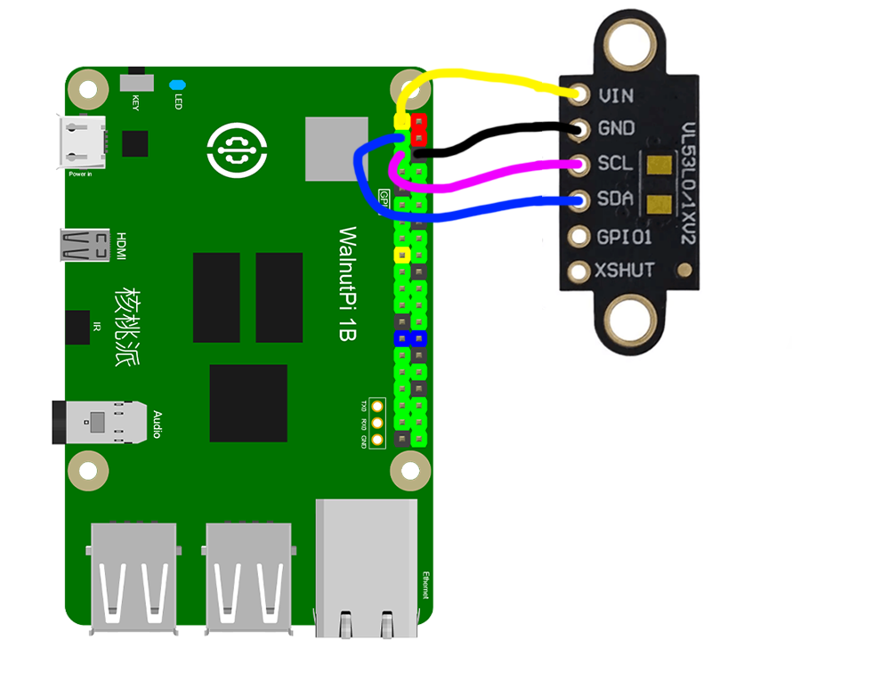
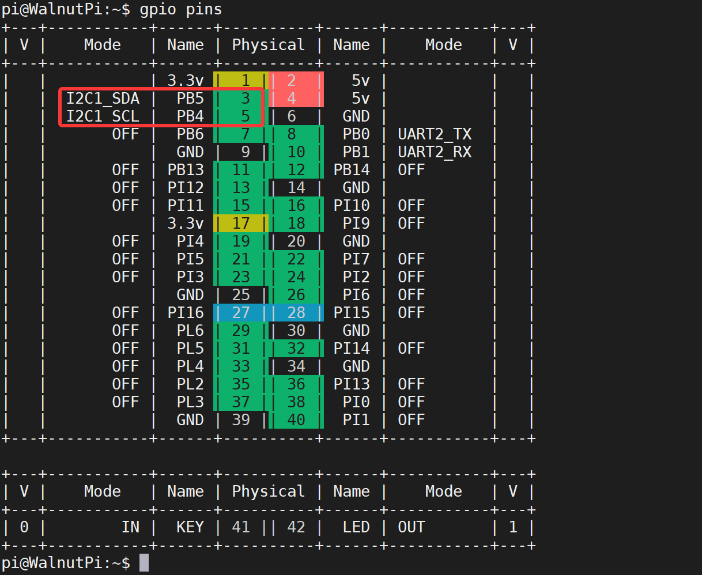
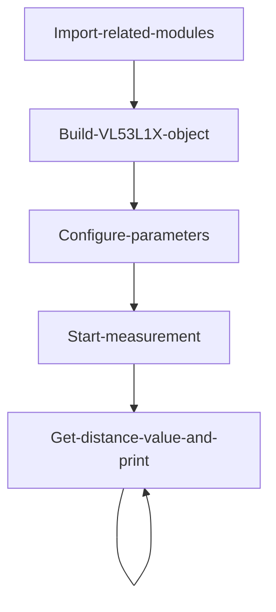
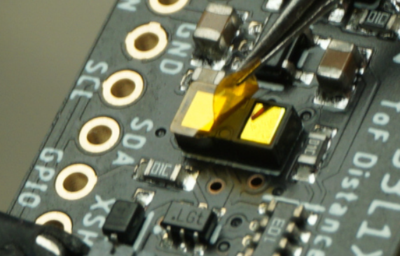
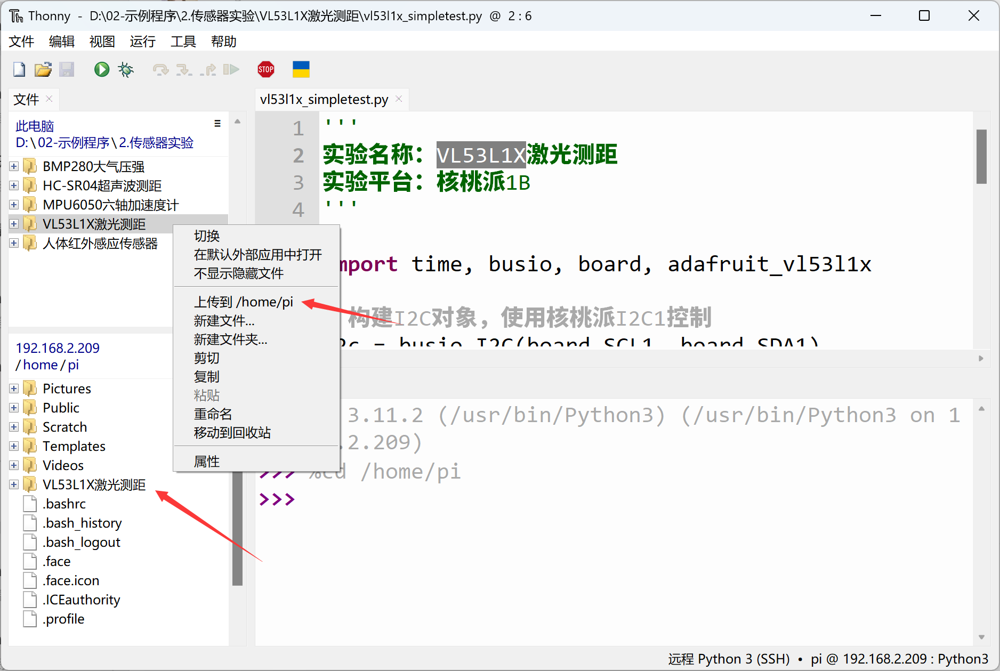
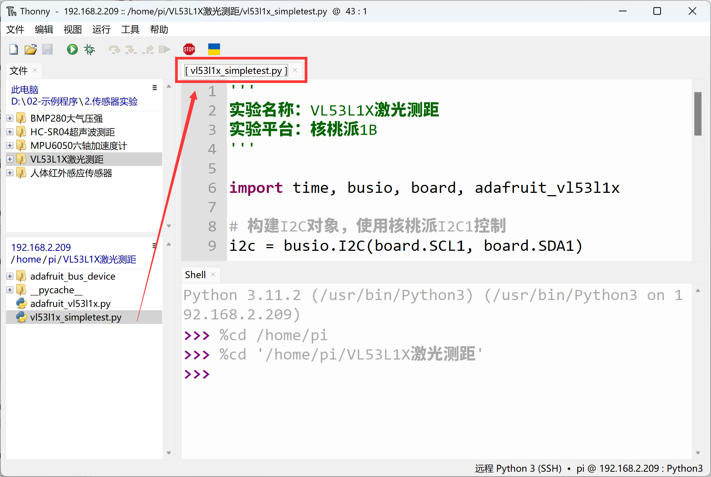
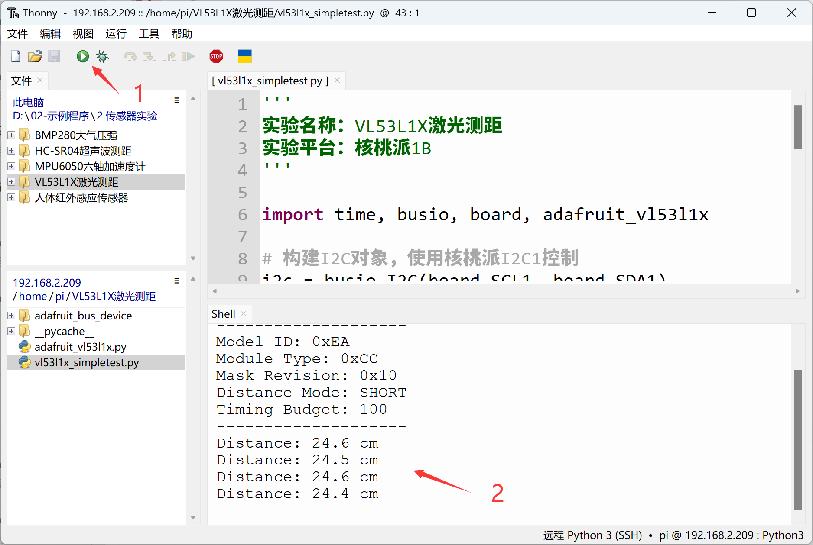

# VL53L1X Laser Distance Measurement

## Introduction
The VL53L1X Time-of-Flight (ToF) ranging module offers precise distance measurement up to 4 meters with 1mm accuracy, fast measurement frequency up to 50Hz, I2C interface communication, and low power consumption. Compared to the previous HC-SR04 ultrasonic module, it features higher accuracy, faster response, and stronger anti-interference capability, making it commonly used in high-precision and high real-time requirement ranging applications.

## Experiment Objective
Use Python programming to implement VL53L1X sensor distance measurement!

## Experiment Explanation

Most VL53L1X modules on the market are universal and use I2C bus communication. The image below shows a VL53L1X sensor module:



|  Module Parameters |  |
|  :---:  | ---  |
| Supply Voltage  | 3.3V |
| Communication Method  | I2C Bus (default address: 0x29) |
| Measuring Distance  | 4cm - 4m |
| Measurement Accuracy  | 1mm |
| Pin Description  | `VCC`: Connect to 3.3V <br></br> `GND`: Ground <br></br>  `SDA`: I2C data pin  <br></br> `SCL`: I2C clock pin |

<br></br>

From the description above, we can see that the VL53L1X is a sensor driven via an I2C interface. We can program the Walnut Pi's I2C interface to communicate with this module.

This example uses the Walnut Pi's I2C1 to connect the VL53L1X sensor:




## Enable I2C1

Enter the following command in the terminal:
```bash
sudo set-device enable i2c1
```

Restart the development board:
```bash
sudo reboot
```

Check the status after startup:
```bash
gpio pins
```

The following output indicates successful activation:


For more GPIO configuration tutorials, see: [GPIO Device Configuration](../../gpio/gpio_config.md)

## VL53L1X Object

In CircuitPython, you can directly use a pre-written Python library to obtain VL53L1X sensor data. Details are as follows:

### Constructor
```python
vl53 = adafruit_vl53l1x.VL53L1X(i2c, address=0x29)
```
Build a VL53L1X object.

Parameter description:
- `i2c` You need to build an I2C object. Refer to: [I2C Object Description](../gpio/i2c_oled#i2c-object); not repeated here.
- `address` Module I2C address. Default: 0x29;

### Usage

```python
vl53.distance_mode = value
```
- `value`: Mode value
    - `1`: Short distance mode
    - `2`: Long distance mode

<br></br>

```python
vl53.timing_budget = value
```
- `value`: Ranging duration, unit ms.

    Increasing the ranging duration can increase the device's maximum ranging distance and improve repeatability error. Power consumption increases accordingly. Settable values are ms = 15 (short distance mode only), 20, 33, 50, 100, 200, 500. Default is 50.

<br></br>

```python
vl53.start_ranging()
```
Start measurement.

<br></br>

```python
vl53.data_ready
```
Sensor measurement status. Returns 1: measurement data available; returns 0: no measurement data.

<br></br>

```python
vl53.distance
```
Read measurement result. Unit cm, data type `float`.

<br></br>

After understanding the VL53L1X sensor principles and object usage, we can outline the programming logic. The flow chart is as follows:



## Reference Code
```python
'''
Experiment Name: VL53L1X Laser Distance Measurement
Experiment Platform: Walnut Pi 2B
'''

import time, busio, board, adafruit_vl53l1x

# Build I2C object, controlled with Walnut Pi I2C1
i2c = busio.I2C(board.SCL1, board.SDA1)

vl53 = adafruit_vl53l1x.VL53L1X(i2c, address=0x29)

# Parameter settings
vl53.distance_mode = 1  #1: Short distance mode; 2: Long distance mode.
vl53.timing_budget = 100 #Ranging duration, unit ms.

# Sensor information
print("VL53L1X Simple Test.")
print("--------------------")
model_id, module_type, mask_rev = vl53.model_info
print("Model ID: 0x{:0X}".format(model_id))
print("Module Type: 0x{:0X}".format(module_type))
print("Mask Revision: 0x{:0X}".format(mask_rev))
print("Distance Mode: ", end="")
if vl53.distance_mode == 1:
    print("SHORT")
elif vl53.distance_mode == 2:
    print("LONG")
else:
    print("UNKNOWN")
print("Timing Budget: {}".format(vl53.timing_budget))
print("--------------------")

# Start measurement
vl53.start_ranging()

while True:
    
    if vl53.data_ready:
        print("Distance: {} cm".format(vl53.distance))
        vl53.clear_interrupt()
        time.sleep(0.5)
```

## Experiment Results

Enter the following command in the terminal to confirm I2C1 activation:
```bash
gpio pins
```

The following output indicates successful activation:


If not enabled, follow the steps above to enable: [Enable I2C1](#enable-i2c1)

If needed, you can peel off the VL53L1X sensor's protective film. Be careful not to scratch the surface; accuracy may improve slightly.



Connect the VL53L1X sensor to the Walnut Pi as follows: SDA1 to module SDA pin, SCL1 to module SCL pin:


Since this example code depends on other Python libraries, the entire example folder needs to be uploaded to the Walnut Pi:



After successful transfer, you need to open and run the Python file from the remote directory (Walnut Pi), because running it will import other library files within the folder. Therefore, this type of code cannot run locally on the computer.



Here we use Thonny to remotely run the above Python code on the Walnut Pi. For instructions on running Python code on the Walnut Pi, please refer to: [Running Python Code](../python_run.md). After successful execution, you can see the distance information printed in the terminal:


