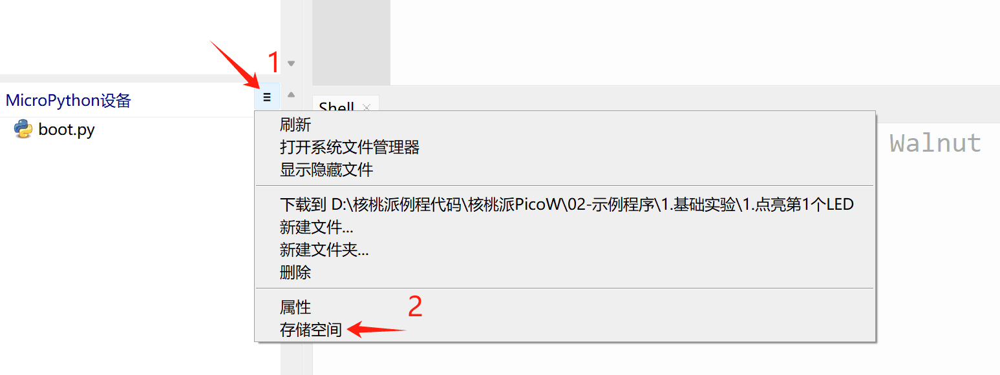

# 文件系统

核桃派PicoW内置了文件系统，可以简单理解成上电后运行的Python脚本文件，这个可以通过Thonny IDE的文件功能非常方便地浏览或读写。

选择 视图 -- 文件 ：

可以看到左边出现本地和开发板的实时文件浏览窗口：

点击MicroPython设备右侧拓展栏，选择存储空间，可以看到开发板总空间和剩余空间，这是用来放代码、图片等其它文件。**（核桃派PicoW带8M字节Flash，前2M用于存放固件，所以剩余6M左右空间）**

在本地文件点击右键—上传到即可将相关文件发送到开发板，也可以将开发板上的文件下载到本地，非常方便。

 
:::tip 提示
micropython默认上电先执行boot.py再执行main.py，一般将主函数代码放在main.py这样更符合MicroPython使用习惯！
:::

