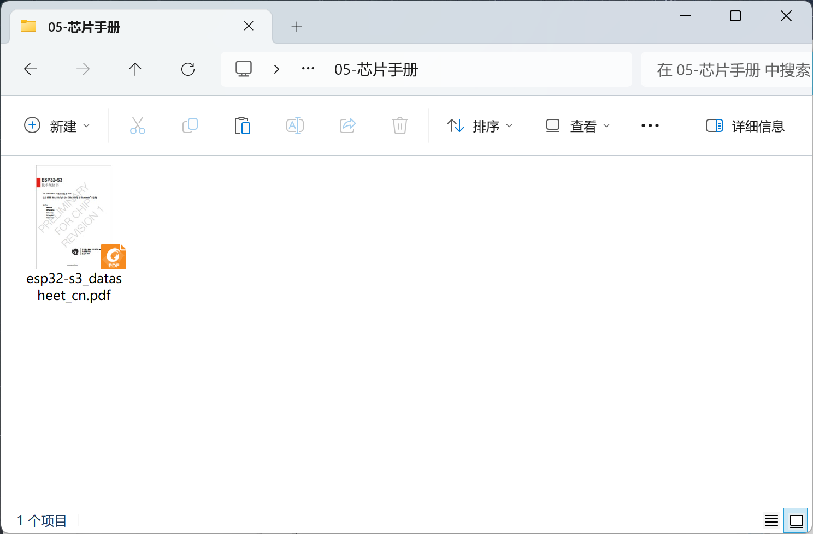

# 资料下载

核桃派PicoW教程配套软件、源代码、原理图、芯片手册等。

## 下载方式

### 百度网盘下载

- 百度网盘链接：https://pan.baidu.com/s/1zShpnKu_Nnm6CSix_XlGXA?pwd=WPKJ 
- 提取码：**WPKJ**

### QQ群文件下载

核桃派开源互助群:  **677173708**

:::tip 提示
在Q群将群文件转发给自己设备或其它QQ即可高速下载。
:::

## 资料介绍

### 开发工具

开发软件、相关驱动。

### 例程源码

本在线教程所有源代码。

### 相关固件

开发板固件，用于升级和重烧。

### 原理图和功能图

开发板原理图和接口说明图片。

### 芯片手册

主要IC手册。

