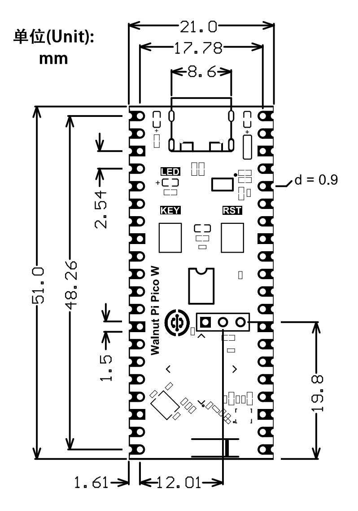

# 核桃派PicoW

## 核桃派PicoW

核桃派PicoW设计、研发和制造均来源于中国。是核桃派生态下MCU级别产品，基于乐鑫ESP32-S3（内置WiFi和蓝牙功能）高性能处理器，拥有出色的射频性能，外观小巧精美，尺寸兼容树莓派PicoW，适用于各类电子产品DIY，商业项目开发和使用。

## 硬件资源

|  产品参数 |
|  :---:  | ---  |
| 主控 | **ESP32-S3R2** 32-bit dual cores @ up to 240MHz |
| 内存 | 2M Bytes PSRAM |
| FLASH  | 8M Bytes | 
| WiFi  | 2.4GHz WiFi 802.11 b/g/n |
| Bluetooth  | Bluetooth 5, BLE + Mesh |
| 天线  | 高增益陶瓷天线（ipex4外接可选） |
| LED  |  ● 可编程LED（蓝色）   ● 电源LED（红色） |
| 按键  |  ● 功能键（BOOT）   ● 复位键 |
| GPIO  | 25 x GPIO  (包含ADC/PWM/UART/I2C/SPI等功能) |
| USB  | Type-C, USB2.0, 下载固件/编程/调试/供电 多合一 |
| 其它  |  ● 预留串口调试（UART0）3Pin引脚    ● 背面焊盘 `TP1`:GND, `TP2`:USB-, `TP3`:USB+, `TP4`:GPIO3, `TP5`:GPIO46, `TP6`:GPIO0 |
| 编程语言  | MicroPython |

|  外观规格 |
|  :---:  | ---  |
| 尺寸  | 51 x 21mm  (长宽为PCB尺寸) |
| 重量  | 3.6克 （裸板）|

## 引脚图

## 尺寸图

