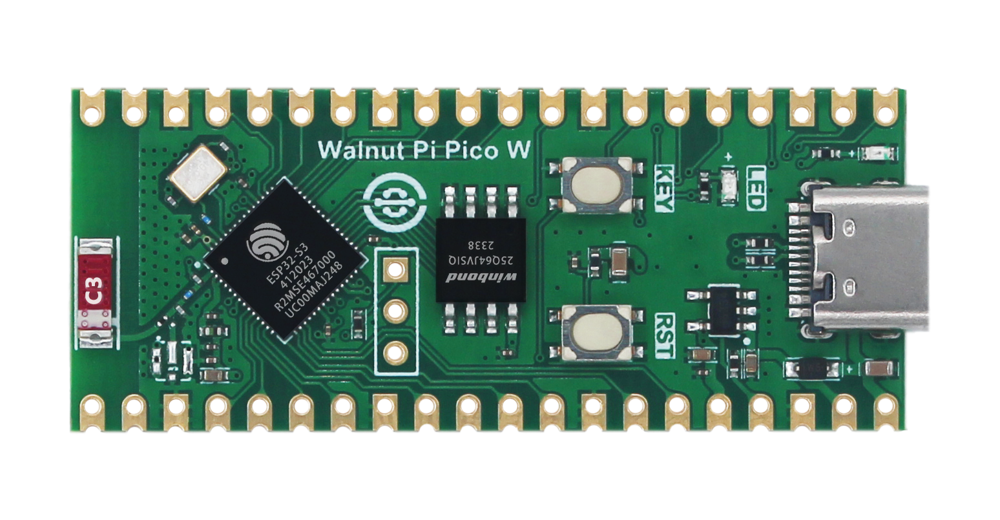
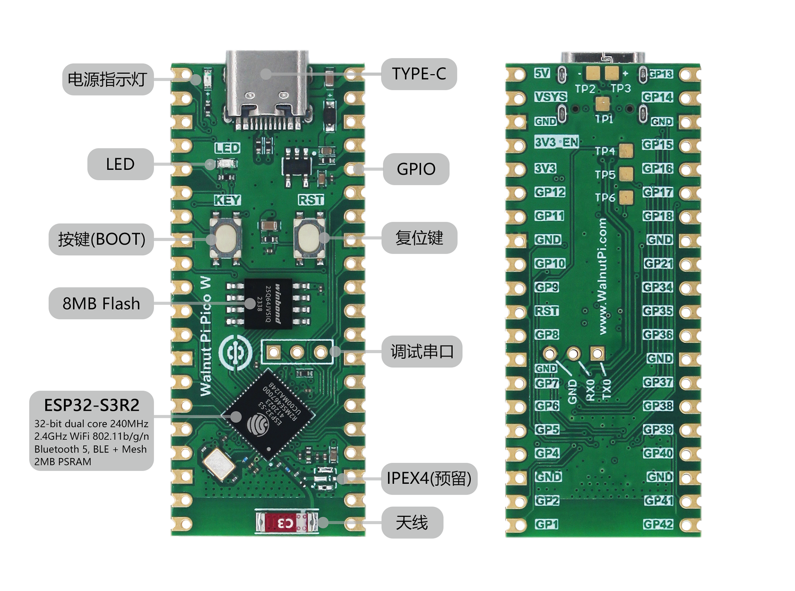
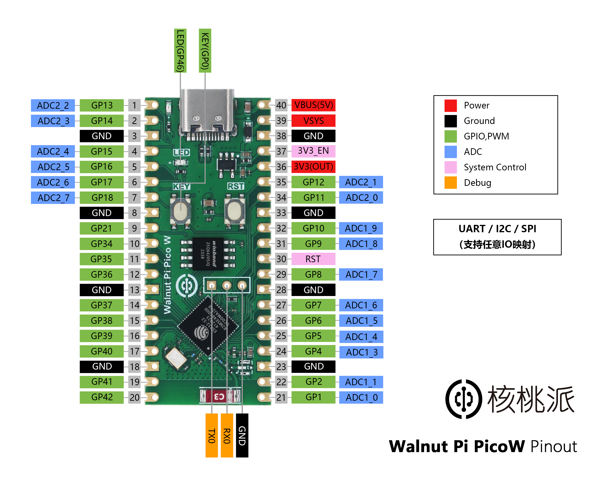
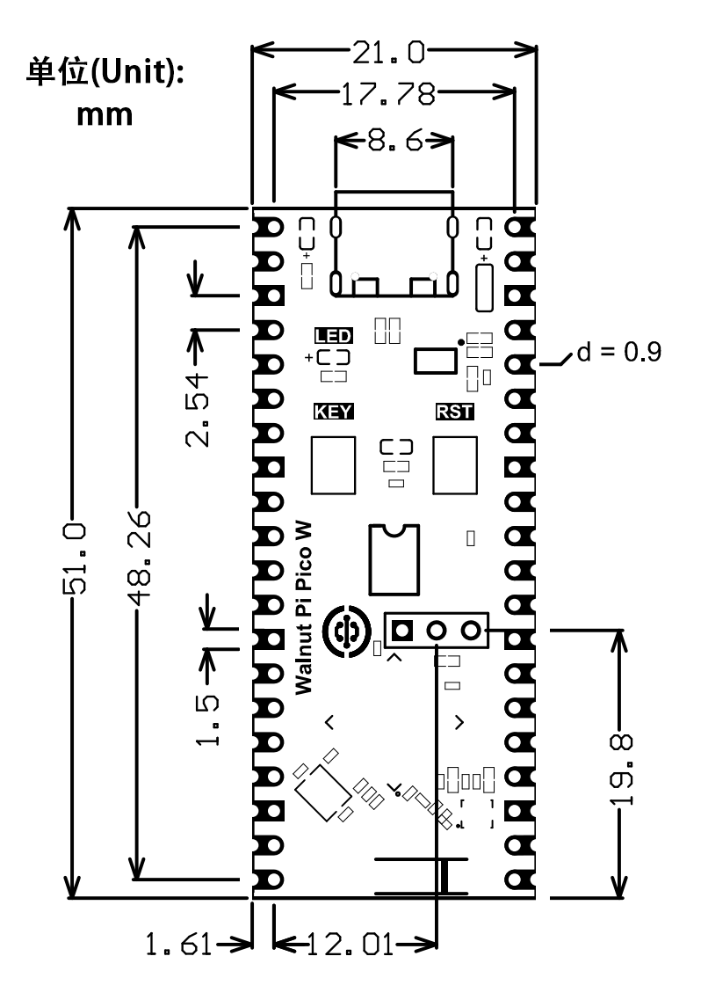

# WalnutPi PicoW

## WalnutPi PicoW

The WalnutPi PicoW is designed, developed, and manufactured in China. It is an MCU-level product within the WalnutPi ecosystem, based on the high-performance Espressif ESP32-S3 processor (with built-in WiFi and Bluetooth functionality). It features excellent RF performance, a compact and elegant appearance, and dimensions compatible with the Raspberry Pi PicoW. It is suitable for all kinds of electronic product DIY, commercial project development, and usage.

## Hardware Resources

|  Product Specifications |  |
|  :---:  | ---  |
| MCU | **ESP32-S3R2** 32-bit dual cores @ up to 240MHz |
| RAM | 2M Bytes PSRAM |
| FLASH  | 8M Bytes |
| WiFi  | 2.4GHz WiFi 802.11 b/g/n |
| Bluetooth  | Bluetooth 5, BLE + Mesh |
| Antenna  | High-gain ceramic antenna (external ipex4 optional) |
| LED  |  ● Programmable LED (blue)   ● Power LED (red) |
| Buttons  |  ● Function button (BOOT)   ● Reset button |
| GPIO  | 25 x GPIO (including ADC/PWM/UART/I2C/SPI functions) |
| USB  | Type-C, USB2.0, all-in-one for firmware download/programming/debugging/power |
| Others  |  ● Reserved UART debug (UART0) 3-pin header    ● Back pads `TP1`:GND, `TP2`:USB-, `TP3`:USB+, `TP4`:GPIO3, `TP5`:GPIO46, `TP6`:GPIO0 |
| Programming Language  | MicroPython |

|  Physical Specifications |  |
|  :---:  | ---  |
| Dimensions  | 51 x 21mm (PCB dimensions) |
| Weight  | 3.6g (bare board) |

## Pinout Diagram

## Dimension Diagram

