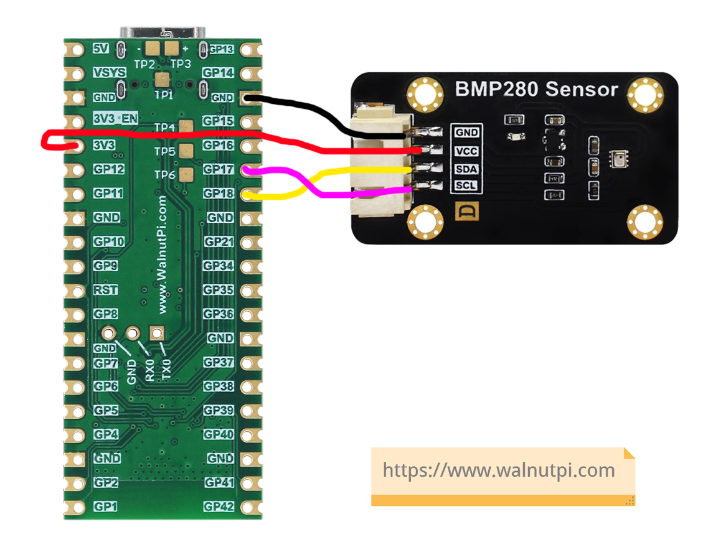
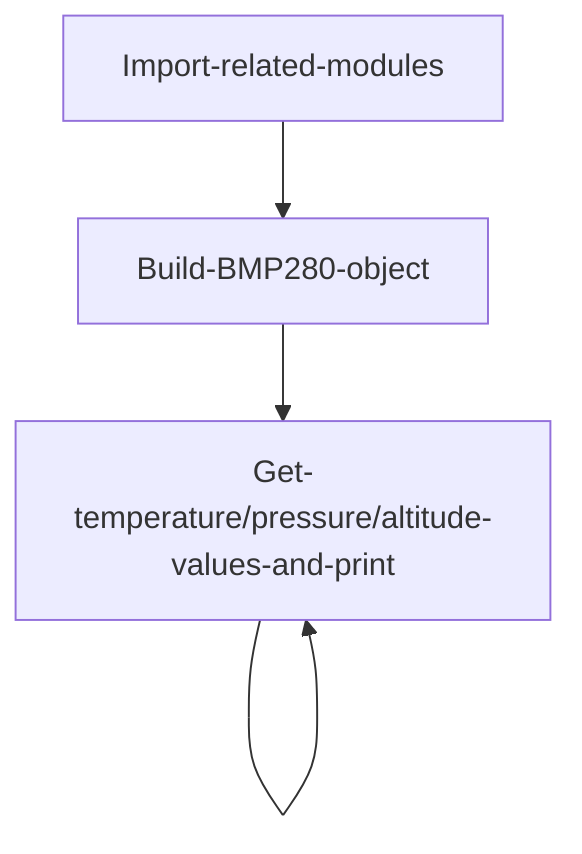
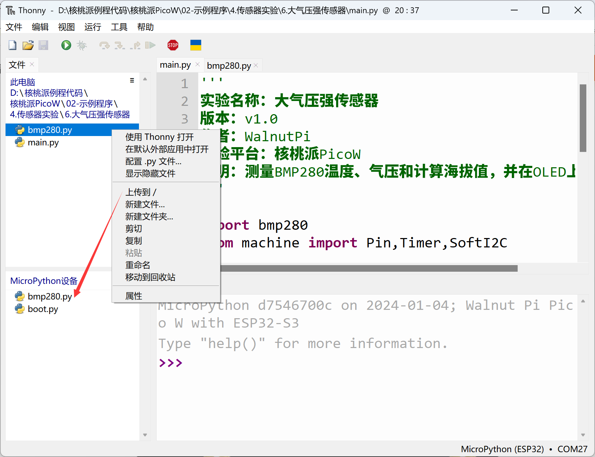
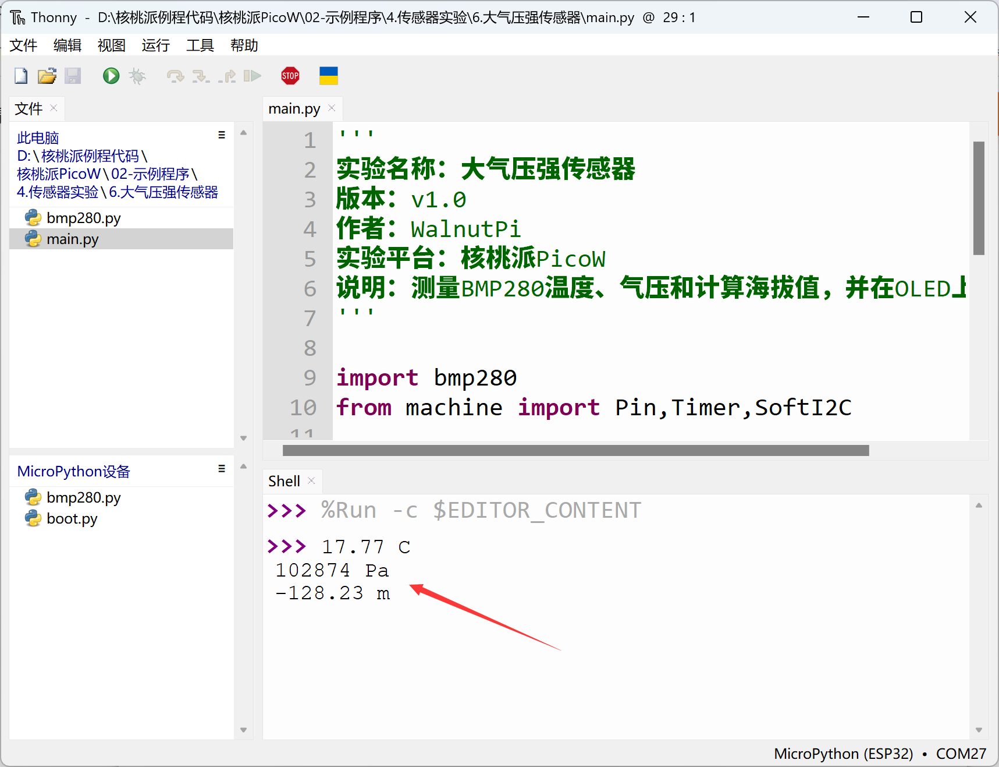

# Atmospheric Pressure Sensor (BMP280)

## Introduction
This experiment uses the BMP280 atmospheric pressure sensor module, a high-precision barometric pressure sensor designed for mobile applications. The sensor module features an extremely compact package, making it ideal for battery-powered devices such as phones, GPS modules, and watches due to its small size and low power consumption. In addition to measuring atmospheric pressure, the BMP280 sensor can also measure temperature (with moderate accuracy) and calculate altitude using formulas.

## Objective
Use Python programming to measure the current environment's atmospheric pressure and temperature, calculate the current altitude from the pressure using a formula, and build your own barometer!

## Experiment Explanation

Most BMP280 modules on the market are generic and use I2C bus communication. Below is a BMP280 sensor module:


|  Module Specifications |  |
|  :---:  | ---  |
| Supply Voltage  | 3.3V |
| Operating Current  | \<20mA |
| Communication  | I2C bus |
| I2C Address  | 0x76 (BMP280 SDO pulled low by default);<br></br> When BMP280 SDO pin is pulled high, I2C address is: 0x77 |
| Pin Description  | `VCC`: Connect to 3.3V <br></br> `GND`: Ground <br></br>  `SDA`: I2C data pin  <br></br> `SCL`: I2C clock pin |

<br></br>

From the above, we can see that the BMP280 is a sensor driven via the I2C interface. We can program the WalnutPi PicoW's I2C interface to communicate with this module.

The WalnutPi PicoW's MicroPython firmware integrates software-simulated SoftI2C, supporting any GPIO pin to be defined as the relevant pin — very convenient. This example uses the WalnutPi PicoW's GPIO17 connected to the BMP280 sensor's SCL pin, and GPIO18 to the SDA pin, as shown below:



**Altitude Calculation:**

Standard atmospheric pressure is defined as the pressure at sea level (0 meters altitude) at a temperature of 0°C and latitude 45°. Its value is 101325 Pascals (Pa).

Relationship between atmospheric pressure and altitude: P=P0×(1-H/44300)^5.256

Therefore, the altitude calculation formula is: H=44300*(1- (P/P0)^(1/5.256))

Where: H is altitude, P0 is standard atmospheric pressure (0°C, 101325Pa)

From the formula above, altitude is derived from atmospheric pressure. Physically speaking, the higher the altitude, the thinner the air, and the lower the atmospheric pressure. By measuring pressure changes, we can calculate altitude. However, this assumes a temperature of 0°C. In reality, higher temperatures mean thinner air and lower pressure. Therefore, altitude data theoretically requires temperature compensation, so the altitude conversion in this experiment has some error. Interested readers can explore this further on their own.


Python's strength lies in its rich modules and function libraries. Once a module is established, subsequent users can use it very simply without redoing low-level driver development. This enables object-oriented programming, and when needed, you can still modify the underlying code — very flexible. Here, we directly call an already-written Python driver file that implements measurement and calculation of pressure, temperature, and altitude. Users can use it directly as follows:

## BMP280 Object

### Constructor
```python
bmp = bmp280.BMP280(i2c)
```
Build a BMP280 object.

Parameter description:
- `i2c`: Defined I2C object.

### Usage

```python
bmp.getTemp()
```
Returns temperature value in °C, data type is `float`.

<br></br>

```python
bmp.getPress()
```
Returns pressure value in Pa, data type is `float`.

<br></br>

```python
bmp280.pressure()
```
Returns atmospheric pressure value in hPa (1hPa = 100Pa), data type is `float`

<br></br>

```python
bmp.getAltitude()
```
Returns altitude value in meters, data type is `float`.

<br></br>

After understanding the BMP280 sensor principles and object usage methods, we can organize the programming approach. The flow chart is as follows:



## Reference Code

```python
'''
Experiment Name: Atmospheric Pressure Sensor
Version: v1.0
Author: WalnutPi
Platform: WalnutPi PicoW
Description: Measure BMP280 temperature, pressure, calculate altitude, and print to terminal.
'''

import bmp280
from machine import Pin,Timer,SoftI2C

#Build BMP280 object
i2c1 = SoftI2C(sda=Pin(18), scl=Pin(17))
bmp = bmp280.BMP280(i2c1)

#Interrupt callback function
def fun(tim):

    # Temperature info print
    print(str(bmp.getTemp()) + ' C')
    # Pressure info print
    print(str(bmp.getPress()) + ' Pa')
    # Altitude info print
    print(str(bmp.getAltitude()) + ' m')

#Start timer
tim = Timer(1)
tim.init(period=1000, mode=Timer.PERIODIC, callback=fun) #Period 1s
```

## Experimental Results

Since this example code depends on other Python libraries, you need to upload the `bmp280.py` file to the WalnutPi PicoW:



Run the main program code using Thonny IDE. You can see the terminal printing temperature, pressure, and altitude information:


