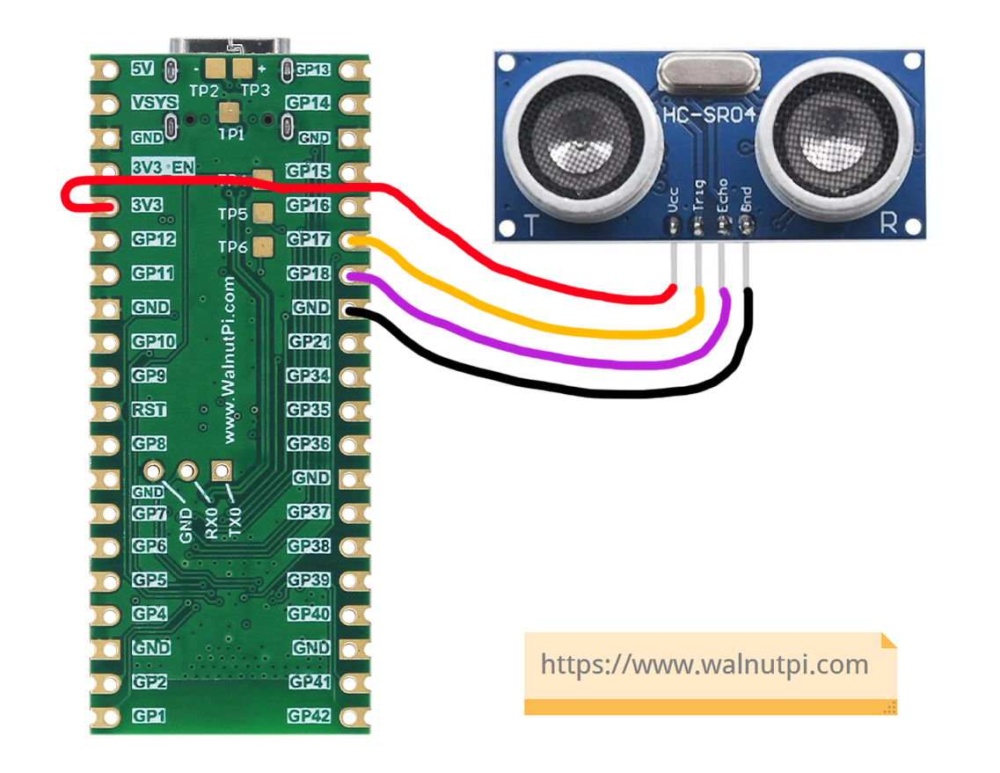
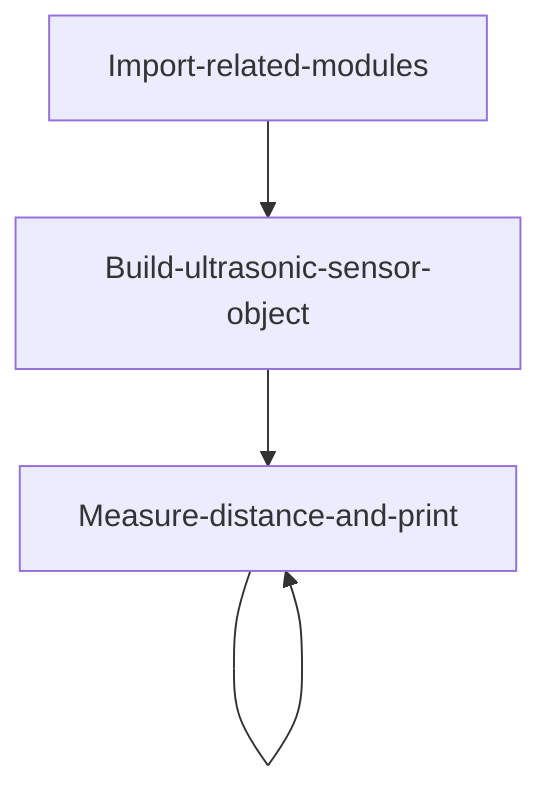
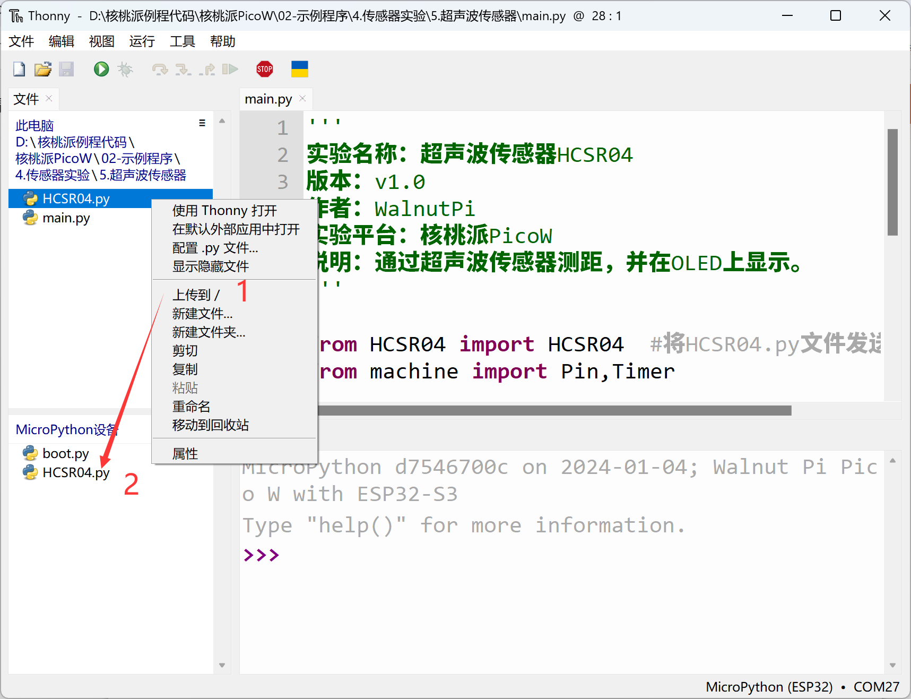
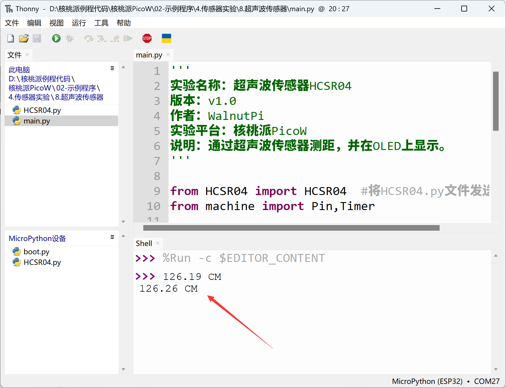

# Ultrasonic Distance Measurement (HC-SR04)

## Introduction
The ultrasonic sensor is a distance measurement sensor. Its principle is based on sound waves reflecting off obstacles and being received, combined with the speed of sound in air to calculate distance. It has applications in measurement, obstacle avoidance cars, autonomous driving, and other fields.

## Objective
Implement ultrasonic sensor distance measurement using MicroPython programming.

## Experiment Explanation

Below is a commonly available HC-SR04 ultrasonic module:


|  Module Specifications |  |
|  :---:  | ---  |
| Supply Voltage  | 3.3V~5V (WalnutPi PicoW requires one supporting 3.3V) |
| Measurement Distance  | 2cm~450cm |
| Measurement Precision  | 0.5cm |
| Pin Description  | `VCC`: Connect to 3.3V <br></br> `GND`: Ground <br></br>  `Trig`: Transmit pin  <br></br> `Echo`: Receive pin |

<br></br>

The ultrasonic sensor module uses two IO ports to control ultrasonic transmission and reception separately. Its working principle is as follows:

1. Connect power and ground to the ultrasonic module;
2. Input a 20us high-level square wave to the pulse trigger pin (trig);
3. After the square wave input, the module automatically emits 8 sound waves at 40KHz, and simultaneously the echo pin level changes from 0 to 1; (a timer should start counting at this point)
4. When the ultrasonic wave returns and is received by the module, the echo pin level changes from 1 back to 0; (the timer should stop counting at this point). The time recorded by the timer is the total duration from ultrasonic emission to return;
5. Using the speed of sound in air at 340 m/s, the measured distance can be calculated.

Below is the timing trigger diagram for the HC-SR04 ultrasonic sensor:


We can use any 2 regular GPIO ports to connect the ultrasonic sensor. This example uses GPIO17 connected to the Trig pin and GPIO18 connected to the Echo pin:



MicroPython has 2 ways to import object libraries. One is libraries integrated in the firmware, which can be called directly. The other is via Python library files, where you just need to send the .py file to the development board's file system. The ultrasonic object used in this experiment uses the .py library method, located in the `HCSR04.py` file. The object description is as follows:

## HCSR04 Object

In CircuitPython, pre-written Python libraries can be used directly to get distance measurements from the ultrasonic sensor. The details are as follows:

### Constructor
```python
sonar = HCSR04(trig,echo)
```
Build an ultrasonic module object, primarily initializing the 2 pins connected to the ultrasonic sensor.

- `trig`: Ultrasonic transmitter pin;
- `echo`: Ultrasonic receiver pin;

Example:
```python
#Initialize ultrasonic module interface
trig = Pin(17,Pin.OUT)
echo = Pin(18,Pin.IN)
sonar = HCSR04(trig,echo)
```

### Usage
```python
sonar.getDistance()
```
Returns the measured distance value in cm, data type is `float`.

<br></br>

After building the object, we can continuously loop to get ultrasonic distance information. The code flow is as follows:



## Reference Code

```python
'''
Experiment Name: Ultrasonic Sensor HC-SR04
Version: v1.0
Author: WalnutPi
Platform: WalnutPi PicoW
Description: Distance measurement using ultrasonic sensor.
'''

from HCSR04 import HCSR04  #Send the HCSR04.py file to the development board
from machine import Pin,Timer

#Initialize ultrasonic module interface
trig = Pin(17,Pin.OUT)
echo = Pin(18,Pin.IN)
sonar = HCSR04(trig,echo)

#Interrupt callback function
def fun(tim):

    Distance = sonar.getDistance() #Measure distance

    # Terminal print distance, unit cm, keep 2 decimal places.
    print(str('%.2f'%(Distance)) + ' CM')

#Start RTOS timer
tim = Timer(1)
tim.init(period=1000, mode=Timer.PERIODIC, callback=fun) #Period 1s
```

## Experimental Results

Since this example code depends on other Python libraries, you need to upload the `HCSR04.py` file to the WalnutPi PicoW:



Run the main program code using Thonny IDE. You can see the terminal printing ultrasonic sensor distance information.


