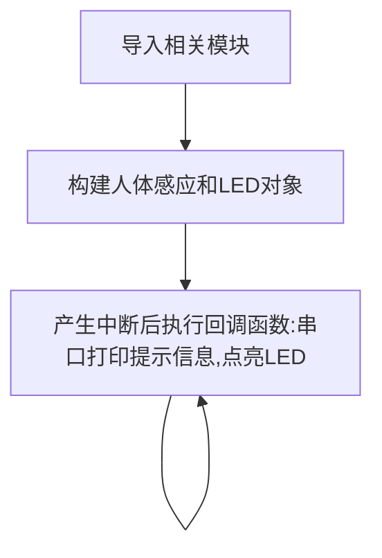

# 人体感应传感器

## 前言
人体感应传感器，在室内安防应用非常普遍，其原理是由探测元件将探测到人体的红外辐射转变成微弱的电压信号，经过放大后输出。为了提高探测器的探测灵敏度以增大探测距离，一般在探测器的前方装设一个塑料的菲涅尔透镜，它和放大电路相配合，可将信号放大 70dB 以上，这样就可以测出 5~10 米范围内人的行动。

## 实验目的
通过python编程来检测人体感应模块，当有人出现时候串口打印“Get People!！！”提示，蓝色指示灯点亮（没人时候熄灭）。

## 实验讲解

下图是一款常用的人体感应传感器模块，主要有供电引脚和信号输出引脚（供电电压一般为3.3V，具体以厂家参数为准）。

 

这款模块通电后，当检测到有人时候，传感器信号输出引脚输出高电平并持续3-5秒。

 

由此可见，可以使用外部中断结合上升沿的触发方式来编程实现相关功能。外部中断参考 [**外部中断**](../basic_examples/exti.md) 章节内容，这里不再重复。

本例程使用GPIO10来连接，接线图如下:

 


代码编写流程如下：



## 参考代码

```python
'''
实验名称：人体感应传感器
版本：v1.0
作者：WalnutPi
实验平台：核桃派PicoW
说明：人体红外感应传感器应用
'''

import time
from machine import Pin   #从machine模块导入I2C、Pin子模块

Human=Pin(10,Pin.IN,Pin.PULL_UP) #构建人体红外对象
LED=Pin(46,Pin.OUT) #构建led对象，GPIO46,输出

def fun(Human): #Get People闪烁5次效果！

    print("Get People!!!")  # 提示有人
    LED.value(1)  # 点亮LED
    
    #等待传感器高电平结束
    while Human.value():
        pass
    
    LED.value(0)  # 熄灭LED

Human.irq(fun,Pin.IRQ_RISING) #定义中断，上升沿触发
```

## 实验结果

使用Thonny IDE运行代码，当传感器检测到有人时候，蓝灯亮。

 

终端打印提示信息"Get People!!!" ：

 

没人时候蓝灯熄灭。

 

