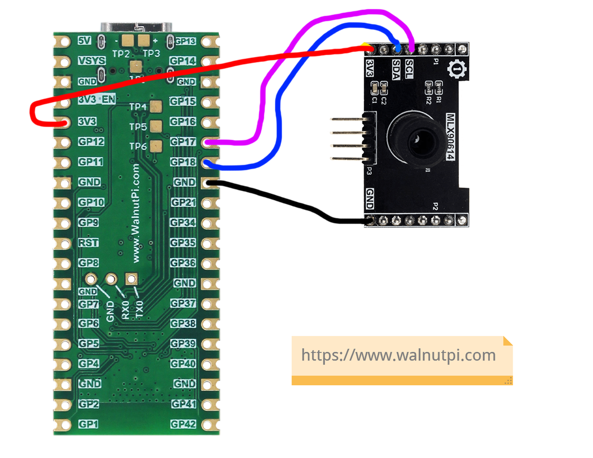
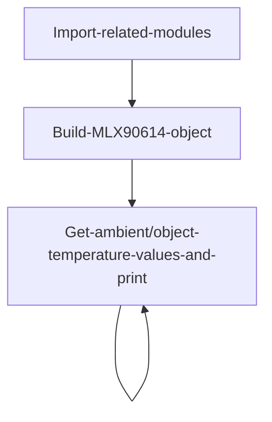
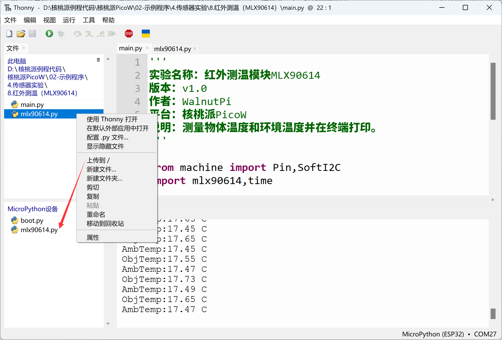
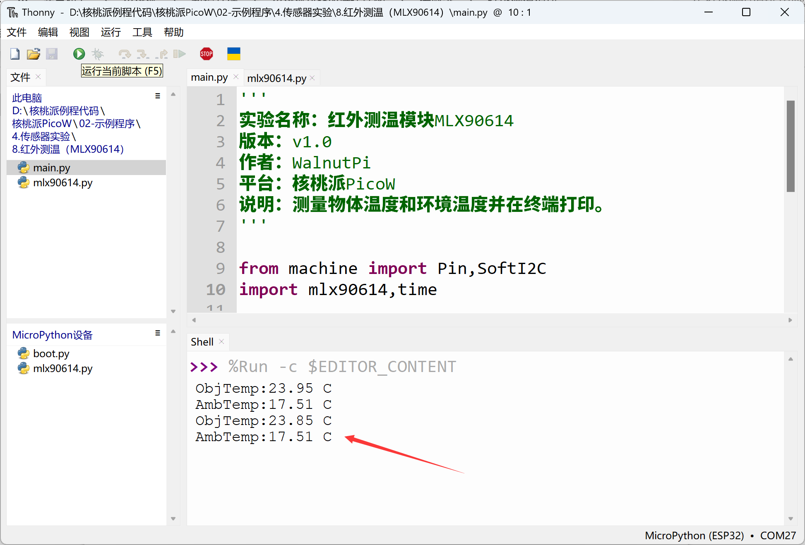

# Infrared Temperature Measurement (MLX90614)

## Introduction
The MLX90614 is an infrared thermometer for non-contact temperature measurement, capable of measuring objects between -70 to 380°C. The sensor uses an infrared-sensitive thermopile detector chip that can measure temperature with 0.02°C resolution within its temperature range.

## Objective
Implement MLX90614 non-contact temperature measurement using Python programming.

## Experiment Explanation

Most MLX90614 modules on the market are generic and use I2C bus communication. Below is an MLX90614 sensor module, available in DCC (short range 10cm) and DCI (long range 100cm) models — the code is the same for both.


|  Module Specifications |  |
|  :---:  | ---  |
| Supply Voltage  | 3.3V |
| Measurement Distance  | DCC (10cm) and DCI (100cm) |
| Measurement Range  | -70℃ - 382℃ |
| Measurement Precision  | 0.5℃ |
| Communication  | I2C bus (default address: 0x5a) |
| Pin Description  | `VCC`: Connect to 3.3V <br></br> `GND`: Ground <br></br>  `SDA`: I2C data pin  <br></br> `SCL`: I2C clock pin |

<br></br>

From the above, we can see that the MLX90614 is a sensor driven via the I2C interface. We can program the WalnutPi PicoW's I2C interface to communicate with this module.

The WalnutPi PicoW's MicroPython firmware integrates software-simulated SoftI2C, supporting any GPIO pin to be defined as the relevant pin — very convenient. This example uses the WalnutPi PicoW's GPIO17 connected to the MLX90614 sensor's SCL pin, and GPIO18 to the SDA pin, as shown below:




## MLX90614 Object

### Constructor
```python
mlx = mlx90614.MLX90614(i2c)
```
Build an MLX90614 object.

Parameter description:
- `i2c`: Defined I2C object.

### Usage

```python
mlx.ObjectTemp()
```
Returns object temperature in °C, data type: `float`.
<br></br>

```python
mlx.AmbientTemp()
```
Returns ambient temperature in °C, data type: `float`.

<br></br>

After understanding the MLX90614 sensor principles and object usage methods, we can organize the programming approach. The flow chart is as follows:



## Reference Code
```python
'''
Experiment Name: Infrared Temperature Measurement Module MLX90614
Version: v1.0
Author: WalnutPi
Platform: WalnutPi PicoW
Description: Measure object temperature and ambient temperature, print to terminal.
'''

from machine import Pin,SoftI2C
import mlx90614,time

#Build infrared temperature measurement object
i2c1 = SoftI2C( scl=Pin(17), sda=Pin(18),freq=100000)
mlx = mlx90614.MLX90614(i2c1)

while True:

    #Object temperature
    print('ObjTemp:'+str('%.2f'%mlx.ObjectTemp()+' C'))

    #Ambient temperature
    print('AmbTemp:'+str('%.2f'%mlx.AmbientTemp()+' C'))

    time.sleep(1)
```

## Experimental Results

Since this example code depends on other Python libraries, you need to upload the `mlx90614.py` file to the WalnutPi PicoW:



Run the main program code using Thonny IDE. You can see the terminal printing ambient temperature and object temperature information:


