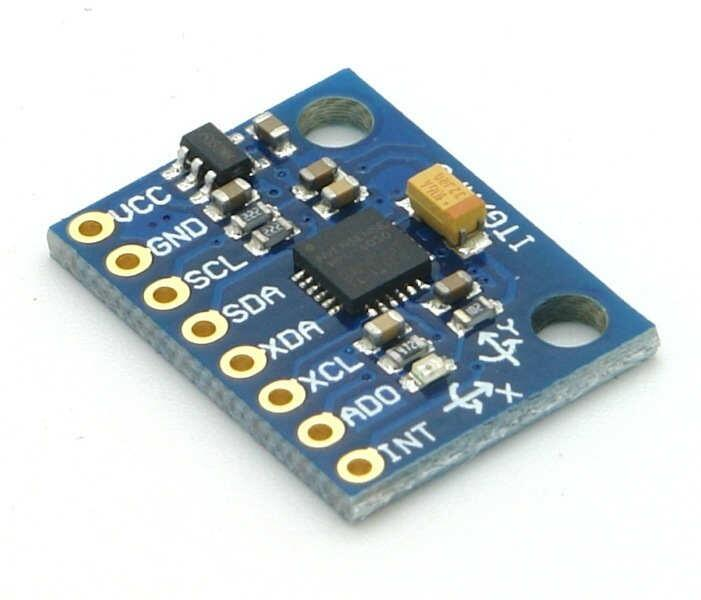
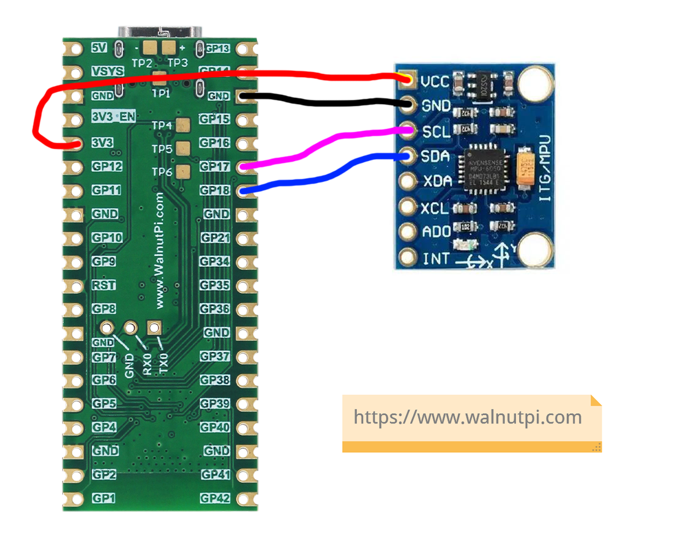
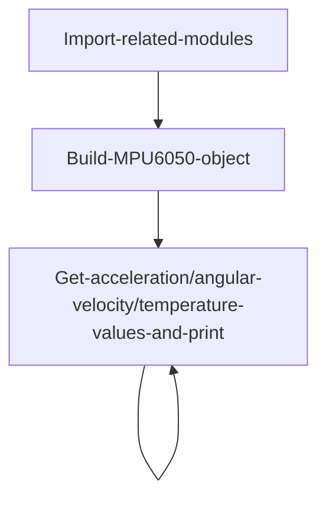
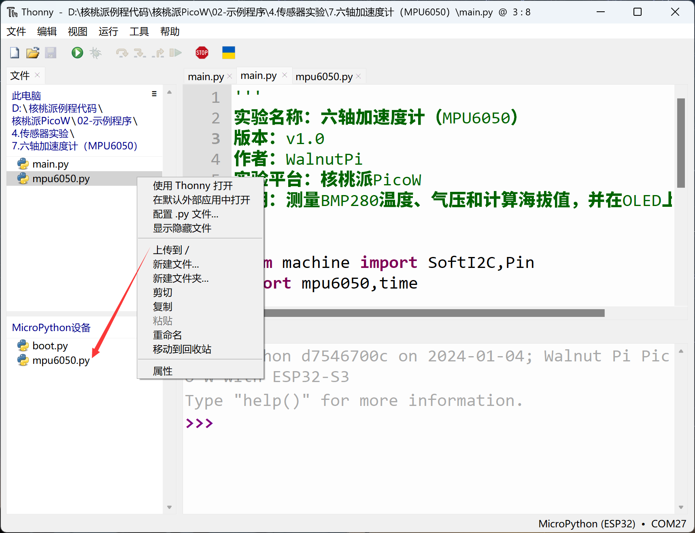
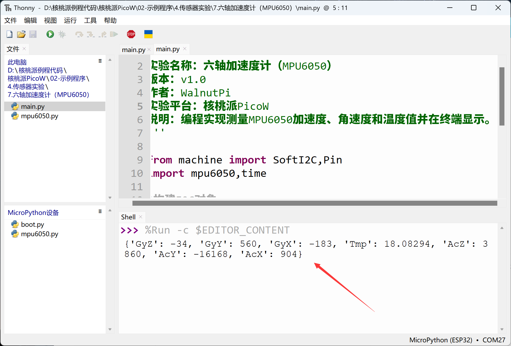

# 6-Axis Accelerometer (MPU6050)

## Introduction
The MPU6050 is a high-performance 6-axis (3-axis accelerometer + 3-axis gyroscope) sensor module used for measuring an object's motion attitude. It uses an I2C interface and is commonly used in quadcopter flight controllers, self-balancing vehicles, and similar applications.

## Objective
Program measurement of MPU6050 acceleration, angular velocity, and temperature values using Python.

## Experiment Explanation

Most MPU6050 modules on the market are generic and use I2C bus communication. Below is an MPU6050 sensor module:



|  Module Specifications |  |
|  :---:  | ---  |
| Supply Voltage  | 3.3V |
| Communication  | I2C bus (default address: 0x68) |
| Measurement Dimensions  | Accelerometer: 3-axis <br></br> Gyroscope: 3-axis |
| Accelerometer Range  | ±2/±4/±8/±16g |
| Gyroscope Range  | ±250/±500/±1000/±2000°/s |
| Temperature Sensor  | Measurement range: -40℃~85℃ (precision: ±1℃) |
| Pin Description  | `VCC`: Connect to 3.3V <br></br> `GND`: Ground <br></br>  `SDA`: I2C data pin  <br></br> `SCL`: I2C clock pin |

<br></br>

**MPU6050 6-Axis Direction Description:**


From the above, we can see that the MPU6050 is a sensor driven via the I2C interface. We can program the WalnutPi PicoW's I2C interface to communicate with this module.

The WalnutPi PicoW's MicroPython firmware integrates software-simulated SoftI2C, supporting any GPIO pin to be defined as the relevant pin — very convenient. This example uses the WalnutPi PicoW's GPIO17 connected to the MPU6050 sensor's SCL pin, and GPIO18 to the SDA pin, as shown below:

This example uses WalnutPi's I2C1 to connect to the MPU6050 sensor:



## MPU6050 Object

### Constructor
```python
mpu = mpu6050.accel(i2c, addr=0x68)
```
Build an MPU6050 object.

Parameter description:
- `i2c`: Defined I2C object.
- `addr`: Module I2C address. Default: 0x68;

### Usage

```python
mpu.get_values()
```
Returns 7 data values in sequence:

x, y, z acceleration values, unit m/s², data type `float`

Temp temperature value, unit ℃, data type `float`

x, y, z angular velocity values, unit rad/s, data type `float`

<br></br>

After understanding the MPU6050 sensor principles and object usage methods, we can organize the programming approach. The flow chart is as follows:



## Reference Code

```python
'''
Experiment Name: 6-Axis Accelerometer (MPU6050)
Version: v1.0
Author: WalnutPi
Platform: WalnutPi PicoW
Description: Program measurement of MPU6050 acceleration, angular velocity, and temperature values, display in terminal.
'''

from machine import SoftI2C,Pin
import mpu6050,time

#Build I2C object
i2c1 = SoftI2C(scl=Pin(17), sda=Pin(18))

#Build MPU6050 object
mpu = mpu6050.accel(i2c1)

while True:

    #Print 6-axis accelerometer raw values
    print(mpu.get_values())

    #Delay 1 second
    time.sleep(1)
```

## Experimental Results

Since this example code depends on other Python libraries, you need to upload the `mpu6050.py` file to the WalnutPi PicoW:



Run the main program code using Thonny IDE. You can see the terminal printing the 7 raw values from the MPU6050 6-axis accelerometer:


