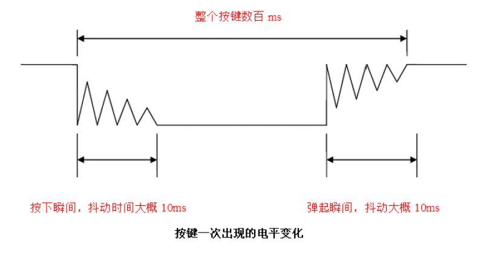
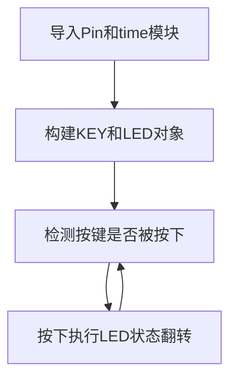

# 按键

## 前言
按键是最简单也最常见的输入设备，很多产品都离不开按键，包括早期的iphone，今天我们就来学习一下如何使用MicroPython来编写按键程序。有了按键输入功能，我们就可以做很多好玩的东西了。

## 实验目的
使用按键功能，通过检测按键被按下后，改变LED（蓝灯）的亮灭状态。

## 实验讲解

核桃派PicoW开发板上有2个按键，RST和KEY，RST顾名思义是复位用的，所以真正自带可以用的就只有1个按键KEY。

功能按键KEY位于开发板下图所示位置：


我们先来看看原理图，找到按键对应的IO引脚。


从原理图可以看到，按键KEY的一端连接到ESP32-S3的引脚0，另一端连接到GND。所以按键在没按下时候输入高电平（1），按下时候输入低电平（0）。

和前面LED一样，按键的输入检测也是用到Pin对象模块，具体如下：

## Pin对象

Pin引脚对象。

### 构造函数
```python
KEY = machine.Pin(id, mode, pull)
```

Pin位于machine模块下:

- `id` ：芯片引脚编号。如：0、2、46。
- `mode` ：输入/输出模式。
    - `Pin.IN` : 输入模式；
    - `Pin.OUT` : 输出模式；   
- `pull`: 上下拉电阻配置。
    - `None` : 无上下拉电阻；
    - `Pin.PULL_UP` : 上拉电阻启用；
    - `Pin.PULL_DOWN` : 下拉电阻启用。


### 使用方法
```python
KEY.value([X])
```
配置引脚电平值：
- `输出模式` ：输出电平值。
    - `0` : 输出低电平；
    - `1` : 输出高电平。
- `输入模式` ：无需参数，获取当前引脚输入电平值。

<br></br>

更多用法请阅读官方文档：<br></br>
https://docs.micropython.org/en/latest/library/machine.Pin.html#machine-pin

<br></br>

按键被按下时候可能会发生抖动，抖动如下图，有可能造成误判，因此我们需要使用延时函数来进行消抖：



常用的方法就是当检测按键值为0时，延时一段时间，大约10ms，再判断按键引脚值仍然是0，是的话说明按键被按下。延时使用time模块，使用方法如下：
```python
import time

time.sleep(1)           # 睡眠1秒
time.sleep_ms(500)      # 睡眠500毫秒
time.sleep_us(10)       # 睡眠10微妙
start = time.ticks_ms() # 获取毫秒计时器开始值

delta = time.ticks_diff(time.ticks_ms(), start) # 计算从上电开始到当前时间的差值
```

我们将按键引脚0配置成输入，实现当检测到按键被按下时候点亮LED蓝灯，松开时关闭LED蓝灯来做指示。代码编写流程如下：



## 参考代码

```python
'''
实验名称：按键
版本：v1.0
说明：通过按键改变LED的亮灭状态
'''
from machine import Pin
import time

LED=Pin(46,Pin.OUT) #构建LED对象,开始熄灭
KEY=Pin(0,Pin.IN,Pin.PULL_UP) #构建KEY对象
state=0 #LED引脚状态

while True:
    
    if KEY.value()==0:   #按键被按下
        time.sleep_ms(10) #消除抖动
        if KEY.value()==0: #确认按键被按下
            
            state=not state  #使用not语句而非~语句
            LED.value(state) #LED状态翻转
            print('KEY')
            
            while not KEY.value(): #检测按键是否松开
                pass
```

从上面代码可以看到，初始化各个对象后，进入循环，当检测到KEY的值为0（按键被按下）时候，先做了10ms的延时，再次判断；

state为LED状态的值，每次按键按下后通过使用not来改变。这里注意的是在python里使用**not**而不是**~**的方式。not返回的是True和False，即0,1。而~ 是取反操作，会导致出错。


## 实验结果

Thonny IDE中运行代码：


可以看到当按键KEY每次被按下时候，LED蓝灯亮灭状态发生翻转。


GPIO是非常通用的功能，学会了GPIO，就可以把开发板所有的引脚为自己所用，灵活性很强。