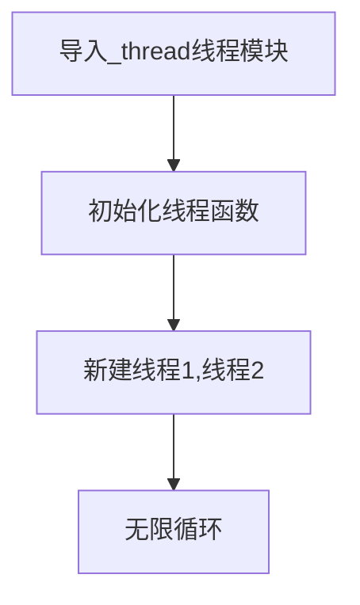
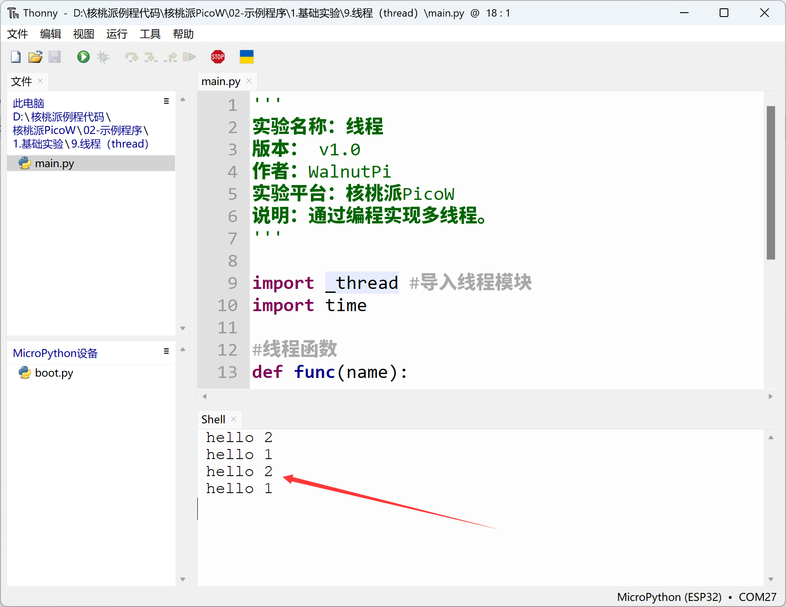

# thread（线程）

## 前言
我们看到前面的编程都是一个循环来完成，但当我们需要分时完成不同任务时候，线程编程就派上用场了。这有点像RTOS(实时操作系统)，今天我们就来学习一下如何通过MicroPython编程实现多线程。

## 实验目的
编程实现多线程同时运行任务。

## 实验讲解

核桃派PicoW的MicroPython固件已经集成了_thread线程模块。我们直接调用即可。该模块衍生于python3，属于低级线程，详情可以看官网介绍：https://docs.python.org/3.5/library/_thread.html#module-thread

编程流程如下：



## 参考代码

```python
'''
实验名称：线程
版本： v1.0
作者：WalnutPi
实验平台：核桃派PicoW
说明：通过编程实现多线程。
'''

import _thread #导入线程模块
import time

#线程函数
def func(name):
    while True:
        print("hello {}".format(name))
        time.sleep(1)

_thread.start_new_thread(func,("1",)) #开启线程1,参数必须是元组
_thread.start_new_thread(func,("2",)) #开启线程2，参数必须是元组

while True:
    pass
```

## 实验结果

运行代码，可以看到串口终端重复执行2个线程。



本章我们学习了基于MicroPython的线程编程，实际是python3的低级线程编程。线程的引入让我们在处理多任务时候变得简单，大大增加了程序编写的灵活性。