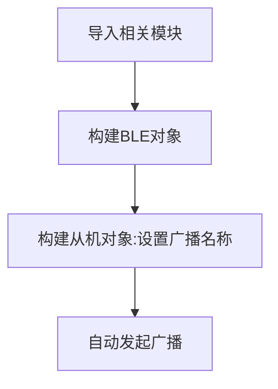

# 蓝牙广播

## 前言
BLE（Bluetooth Low Energy，低功耗蓝牙）是物联网中非常重要的角色，相对于WiFi连接而言，BLE可以做到超低功耗，快速连接，通过连接智能手机从而接入到互联网，成了很多智能产品普遍的选择，智能手环就是一个应用。

跟传统蓝牙音箱一样，要想连接就得先让手机搜索到BLE设备的发出的信号（广播），本节我们就来学习一下BLE是如何广播的。


## 实验目的
说明：编程实现核桃派PicoW进行蓝牙广播（从机），让手机（主机）搜索到该设备。

## 实验讲解

通常情况下，蓝牙设备（蓝牙从机）只有发出广播信号，才能让手机（蓝牙主机）搜索到从而发起连接。

核桃派PicoW的MicroPython固件内置bluetooth库和提供额外的BLE py库文件，开发者使用简单的模块函数可以非常方便地对树莓派PicoW做各种蓝牙无线应用。


我们来看看BLE的构造函数和使用方法。

## BLE对象

### 构造函数
```python
import bluetooth

ble = bluetooth.BLE()
```
构建BLE对象。 

## 蓝牙从机对象

### 构造函数

```python
import ble_simple_peripheral

p = ble_simple_peripheral.BLESimplePeripheral(ble,name='WalnutPi')
```
构建蓝牙从机对象。 
- `ble`: 前面构建好的BLE对象；
- `name` : 广播名称，这里最多支持8个字符。


### 使用方法

构建了从机对象后会自动发起蓝牙广播。

<br></br>

更多用法请阅读官方文档：<br></br>
https://docs.micropython.org/en/latest/library/bluetooth.html

从上表可以看到MicroPython通过模块封装，让BLE广播变得非常简单。代码编写流程如下：



## 参考代码

```python
'''
实验名称：蓝牙广播
版本：v1.0
作者：WalnutPi
说明：编程实现核桃派PicoW进行蓝牙广播（从机），让手机搜索到该设备。
'''

import bluetooth,ble_simple_peripheral,time

#构建BLE对象
ble = bluetooth.BLE()

#构建从机对象,广播名称为WalnutPi，名称最多支持8个字符。
p = ble_simple_peripheral.BLESimplePeripheral(ble,name='WalnutPi')
```

在 ble_simple_peripheral.py 代码中广播间隔默认是500000us，即500ms, 这里可以改成100ms，让手机更容易搜索到设备。**广播间隔越短，设备更容易被搜索，功耗越大。**


## 实验结果

由于本例程依赖蓝牙相关库，所以需要使用thonny把例程源码中配套py库文件上传到核桃派PicoW开发板：


运行主程序main.py，核桃派picow就开始蓝牙广播了：


<br></br>

**手机APP测试:**

由于ble不是经典蓝牙协议，无法在手机直接搜索操作，需要安装app来测试。这里推荐Adafruit的**bluefruit connect**应用软件来测试。

- 苹果手机安装方法：

在APP Store 搜索：“bluefruit connect” 直接安装即可。


<br></br>

- 安卓手机安装方法：

使用核桃派资料包提供的apk安装，位于资料包 **开发工具-->蓝牙测试APP -->安卓手机** 目录下：


安装后打开APP （本教程基于安卓APP测试），可以看到搜索到核桃派PicoW发出的蓝牙广播信号。


本例程成功实现了核桃派PicoW发起蓝牙广播，在后面章节将讲解如何蓝牙连接和相互传输收发数据。


