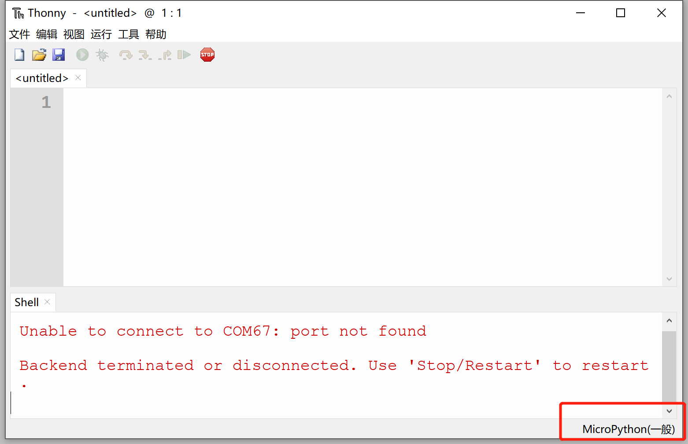
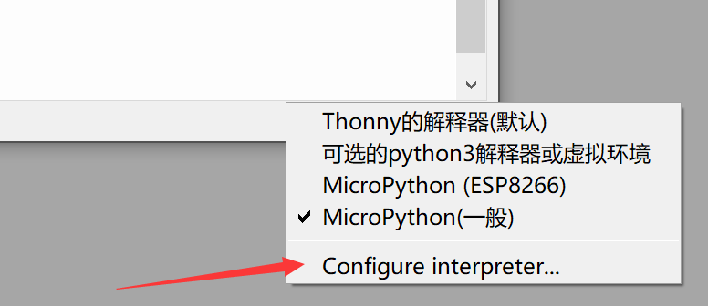

# REPL串口交互调试

核桃派PicoW(ESP32-S3)的MicroPython固件集成了交互解释器REPL 【读取(Read)-运算(Eval)-输出(Print)-循环(Loop) 】，开发者可以直接通过串口终端来调试开发板。

将开发板连接到电脑，从我的**电脑—属性—设备管理器**中找到当前开发板的串口号，这里是COM27。

我们打开Thonny，将开发板连接到电脑。点击右下角：

在弹出的列表选择：Configure interpreter(配置解析器)

选择“MicroPython（ESP32）”和当前开发板对应的串口号，点击确认。

连接成功后可以在shell（串口终端）看到固件的相关信息：

如果连接串口后没有出现固件信息，那么有可能是因为开发板里面有代码在运行，阻塞了REPL，这时候可以点击菜单栏的 **运行 - 中断执行按钮** 打断在运行的程序即可。

接下来我们在终端测试一下REPL：

我们在终端里面输入 print(“Hello World!”) , 按回车，可以看到打印出Hello World!字符：

输入 1+1 ，按回车：

REPL还有一个强大的功能就是打印错误的代码来调试程序，在后面代码运行时候，如果程序出错，出错信息将通过REPL打印。