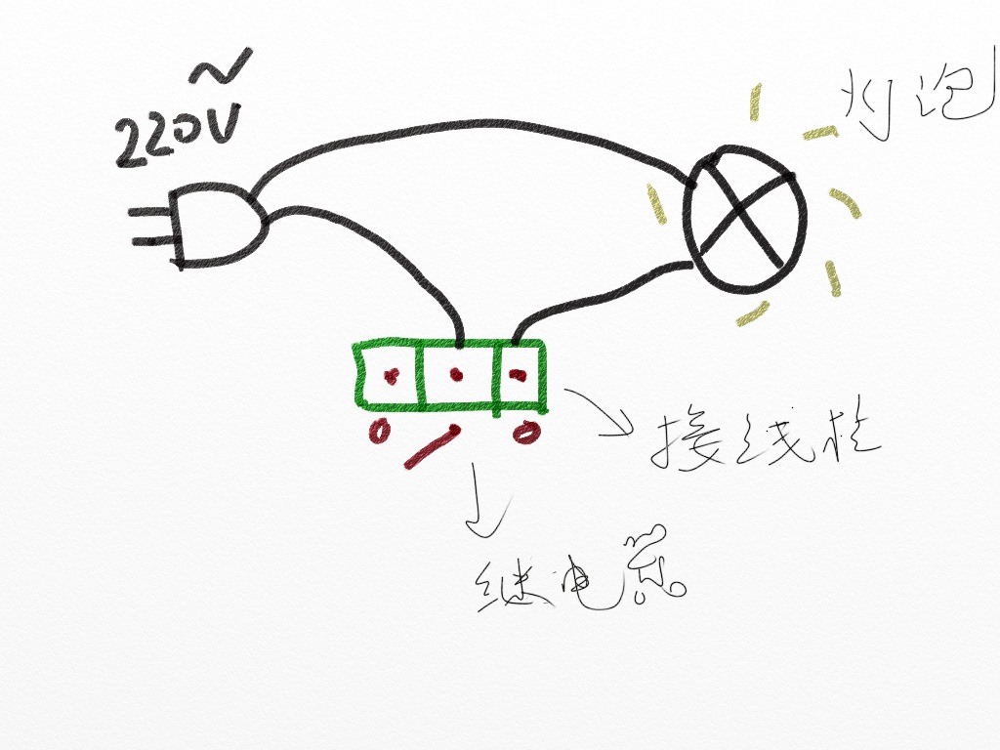
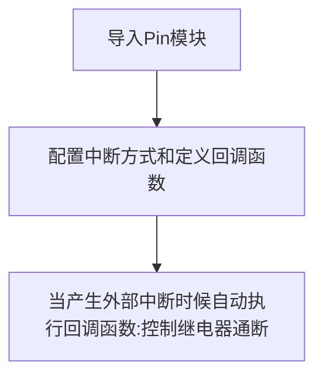

# 继电器

## 前言
我们知道我们的开发板GPIO输出的电平是3.3V的，这是不能直接控制一些高电压的设备，比如电灯（220V）。这时候就可以使用我们常用的低压控制高压元件—继电器。

## 实验目的
使用按键控制继电器通断。

## 实验讲解

下图是01Studio的继电器模块，可以使用3.3V供电，核桃派PicoW引出IO可以直接连接该模块控制端。左侧低压控制接口主要有供电引脚和信号控制引脚（供电电压一般为3.3V，具体以厂家参数为准）。右侧蓝色为高压部分，可连接220V电器。

:::tip 提示

务必使用3.3V电平控制的继电器，因为核桃派PicoW的GPIO耐压值为3.3V，使用5V控制的继电器可能会反向烧坏开发板。

:::


继电器可以理解成是一个开关，相当于我们平时家里面的电灯开关面板一样，只是现在使用单片机的GPIO来控制。继电器低压控制高压电器一个比较典型的接线图如下图所示：



本实验中核桃派PicoW引脚10和继电器模块的控制引脚连接，接线示意图如下：


01Studio的继电器模块的控制原理非常简单，跟LED控制方式一样，只是使用低电平‘0’表示继电器开，高电平‘1’表示继电器关。

我们可以参考基础实验—按键外部中断实验例程来使用继电器，请参考  [**外部中断**](../basic_examples/exti.md) 章节内容，这里不再重复！

代码编写流程如下：




## 参考代码

```python
'''
实验名称：继电器
版本：v1.0
作者：WalnutPi
实验平台：核桃派PicoW
说明：通过按键改变继电器通断状态（外部中断方式）
'''

#导入相关模块
from machine import Pin
import time

relay=Pin(10,Pin.OUT,value=1) #构建继电器对象,默认断开
KEY=Pin(0,Pin.IN,Pin.PULL_UP) #构建KEY对象

state=0  #继电器引脚状态标志位

#LED状态翻转函数
def fun(KEY):
    global state
    time.sleep_ms(10) #消除抖动
    if KEY.value()==0: #确认按键被按下
        state = not state
        relay.value(state)

KEY.irq(fun,Pin.IRQ_FALLING) #定义中断，下降沿触发
```

## 实验结果

运行代码，可以通过按键来控制继电器通断：


继电器的控制方式非常简单，用途非常广。只需要一个简单的GPIO高低电平即可实现控制。