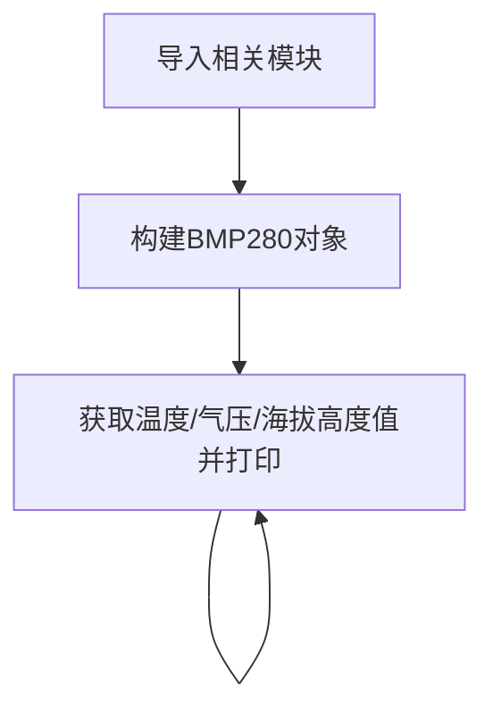

# 大气压强传感器（BMP280）

## 前言
本实验中大气压强传感器模块使用的是BMP280，这是一款专为移动应用而设计的高精度大气压传感器， 传感器模块采用极其紧凑的封装，其小尺寸和低功耗可以应用在手机、 GPS 模块、 手表的电池供电设备中。 BMP280 传感器除了可以测量大气压强，还可以测量温度（温度精度不高）以及通过计算公式来换算出海拔高度。

## 实验目的
通过python编程实现测量当前环境的大气压强、温度信息，将大气压强通过公式计算出当前海拔高度，打造自己的气压计！

## 实验讲解

市面上大多BMP280模块都通用，使用I2C总线通讯，下图是一款BMP280传感器模块：

 

|  模块参数 |
|  :---:  | ---  |
| 供电电压  | 3.3V |
| 工作电流  | <20mA |
| 通信方式  | I2C总线 |
| I2C地址  | 0x76（BMP280的SDO默认下拉）；<br></br> 当 BMP280 的 SDO 引脚上拉时，I2C 地址为：0x77 | 
| 引脚说明  | `VCC`: 接3.3V <br></br> `GND`: 接地 <br></br>  `SDA`: I2C数据引脚  <br></br> `SCL`: I2C时钟引脚 |

<br></br>

从上面介绍可以看到BMP280是一款通过I2C接口驱动的传感器。我们通过核桃派PicoW的I2C接口编程，即可以对该模块实现数据通讯。

核桃派PicoW的MicroPython固件集成了软件模拟SoftI2C，支持任意GPIO引脚定义为相关引脚，非常方便。本例程使用核桃派PicoW的GPIO17连接BMP280传感器SCL引脚，GPIO18连接SDA引脚，如下图：

 

**海拔高度计算：**

标准大气压是指把温度为0℃、纬度45度海平面（海拔为0米）上的气压称为1个大气压，其数值为101325 帕斯卡（Pa）。

大气压和海拔高度的关系：P=P0×（1-H/44300)^5.256

因此计算高度公式为：H=44300*(1- (P/P0)^(1/5.256) )

上式中：H为海拔高度，P0=标准大气压（0℃，101325Pa）

从上面公式可以看到，高度是通过大气压强换算出来的，从物理学的角度我们可以知道，高度越高的地方，空气越稀薄，大气压强越低。通过气压的变化我们就可以计算出海拔高度；但是这存在特定条件，那就是温度为0℃的时候，而温度越高的地方，空气越稀薄，大气压强就越低。因此高度数据理论上需要做温度补偿，因此本实验的高度值换算存在一定的误差。有兴趣的小伙伴可以自行深入研究。


Python的强大之处是其有丰富的模块和函数库，一旦模块建立了，那么后来者使用起来就非常简单，无须再去做底层驱动的开发。从而实现面向对象的编程，而当有需要的时候又可以去改底层代码，可以说是进可攻退可守，非常灵活。在这里我们直接调用已经编写好的python驱动文件，该文件实现了对大气压、温度、高度的测量和计算。用户直接使用即可，具体如下：

## BMP280对象

### 构造函数
```python
bmp = bmp280.BMP280(i2c)
```
构建bmp280对象。

参数说明：
- `i2c` :定义好的I2C对象。

### 使用方法

```python
bmp.getTemp()
```
返回温度值，单位℃，数据类型为`float`。

<br></br>

```python
bmp.getPress()
```
返回气压值，单位Pa，数据类型为`float`。

<br></br>

```python
bmp280.pressure()
```
返回大气压强值，单位hPa (1hPa = 100Pa), 数据类型为`float`

<br></br>

```python
bmp.getAltitude()
```
返回海拔高度值，单位m, 数据类型为`float`。

<br></br>

理解了BMP280传感器原理和对象使用方法后，我们可以整理出编程思路，流程图如下 ：



## 参考代码

```python
'''
实验名称：大气压强传感器
版本：v1.0
作者：WalnutPi
实验平台：核桃派PicoW
说明：测量BMP280温度、气压和计算海拔值，并在终端打印。
'''

import bmp280
from machine import Pin,Timer,SoftI2C

#构建BMP280对象
i2c1 = SoftI2C(sda=Pin(18), scl=Pin(17))
bmp = bmp280.BMP280(i2c1)

#中断回调函数
def fun(tim):

    # 温度信息打印
    print(str(bmp.getTemp()) + ' C')
    # 湿度信息打印
    print(str(bmp.getPress()) + ' Pa')
    # 海拔信息打印
    print(str(bmp.getAltitude()) + ' m')

#开启定时器
tim = Timer(1)
tim.init(period=1000, mode=Timer.PERIODIC, callback=fun) #周期1s
```

## 实验结果

由于本例程代码依赖其它py库，所以需要将bmp280.py文件上传到核桃派PicoW：

 

使用Thonny IDE运行主程序代码，可以看到终端打印出温度、气压和海拔高度信息：

 