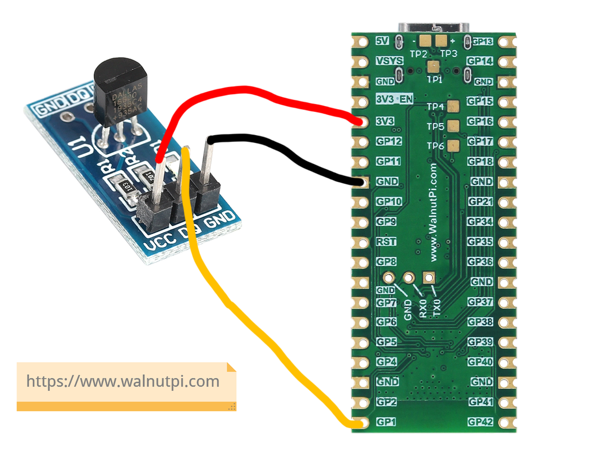
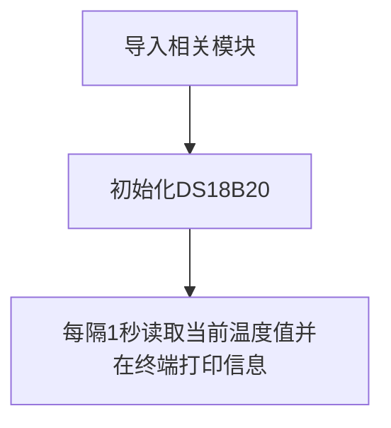

# 温度传感器（DS18B20）

## 前言
相信没有电子爱好者不知道DS18B20的，DS18B20是常用的数字温度传感器，其输出的是数字信号，具有体积小，硬件开销低，抗干扰能力强，精度高的特点。DS18B20数字温度传感器接线方便，封装成后可应用于多种场合，如管道式，螺纹式，磁铁吸附式，不锈钢封装式，型号多种多样。

主要根据应用场合的不同而改变其外观。封装后的DS18B20可用于电缆沟测温，高炉水循环测温，锅炉测温，机房测温，农业大棚测温，洁净室测温，弹药库测温等各种非极限温度场合。耐磨耐碰，体积小，使用方便，封装形式多样，适用于各种狭小空间设备数字测温和控制领域。


**DS18B20温度传感器**


**DS18B20金属探头封装**


## 实验目的
通过MicroPython编程采集DS18B20传感器温度数据。

## 实验讲解

DS18B20是单总线驱动（onewire）传感器，也就是说只占用1个IO口。下图是一款常用的DS18B20模块，本例程使用GPIO1来连接，接线图如下：



也就是说我们需要针对核桃派PicoW引脚1编写程序来驱动DS18B20。那么我们需要自己来编写驱动么？答案是不需要的，人生苦短，核桃派PicoW的MicroPython固件已经集成了单总线模块和ds18b20对象，我们直接python编程使用即可：

单总线模块onewire和ds18x20模块说明如下：

## onewire对象

### 构造函数
```python
ow = onewire.OneWire(machine.Pin(id))
```
构建单总线对象

- `id` ：芯片引脚编号。如：1、2。


### 使用方法
```python
ow.scan()
```
扫描总线上的设备。返回设备地址，支持多设备同时挂载。

<br></br>

```python
ow.reset()
```
总线设备复位。

<br></br>

```python
ow.readbyte()
```
读1个字节。

<br></br>

```python
ow.readbyte()
```
读1个字节。

<br></br>

```python
ow.writebyte(0x12)
```
写入1个字节。

<br></br>

```python
ow.write('123')
```
写入多个字节。

<br></br>

```python
ow.select_rom(b'12345678')
```
根据ROM编号选择总线上指定设备。

<br></br>

## ds18x20对象

### 构造函数
```python
ds = ds18x20.DS18X20(ow)
```
构建DS18B20传感器对象。

- `ow` ：定义好的单总线对象。


### 使用方法
```python
ds.scan()
```
扫描总线上的DS18B20设备。返回设备地址，支持多设备同时挂载。

<br></br>

```python
ds.convert_temp()
```
温度转换。

<br></br>

```python
ds.read_temp(rom)
```
获取温度值。rom：表示对应的设备号。

<br></br>

大部分场景下温度的变化不会太频繁，我们可以每隔1秒采集一次，显示精度为小数点后2位，基本满足大部分应用需求。代码编写流程如下：




## 参考代码

```python
'''
实验名称：温度传感器DS18B20
版本：v1.0
作者：WalnutPi
说明：通过编程采集温度数据，并在终端打印。
'''

#引用相关模块
from machine import Pin,Timer
import onewire,ds18x20,time

#初始化DS18B20
ow= onewire.OneWire(Pin(1)) #使能单总线
ds = ds18x20.DS18X20(ow)        #传感器是DS18B20
rom = ds.scan()         #扫描单总线上的传感器地址，支持多个传感器同时连接

def temp_get(tim):
    ds.convert_temp()
    temp = ds.read_temp(rom[0]) #温度显示,rom[0]为第1个DS18B20
    
    print(str('%.2f'%temp)+' C') #终端打印温度信息

#开启RTOS定时器1
tim = Timer(1)
tim.init(period=1000, mode=Timer.PERIODIC,callback=temp_get) #周期为1000ms
```

## 实验结果

将DS18B20模块按下图连接到核桃派PicoW的引脚1。


运行代码，可以看到终端打印传感器采集到的温度信息：


DS18B20作为我们第一个实验传感器，使用MicroPython编程非常容易就用起来了，而且精度和稳定性丝毫没有影响。温度传感器只是一个敲门砖，接下来我们将会学习更多的传感器应用。