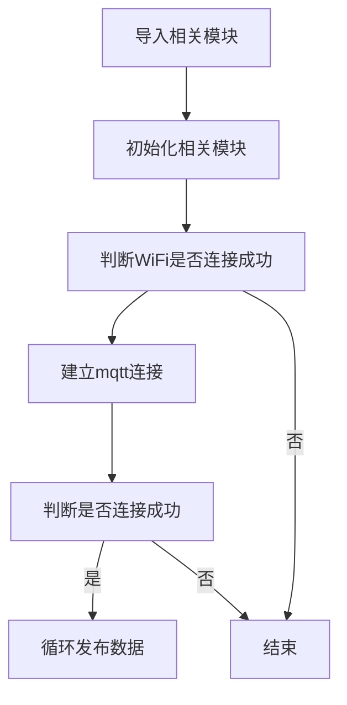
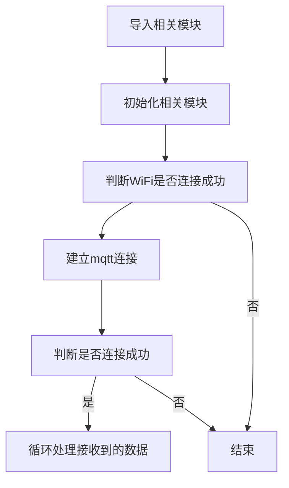

# MQTT通讯

## 前言
上一节，我们学习了Socket通信，当服务器和客户端建立起连接时，就可以相互通信了。在互联网应用大多使用WebSocket接口来传输数据。而在物联网应用中，常常出现这样的情况：海量的传感器，需要时刻保持在线，传输数据量非常低，有着大量用户使用。如果仍然使用socket作为通信，那么服务器的压力和通讯框架的设计随着数量的上升将变得异常复杂！

那么有无一个框架协议来解决这个问题呢，答案是有的。那就是MQTT(消息队列遥测传输)。


## 实验目的
通过编程让核桃派PicoW实现MQTT协议信息的发布和订阅（接收）。

## 实验讲解
MQTT是IBM于1999年提出的，和HTTP一样属于应用层，它工作在 TCP/IP协议族上，通常还会调用socket接口。是一个基于客户端-服务器的消息发布/订阅传输协议。其特点是协议是轻量、简单、开放和易于实现的，这些特点使它适用范围非常广泛。在很多情况下，包括受限的环境中，如：机器与机器（M2M）通信和物联网（IoT）。其在，通过卫星链路通信传感器、偶尔拨号的医疗设备、智能家居、及一些小型化设备中已广泛使用。
总结下来MQTT有如下特性/优势：
- 异步消息协议
- 面向长连接
- 双向数据传输
- 协议轻量级
- 被动数据获取


从上图可以看到，MQTT通信的角色有两个，分别是服务器和客户端。服务器只负责中转数据，不做存储；客户端可以是信息发送者或订阅者，也可以同时是两者。具体如下图：


确定了角色后是如何传输数据呢？下表示MQTT最基本的数据帧格式，例如温度传感器发布主题“Temperature”编号,消息是“25”（表示温度）。那么所有订阅了这个主题编号的客户端（手机应用）就会收到相关信息，从而实现通信。如下表所示：


由于特殊的发布/订阅机制，服务器不需要存储数据（当然也可以在服务器的设备上建立一个客户端来订阅保存信息），因此非常适合海量设备的传输。

人生苦短，而MicroPython已经封装好了MQTT客户端的库文件。让我们的应用变得简单美妙。MQTT模块文件为例程文件夹里面的 simple.py 文件。使用方法如下：

## MQTTClient对象

### 构造函数
```python
client=mqtt.MQTTClient(client_id, server, port)
```
导入MQTT库和构建client客户端对象。

参数说明：
- `client_id` : 客户端ID，具有唯一性；
- `server` : MQTT服务器地址，可以是IP或者网址；
- `port` : MQTT服务器端口。（取决于MQTT服务器厂家）

### 使用方法
```python
client.connect()
```
连接到MQTT服务器。

<br></br>

```python
client.publish(topic,message)
```
发布信息。
- `topic` : 主题名称；
- `message` : 信息内容，例：'Hello WalnutPi!'

<br></br>

```python
client.subscribe(topic)
```
订阅;
- `topic` : 主题名称。

<br></br>

```python
client.set_callback(callback)
```
设置回调函数。
- `callback` : 订阅后如果接收到信息，就执行项应名称的回调函数。

<br></br>

```python
client.check_msg()
```
检查订阅信息。如收到信息就执行设置过的回调函数callback。

<br></br>

由于客户端分为发布者和订阅者角色，因此为了方便大家更好理解，本实验分开两个案例来编程，分别为发布者(publish)和订阅者(subscribe)。再结合MQTT网络调试助手来测试。代表编写流程图如下：

**发布者(publish)代码流程：**


<br></br>

**订阅者(subscribe)代码流程：**



## 参考代码

### 发布者 publish

```python
'''
实验名称：MQTT通信(发布者)
版本：v1.0
作者：WalnutPi
说明：编程实现MQTT通信，实现发布数据。
'''
import network,time
from simple import MQTTClient #导入MQTT板块
from machine import Pin,Timer

#WIFI连接函数
def WIFI_Connect():

    WIFI_LED=Pin(46, Pin.OUT) #初始化WIFI指示灯

    wlan = network.WLAN(network.STA_IF) #STA模式
    wlan.active(True)                   #激活接口
    start_time=time.time()              #记录时间做超时判断

    if not wlan.isconnected():
        print('connecting to network...')
        wlan.connect('01Studio', '88888888') #输入WIFI账号密码

        while not wlan.isconnected():

            #LED闪烁提示
            WIFI_LED.value(1)
            time.sleep_ms(300)
            WIFI_LED.value(0)
            time.sleep_ms(300)

            #超时判断,15秒没连接成功判定为超时
            if time.time()-start_time > 15 :
                print('WIFI Connected Timeout!')
                break

    if wlan.isconnected():
        #LED点亮
        WIFI_LED.value(1)

        #串口打印信息
        print('network information:', wlan.ifconfig())
        
        return True

    else:
        return False

#发布数据任务
def MQTT_Send(tim):
    client.publish(TOPIC, 'Hello WalnutPi!')

#执行WIFI连接函数并判断是否已经连接成功
if WIFI_Connect():

    SERVER = 'mq.tongxinmao.com'
    PORT = 18830
    CLIENT_ID = 'WalnutPi-PicoW' # 客户端ID
    TOPIC = '/public/walnutpi/1' # TOPIC名称
    client = MQTTClient(CLIENT_ID, SERVER, PORT)
    client.connect()

    #开启RTOS定时器，编号为-1,周期1000ms，执行socket通信接收任务
    tim = Timer(-1)
    tim.init(period=1000, mode=Timer.PERIODIC,callback=MQTT_Send)
```

### 订阅者 subscribe

```python
'''
实验名称：MQTT通信（订阅者）
版本：v1.0
作者：WalnutPi
说明：编程实现MQTT通信，实现订阅（接收）数据。
'''
import network,time
from simple import MQTTClient #导入MQTT板块
from machine import Pin,Timer

#WIFI连接函数
def WIFI_Connect():

    WIFI_LED=Pin(46, Pin.OUT) #初始化WIFI指示灯

    wlan = network.WLAN(network.STA_IF) #STA模式
    wlan.active(True)                   #激活接口
    start_time=time.time()              #记录时间做超时判断

    if not wlan.isconnected():
        print('connecting to network...')
        wlan.connect('01Studio', '88888888') #输入WIFI账号密码

        while not wlan.isconnected():

            #LED闪烁提示
            WIFI_LED.value(1)
            time.sleep_ms(300)
            WIFI_LED.value(0)
            time.sleep_ms(300)

            #超时判断,15秒没连接成功判定为超时
            if time.time()-start_time > 15 :
                print('WIFI Connected Timeout!')
                break

    if wlan.isconnected():
        #LED点亮
        WIFI_LED.value(1)

        #串口打印信息
        print('network information:', wlan.ifconfig())

        return True

    else:
        return False


#设置MQTT回调函数,有信息时候执行
def MQTT_callback(topic, msg):
    print('topic: {}'.format(topic))
    print('msg: {}'.format(msg))

#接收数据任务
def MQTT_Rev(tim):
    client.check_msg()

#执行WIFI连接函数并判断是否已经连接成功
if WIFI_Connect():

    SERVER = 'mq.tongxinmao.com'
    PORT = 18830
    CLIENT_ID = 'WalnutPi-PicoW' # 客户端ID
    TOPIC = '/public/walnutpi/2' # TOPIC名称

    client = MQTTClient(CLIENT_ID, SERVER, PORT) #建立客户端对象
    client.set_callback(MQTT_callback)  #配置回调函数
    client.connect()
    client.subscribe(TOPIC) #订阅主题

    #开启RTOS定时器，编号为1,周期300ms，执行socket通信接收任务
    tim = Timer(1)
    tim.init(period=300, mode=Timer.PERIODIC,callback=MQTT_Rev)
```

## 实验结果

### 发布者测试

电脑打开 **核桃派PicoW资料包/01-开发工具/通讯猫MQTT助手** 下的通讯猫软件，保证电脑是连接到互联网的：


接下来是配置MQTT助手，按下图配置。

1、点击网络；

2、点击MQTT;

3、点击启动；
 
4、输入订阅主题，这里 填发送者的主题 “/public/walnutpi/1”;

5、点击订阅主题按钮，等待接收信息；

6、订阅成功后左边提示订阅成功。


**MQTT例程依赖于mqtt库，位于例程文件夹下的simple.py文件，运行实验前需要先将simple.py文件通过Thonny IDE上传到开发板：**


Thonny IDE运行MQTT通讯发布者代码，运行成功后可以看到MQTT网络助手接收到开发板发来的信息：


### 订阅者测试


订阅者”代码测试方法跟“发布者”相反。在MQTT助手中发布主题修改为：'/public/walnutpi/2'。


运行订阅者代码，可以看到Thonny IDE下方终端打印接收到的数据（实际是树莓派PicoW开发板接收到的数据）。


当然你也可以在同一个MQTT在线助手下测试发布和订阅功能来做一些测试，只需要将订阅主题和发布主题设置一致即可，如下图所示：


通过本节我们了解了MQTT通信原理以及成功实现通信。这个实验的MQTT是连接到通讯猫服务器的，所以是支持远程数据传输的。目前市面上大部分物联网云平台支持MQTT，原理大同小异。大家可以基于不同平台协议来开发，实现自己的物联网设备远程连接。